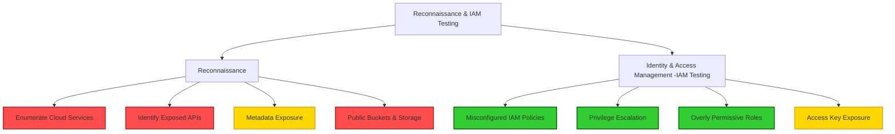
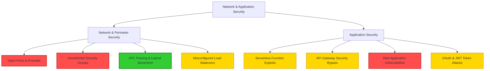
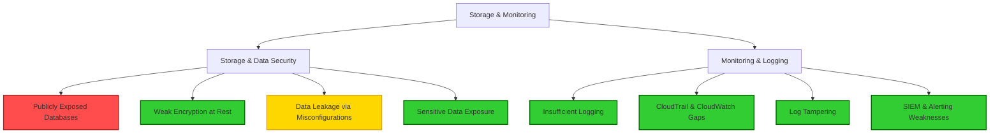
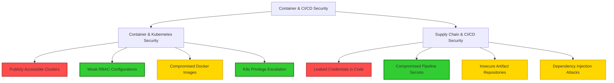
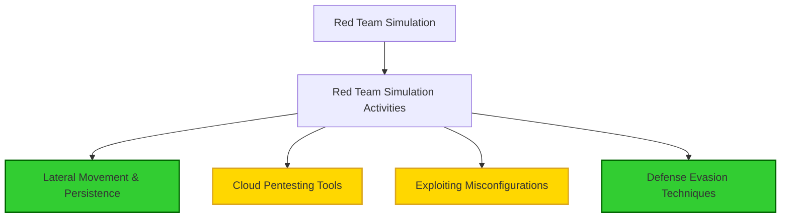

```mermaid
graph TD
  A[Cloud Security Testing] --> B[Reconnaissance]
  B --> B1[Enumerate Cloud Services]:::public
  B --> B2[Identify Exposed APIs]:::public
  B --> B3[Metadata Exposure]:::basic_auth
  B --> B4[Public Buckets & Storage]:::public

  A --> C[Identity & Access Management IAM Testing]
  C --> C1[Misconfigured IAM Policies]:::privileged
  C --> C2[Privilege Escalation]:::privileged
  C --> C3[Overly Permissive Roles]:::privileged
  C --> C4[Access Key Exposure]:::basic_auth

  A --> D[Network & Perimeter Security]
  D --> D1[Open Ports & Firewalls]:::public
  D --> D2[Unrestricted Security Groups]:::public
  D --> D3[VPC Peering & Lateral Movement]:::privileged
  D --> D4[Misconfigured Load Balancers]:::basic_auth

  A --> E[Application Security]
  E --> E1[Serverless Function Exploits]:::basic_auth
  E --> E2[API Gateway Security Bypass]:::basic_auth
  E --> E3[Web Application Vulnerabilities]:::public
  E --> E4[OAuth & JWT Token Attacks]:::basic_auth

  A --> F[Storage & Data Security]
  F --> F1[Publicly Exposed Databases]:::public
  F --> F2[Weak Encryption at Rest]:::privileged
  F --> F3[Data Leakage via Misconfigurations]:::basic_auth
  F --> F4[Sensitive Data Exposure]:::privileged

  A --> G[Monitoring & Logging]
  G --> G1[Insufficient Logging]:::privileged
  G --> G2[CloudTrail CloudWatch Gaps]:::privileged
  G --> G3[Log Tampering]:::privileged
  G --> G4[SIEM & Alerting Weaknesses]:::privileged

  A --> H[Container & Kubernetes Security]
  H --> H1[Publicly Accessible Clusters]:::public
  H --> H2[Weak RBAC Configurations]:::privileged
  H --> H3[Compromised Docker Images]:::basic_auth
  H --> H4[K8s Privilege Escalation]:::privileged

  A --> I[Supply Chain & CI CD Security]
  I --> I1[Leaked Credentials in Code]:::public
  I --> I2[Compromised Pipeline Secrets]:::privileged
  I --> I3[Insecure Artifact Repositories]:::basic_auth
  I --> I4[Dependency Injection Attacks]:::basic_auth

  A --> J[Red Team Simulation]
  J --> J1[Lateral Movement & Persistence]:::privileged
  J --> J2[Cloud Pentesting Tools]:::basic_auth
  J --> J3[Exploiting Misconfigurations]:::basic_auth
  J --> J4[Defense Evasion Techniques]:::privileged

  classDef public fill:#FF4C4C,stroke:#B22222,stroke-width:2px;
  classDef basic_auth fill:#FFD700,stroke:#DAA520,stroke-width:2px;
  classDef privileged fill:#32CD32,stroke:#006400,stroke-width:2px;

```

Housekeeping. 
Red means Public access 
Yellow means basic privilege access. 
Green means high privilege access

# Group 1: Reconnaissance & IAM Testing

---

# Group 2: Network & Application Security

---

# Group 3: Storage & Monitoring

---

# Group 4: Container & CI/CD Security

---

# Group 5: Red Team Simulation

---

