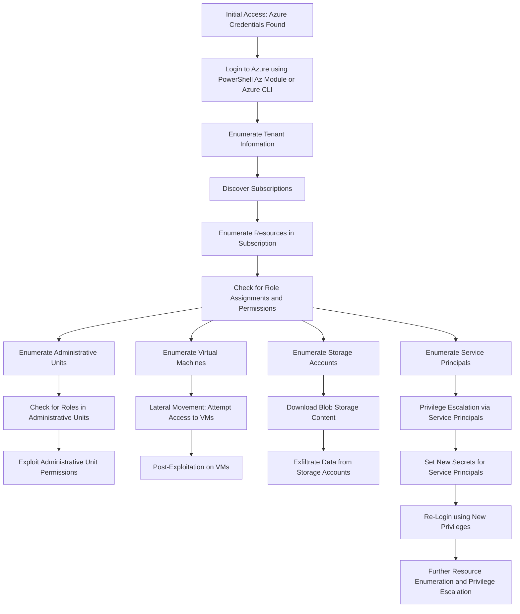

---
{"dg-publish":true,"permalink":"/0-learn-like-a-systems-engineer/clouds/azure/azure-general/azure-rest-api-with-azure-cli/","noteIcon":"","created":"2025-04-15T14:11:19.583-04:00"}
---




https://learn.microsoft.com/en-us/cli/azure/use-azure-cli-rest-command?tabs=bash


### 1. **List All Administrative Units**
   ```bash
   az rest --method GET --url https://graph.microsoft.com/v1.0/directory/administrativeUnits | jq

az rest --method GET --url https://graph.microsoft.com/v1.0/directory/administrativeUnits | jq '.value[] | {displayName, id}'

PS> az rest --method GET --url https://graph.microsoft.com/v1.0/directory/administrativeUnits | jq -r '.value[] | .id'

   ```

### 2. **Get Scoped Role Members of an Administrative Unit**
   ```bash
   az rest --method GET --url "https://graph.microsoft.com/v1.0/directory/administrativeUnits/<administrativeUnitId>/scopedRoleMembers" | jq '.value[]'


   ```

### 3. **Get a Directory Role by Role ID**
   ```bash
   az rest --method GET --url "https://graph.microsoft.com/v1.0/directoryRoles/<roleID>" --headers "Content-Type=application/json" | jq
   ```

### 4. **List Members of an Administrative Unit**
   ```bash
   az rest --method GET --url "https://graph.microsoft.com/v1.0/directory/administrativeUnits/<administrativeUnitId>/members" | jq '.value[]'
   ```

### 5. **Get All Users in a Directory**
   ```bash
   az rest --method GET --url "https://graph.microsoft.com/v1.0/users" | jq '.value[]'
   ```

### 6. **Get a Specific User by ID**
   ```bash
   az rest --method GET --url "https://graph.microsoft.com/v1.0/users/<userID>" | jq
   ```

### 7. **List All Groups in a Directory**
   ```bash
   az rest --method GET --url "https://graph.microsoft.com/v1.0/groups" | jq '.value[]'
   ```

### 8. **Get a Specific Group by ID**
   ```bash
   az rest --method GET --url "https://graph.microsoft.com/v1.0/groups/<groupID>" | jq
   ```

### 9. **List All Service Principals in the Directory**
   ```bash
   az rest --method GET --url "https://graph.microsoft.com/v1.0/servicePrincipals" | jq '.value[]'
   ```

### 10. **Get Service Principal by ID**
   ```bash
   az rest --method GET --url "https://graph.microsoft.com/v1.0/servicePrincipals/<servicePrincipalId>" | jq
   ```

### 11. **List All Applications**
   ```bash
   az rest --method GET --url "https://graph.microsoft.com/v1.0/applications" | jq '.value[]'
   ```

### 12. **Get Application by ID**
   ```bash
   az rest --method GET --url "https://graph.microsoft.com/v1.0/applications/<applicationId>" | jq
   ```

### 13. **List All Directory Roles**
   ```bash
   az rest --method GET --url "https://graph.microsoft.com/v1.0/directoryRoles" | jq '.value[]'
   ```

### 14. **List Role Assignments for a Specific Role**
   ```bash
   az rest --method GET --url "https://graph.microsoft.com/v1.0/directoryRoles/<roleID>/members" | jq '.value[]'
   ```

### 15. **Get Details of Azure Subscription**
   ```bash
   az rest --method GET --url "https://management.azure.com/subscriptions/<subscriptionId>?api-version=2020-01-01" --headers "Content-Type=application/json" | jq
   ```

### 16. **List Resources in a Resource Group**
   ```bash
   az rest --method GET --url "https://management.azure.com/subscriptions/<subscriptionId>/resourcegroups/<resourceGroupName>/resources?api-version=2020-06-01" --headers "Content-Type=application/json" | jq '.value[]'
   ```

### 17. **List All Virtual Machines**
   ```bash
   az rest --method GET --url "https://management.azure.com/subscriptions/<subscriptionId>/providers/Microsoft.Compute/virtualMachines?api-version=2020-06-01" --headers "Content-Type=application/json" | jq '.value[]'
   ```

### 18. **List All Storage Accounts**
   ```bash
   az rest --method GET --url "https://management.azure.com/subscriptions/<subscriptionId>/providers/Microsoft.Storage/storageAccounts?api-version=2019-06-01" --headers "Content-Type=application/json" | jq '.value[]'
   ```

### 19. **List All Blobs in a Storage Account Container**
   ```bash
   az rest --method GET --url "https://<storageAccountName>.blob.core.windows.net/<containerName>?restype=container&comp=list&api-version=2020-04-08" --headers "x-ms-version=2020-04-08" | jq
   ```

### 20. **List All Role Assignments in a Subscription**
   ```bash
   az rest --method GET --url "https://management.azure.com/subscriptions/<subscriptionId>/providers/Microsoft.Authorization/roleAssignments?api-version=2020-10-01" --headers "Content-Type=application/json" | jq '.value[]'
```


