According to[Jaap Wesselius](https://jaapwesselius.com/2020/01/02/implementing-active-directory-federation-services-step-by-step/)), 

>In Office 365 there are multiple ways for users to authenticate, and this is related to the type of identity being used:
Cloud Identity – is created in the cloud, password lives in the cloud and user authenticates in the cloud.
Synced Identity – is create in on-premises Active Directory and is synchronized to the cloud, including its password (most of the times). User authenticates in the cloud with on-premises password.
Federated Identity – is created in on-premises Active Directory and is synchronized to the cloud, sometimes including its password (recommended for disaster recovery). User authenticates against on-premises Domain Controllers using federation infrastructure (ADFS).

I am visual guy so here is the Mermaid graph. 

```mermaid
graph TD

    subgraph Cloud Identity
        CI_User[User with Cloud Identity]
        CI_PW[Password in Cloud]
        CI_Auth[Authentication in Cloud]
        CI_User --> CI_PW
        CI_PW --> CI_Auth
    end

    subgraph Synced Identity
        SI_User[User with Synced Identity]
        SI_OnPrem[On-Premises AD]
        SI_Sync[Password Sync to Cloud]
        SI_Auth[Authentication in Cloud with On-Premises Password]
        SI_User --> SI_OnPrem
        SI_OnPrem --> SI_Sync
        SI_Sync --> SI_Auth
    end

    subgraph Federated Identity
        FI_User[User with Federated Identity]
        FI_OnPrem[On-Premises AD]
        FI_Federation[Authentication via ADFS Federation Infrastructure]
        FI_DC[On-Premises Domain Controller]
        FI_User --> FI_OnPrem
        FI_OnPrem --> FI_Federation
        FI_Federation --> FI_DC
    end


```

