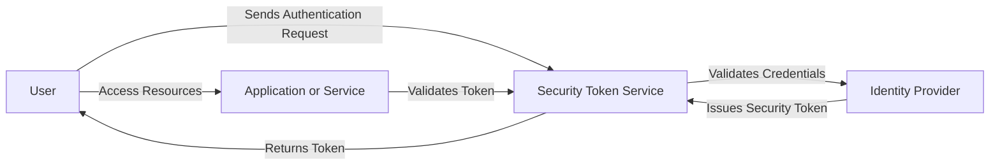
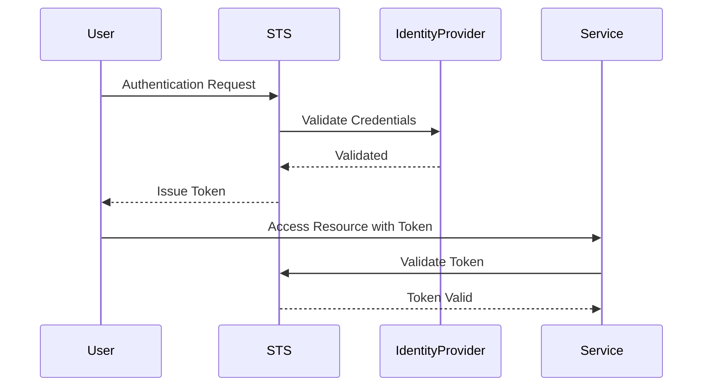

# 1. What is STS?

[Navya Canumalla](https://stackoverflow.com/questions/45174728/what-does-sts-mean-in-the-context-of-azure-ad-b2c)

>STS stands for the Security Token Service. In the context of the standard OAuth protocol, it basically maps to the Authorization Server which issues tokens to the applications after authentication and authorization.

From [Wiki](https://en.wikipedia.org/wiki/Security_token_service),
>Within that claims-based identity framework, a secure token service is responsible for issuing, validating, renewing and cancelling security tokens. 


https://learn.microsoft.com/en-us/azure/architecture/patterns/federated-identity


# 2. How does STS work within IAM?



## 2.1  STS in IAM Process

| **Component**             | **Role**                                                                                   |
|---------------------------|---------------------------------------------------------------------------------------------|
| **User**                   | The person or entity trying to access a resource, initiating authentication through STS.    |
| **Security Token Service** | Validates the credentials of the user and issues security tokens (e.g., JWT, SAML).         |
| **Identity Provider**      | Central system that verifies identity and authenticates the user on behalf of the STS.      |
| **Application/Service**    | The resource or service the user wants to access. Validates the token for access control.   |

## 2.2  Token Issuance & Validation Flow




## 2.3 Where does it fit in Azure?

Attackers can identify whether a company is using Azure environment or not. 

```bash
https://login.microsoftonline.com/getuserrealm.srf?login=megabigtech.com&json=1
```

According to [MicroFocus](https://www.microfocus.com/documentation/idol/IDOL_24_1/SharePointRemoteConnector_24.1_Documentation/Help/Content/Configuration/TaskName/SharepointOnlineFederatedAuthUseSTSUrl.htm)
> When the connector is configured to collect data from SharePoint Online, it makes a request to Microsoft Online (https://login.microsoftonline.com/GetUserRealm.srf) to determine if the SharePoint Online instance uses federated authentication.

Also from [Vitaly Lyamin, an engineer with the SharePoint Developer Support team](https://techcommunity.microsoft.com/t5/microsoft-sharepoint-blog/sharepoint-online-active-authentication/ba-p/510052) 
> Microsoft Online provides a way to discover the custom Security token service (STS) authentication URL via the “GetUserRealm.srf” endpoint


See [../../../../0.2. Attack Cloud/0.2.3. Azure/PwnedLabs/6. Azure Recon to Foothold and Profit#1. Does the company use Azure?|../../PwnedLabs/6. Azure Recon to Foothold and Profit#1. Does the company use Azure?](<../../../../0.2. Attack Cloud/0.2.3. Azure/PwnedLabs/6. Azure Recon to Foothold and Profit.md#1-does-the-company-use-azurepwnedlabs6-azure-recon-to-foothold-and-profit1-does-the-company-use-azure>)
for an example. 

### 2.3.1 Understand getuserrealm Output


==State== field indicates how the authentication should be handled for the given domain.


#### 2.3.1.1 **State Field**
| **State Value** | **Description**                                                            |
| --------------- | -------------------------------------------------------------------------- |
| 0               | **Error**: An error occurred during the realm discovery process.           |
| 1               | **Unknown**: The domain is not recognized by Azure AD.                     |
| 2               | **Federated**: The domain uses an external identity provider (e.g., ADFS). |
| 3               | **Managed**: The domain is managed by Azure AD.                            |
| 4               | **Managed**: Same as 3; Azure AD directly handles authentication.          |
| 6               | **Hybrid**: A mix of Managed and Federated authentication models.          |

#### 2.3.1.2 **UserState Field**
==UserState== field indicates information about the user within the domain. 

| **UserState Value** | **Description**                                                                                 |
| ------------------- | ----------------------------------------------------------------------------------------------- |
| 0                   | **User Not Found**: The user does not exist in Azure AD or any associated identity provider.    |
| 1                   | **User Found**: The user exists and can authenticate with the associated identity provider.     |
| 2                   | **Federated User**: The user is federated and authenticates with an external identity provider. |


### 2.3.1.3 **NameSpaceType Field**
==NameSpaceType== field indicates insight into the type of authentication being used. 

| **NameSpaceType Value** | **Description**                                                                |
| ----------------------- | ------------------------------------------------------------------------------ |
| Managed                 | The domain is managed by Azure AD. Authentication is handled by Azure AD.      |
| Federated               | The domain uses an external identity provider for authentication (e.g., ADFS). |
| Unknown                 | The domain is not recognized or has no proper authentication configuration.    |
