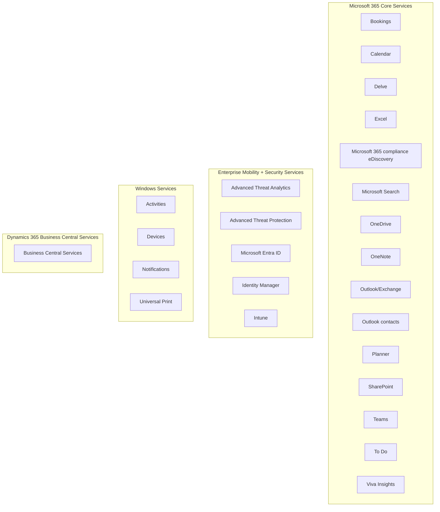

https://learn.microsoft.com/en-us/graph/overview
https://learn.microsoft.com/en-us/graph/use-the-api
https://jaapwesselius.com/tag/graph-api/
https://developer.microsoft.com/en-us/graph
https://learn.microsoft.com/en-us/powershell/microsoftgraph/installation?view=graph-powershell-1.0


# 1. What is Microsoft Graph?


> Microsoft Graph is the gateway to data and intelligence in Microsoft 365. It provides a unified programmability model that you can use to access the tremendous amount of data in Microsoft 365, Windows, and Enterprise Mobility + Security. Use the wealth of data accessible through Microsoft Graph to build apps for organizations and consumers that interact with millions of users.


# 2. What is Microsoft Graph PowerShell SDK?


The Microsoft Graph PowerShell SDK acts as an API wrapper for the Microsoft Graph APIs, exposing the entire API set for use in PowerShell. It contains a set of cmdlets that helps you manage identities at scale from automating tasks to managing users in bulk using Microsoft Entra ID. It will help administer every Microsoft Entra feature that has an API in Microsoft Graph.

## Useful Commands
https://learn.microsoft.com/en-us/powershell/microsoftgraph/get-started?toc=%2Fgraph%2Ftoc.json&view=graph-powershell-1.0

```powershell

Install-Module Microsoft.Graph
Import-Module Microsoft.Graph
Connect-MgGraph

# Listing Parameters
Get-Help Get-MgUser -Detailed

#Finidng Available Commands
Get-Command -Module Microsoft.Graph* *team*


#The Find-MgGraphCommand cmdlet can be used to discover the required permissions for another cmdlet
Find-MgGraphCommand -command Get-MgUser | Select -First 1 -ExpandProperty Permissions

# Sign in 
Connect-MgGraph
Connect-MgGraph -Scopes "User.Read.All","Group.ReadWrite.All"


# Get Signed in user. 
Get-MgUser

# User's joined Team
Get-MgUserJoinedTeam -UserId $user.Id


# List Team Channels
Get-MgTeamChannel -TeamId $team.Id

# Send a message
New-MgTeamChannelMessage -TeamId $team.Id -ChannelId $channel.Id -Body @{ Content="Hello World" }
New-MgTeamChannelMessage -TeamId $team.Id -ChannelId $channel.Id -Body @{ Content="Hello World" } -Importance "urgent"

# Check Administrative Unit
Get-MgDirectoryAdministrativeUnit |fl


#Disconnect
Disconnect-MgGraph


```

# 3. What is Graph API?

[Jaap Wesselius](https://jaapwesselius.com/tag/graph-api/) summarized really well on his website. 
>Microsoft Graph is the way resources in the Microsoft cloud are connected to each other. The Graph API is an API you can use to access Microsoft Graph, and browse (or traverse) through all the resources.

Simply put Microsoft Graph is a gateway to MS Cloud, and we can access it via Graph API. 
I really like the fact that it uses REST APIs, not GraphQL apis. 

https://learn.microsoft.com/en-us/graph/patterns/interactive-applications


With Microsoft Graph API, we can access the following cloud services. More information can be found [here](https://learn.microsoft.com/en-us/graph/overview-major-services).




[API user reference](https://learn.microsoft.com/en-us/graph/use-the-api) is here. 

