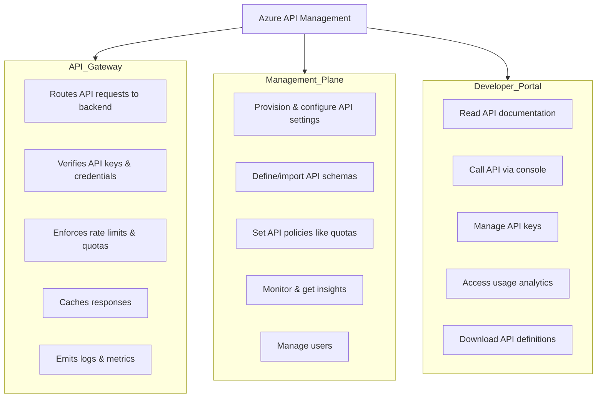

[The official website indicates](https://learn.microsoft.com/en-us/azure/api-management/api-management-key-concepts) the following: 

>Azure API Management is a hybrid, multicloud management platform for APIs across all environments. As a platform-as-a-service, API Management supports the complete API lifecycle.

>Azure API Management helps customers meet these challenges:

>* Abstract backend architecture diversity and complexity from API consumers
>* Securely expose services hosted on and outside of Azure as APIs
>* Protect, accelerate, and observe APIs
>* Enable API discovery and consumption by internal and external users

# 1. Azure API management Components. 
Azure API management consists of three components: API Gateway, Management Plane, and Developer Portal. 

## 1.1 API Gateway
- Acts as the entry point for all API requests and routes them to the appropriate backend services.
- **Key Responsibilities**:
  - Verifies API keys and other credentials (e.g., JWT tokens, certificates).
  - Enforces usage quotas and rate limits.
  - Optionally transforms requests and responses based on policy configurations.
  - Caches responses to reduce latency and backend load.
  - Emits logs, metrics, and traces for monitoring and troubleshooting.
  
- **Self-hosted Gateway**: Available for hybrid environments where the gateway can be deployed on-premises or across clouds via Docker containers.

## 1.2 Management Plane
- Provides full access to the API Management service capabilities for API providers.
- **Key Responsibilities**:
  - Provision and configure API Management service settings.
  - Define or import API schemas from various sources (OpenAPI, WSDL, OData, etc.).
  - Apply policies like quotas, caching, and transformations.
  - Monitor API usage and gather insights through analytics.
  - Manage users and their access to APIs.

## 1.3 Developer Portal
- An open-source, customizable website that documents the APIs and provides a user interface for developers.
- **Key Responsibilities**:
  - Allows developers to read API documentation.
  - Provides an interactive console for testing APIs.
  - Enables developers to create accounts, manage API keys, and view analytics on their API usage.
  - Supports downloading API definitions for integration.
