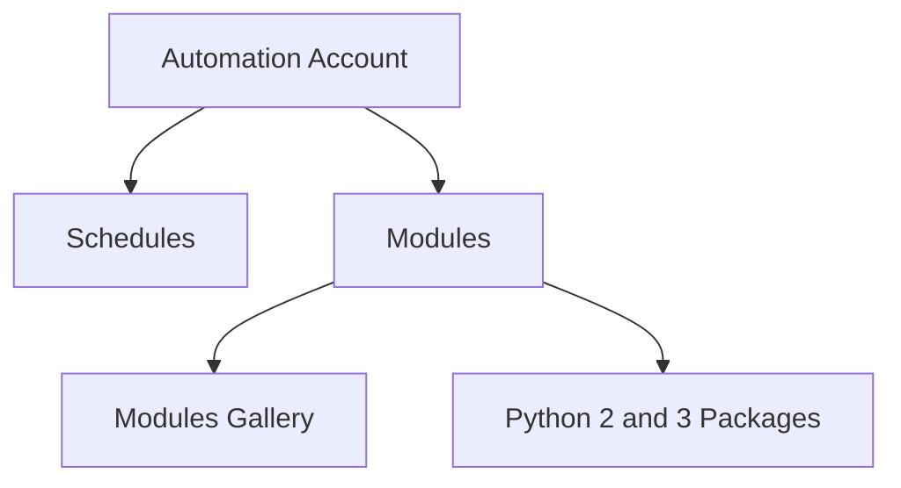
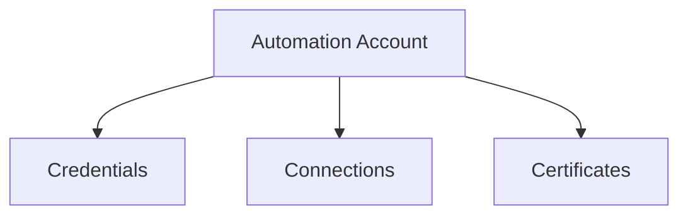
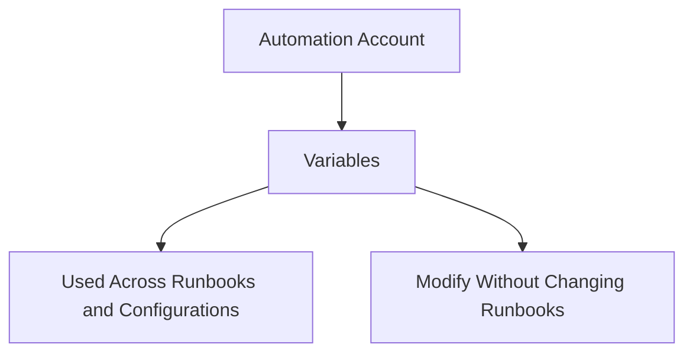

# 1. What is Automation?
https://learn.microsoft.com/en-us/azure/automation/overview

Automation is needed in three broad areas of cloud operations:

* Deploy and manage - Deliver repeatable and consistent infrastructure as code.
* Response - Create event-based automation to diagnose and resolve issues.
* Orchestrate - Orchestrate and integrate your automation with other Azure or third party services and products.


[Oldvetmsg](https://www.reddit.com/r/AZURE/comments/1agonzr/azure_automation/) asked a similar question and I love the answers on Reddit. 

>It's basically a centralised scheduled task server in the cloud.
==i It's great for scheduling and storing secrets.==

## 1.1 What is Automation Account?
https://learn.microsoft.com/en-us/azure/automation/automation-create-standalone-account?tabs=azureportal

>With an Automation account, you can authenticate runbooks by managing resources in either Azure Resource Manager or the classic deployment model. One Automation Account can manage resources across all regions and subscriptions for a given tenant.

## 1.2 Shared Resources


| **Category**                | **Description**                                                                                           |
| --------------------------- | --------------------------------------------------------------------------------------------------------- |
| **Schedules**               | Trigger Automation operations at predefined times.                                                        |
| **Modules**                 | Manage Azure and other systems. Import modules for Microsoft, third-party, community, and custom cmdlets. |
| **Python 2 and 3 Packages** | Support Python 2 and 3 runbooks for Automation accounts.                                                  |
| **Credentials**             | Securely store sensitive information for use by runbooks.                                                 |
| **Connections**             | Store name-value pairs of information for connections to systems.                                         |
| **Certificates**            | Define information for authentication and securing of resources.                                          |
| **Variables**               | Hold reusable content that can be used across runbooks and configurations.                                |
|                             |                                                                                                           |


#### Mermaid Diagram 1: **Automation Schedules and Modules Overview**



#### Steps:
1. **Schedules**: Trigger automation at predefined times.
2. **Modules**: Manage Azure and other systems.
3. **Modules Gallery**: Allows easy importing of runbooks.
4. **Python Packages**: Support for Python 2 and 3 runbooks.

---

#### Mermaid Diagram 2: **Credentials, Connections, and Certificates Management**



#### Steps:
1. **Credentials**: Securely store sensitive information for use by runbooks.
2. **Connections**: Store common name-value pairs for system connections.
3. **Certificates**: Used in authentication and securing resources.

---

#### Mermaid Diagram 3: **Managing Variables in Automation**



#### Steps:
1. **Variables**: Hold reusable content.
2. **Modify Without Changing**: Variables can be updated without modifying runbooks or configurations referencing them.


# 2. AZ CLI Commands
https://learn.microsoft.com/en-us/cli/azure/automation?view=azure-cli-latest
```
az automation account list

```


| **Category**                | **Azure CLI Command**                                                                                                                                                                                                                                               |
| --------------------------- | ------------------------------------------------------------------------------------------------------------------------------------------------------------------------------------------------------------------------------------------------------------------- |
| **Schedules**               | `az automation schedule list --automation-account-name <AutomationAccountName> --resource-group <ResourceGroupName>`                                                                                                                                                |
| **Modules**                 | `az rest --method GET --url "https://management.azure.com/subscriptions/<subscription-id>/resourceGroups/<resource-group-name>/providers/Microsoft.Automation/automationAccounts/<automation-account-name>/modules?api-version=2015-10-31"<br>`                     |
| **Python 2 and 3 Packages** | `az automation runbook list --automation-account-name <AutomationAccountName> --resource-group <ResourceGroupName> --type python3`                                                                                                                                  |
| **Credentials**             | `az rest --method GET --url "https://management.azure.com/subscriptions/<subscription-id>/resourceGroups/<resource-group-name>/providers/Microsoft.Automation/automationAccounts/<automation-account-name>/credentials?api-version=2015-10-31"<br>`                 |
| **Connections**             | `az rest --method GET --url "https://management.azure.com/subscriptions/<subscription-id>/resourceGroups/<resource-group-name>/providers/Microsoft.Automation/automationAccounts/<automation-account-name>/connections?api-version=2015-10-31"<br>`                 |
| **Certificates**            | `az rest --method GET --url "https://management.azure.com/subscriptions/<subscription-id>/resourceGroups/<resource-group-name>/providers/Microsoft.Automation/automationAccounts/<automation-account-name>/certificates/<certificate-name>?api-version=2015-10-31"` |
| **Variables**               | `az rest --method GET --url "https://management.azure.com/subscriptions/<subscription-id>/resourceGroups/<resource-group-name>/providers/Microsoft.Automation/automationAccounts/<automation-account-name>/variables?api-version=2015-10-31"`<br>                   |
|                             |                                                                                                                                                                                                                                                                     |
|                             |                                                                                                                                                                                                                                                                     |


# 3. Azure Powershell
