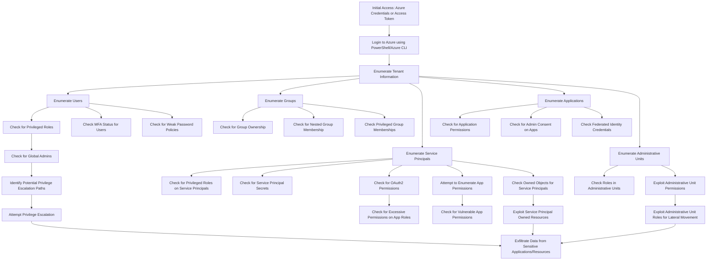

---
{"dg-publish":true,"permalink":"/0-learn-like-a-systems-engineer/clouds/azure/azure-services/azure-entra/","noteIcon":"","created":"2025-04-15T14:11:19.585-04:00"}
---


# 1. Entra ID (Previously Azure Active Directory - AAD)

[Reddit thread about Microsoft ID and AD confusion](https://www.reddit.com/r/AZURE/comments/1aqjkr6/confusion_about_microsoft_id_and_ad/)

An Azure subscription houses all Azure resources, while an **Entra ID tenant houses all identities**.

Microsoft Entra is a family of identity and network access products.


> **Entra ID** (previously Azure AD) is the identity provider for Azure subscriptions, meaning it governs who has access to resources within a subscription. In Azure, multiple subscriptions can trust the same Entra ID directory, allowing for centralized management of resources and users.

[Learn more from Microsoft](https://www.microsoft.com/en-in/security/business/identity-access/microsoft-entra-id)


---

[A helpful description by Luke on StackOverflow](https://stackoverflow.com/questions/47307368/what-is-the-difference-between-an-azure-tenant-and-azure-subscription):

> A tenant is associated with a single identity (person, company, or organization) and can own one or several subscriptions.
> A subscription is linked to a payment setup, and each subscription will result in a separate bill.
> Within each subscription, you can add virtual resources (VM, storage, network, etc.).

---

From the official site:  
[Microsoft Cloud Offerings Overview](https://learn.microsoft.com/en-us/microsoft-365/enterprise/subscriptions-licenses-accounts-and-tenants-for-microsoft-cloud-offerings?view=o365-worldwide)

## 1.1 Summary of the Hierarchy


Here is a quick recap:

- An organization can have multiple subscriptions.
    
    - A subscription can have multiple licenses.
        
    - Licenses can be assigned to individual user accounts.
        
    - User accounts are stored in a Microsoft Entra tenant.

Here’s an example of the relationship between organizations, subscriptions, licenses, and user accounts:

- An organization is identified by its public domain name.
    
    - It can have a **Microsoft 365 E3** subscription with user licenses.
        
    - It can also have a **Microsoft 365 E5** subscription with user licenses.
        
    - Or a **Dynamics 365** subscription with user licenses.
        
    - Along with multiple Azure subscriptions.
        
    - All the organization's user accounts are managed within a common **Microsoft Entra tenant**.


## 1.2 Command

https://learn.microsoft.com/en-us/cli/azure/ad?view=azure-cli-latest




### Commands Combined with Each Step:

#### 1. **Initial Access: Azure Credentials or Access Token**
- **Login using Azure CLI**:
   ```bash
   az login -u <username> -p <password>
   ```
   
- **Login using Service Principal**:
   ```bash
   az login --service-principal -u <appId> -p <secret> --tenant <tenantId>
   ```

#### 2. **Enumerate Tenant Information**
- **Get Tenant Info**:
   ```bash
   az account show
   ```

#### 3. **Enumerate Users**
- **List Users**:
   ```bash
   az ad user list --output table
   ```
   
- **Check for Privileged Roles**:
   ```bash
   az role assignment list --assignee <userId>
   ```

#### 4. **Check MFA Status for Users**
- **Check MFA Status using Graph API**:
   ```bash
   az rest --method GET --url "https://graph.microsoft.com/v1.0/reports/credentialUserRegistrationDetails" | jq '.value[] | {userPrincipalName, mfaEnabled}'
   ```

#### 5. **Check for Weak Password Policies**
- **Using Microsoft Graph API via `az rest`**:
   ```bash
   az rest --method GET --url "https://graph.microsoft.com/v1.0/policies/passwordPolicies" --headers "Content-Type=application/json"
   ```

- **Using PowerShell**:
   ```powershell
   Get-AzureADPolicy | Where-Object {$_.Type -eq "PasswordPolicy"}
   ```

#### 6. **Enumerate Groups**
- **List Groups**:
   ```bash
   az ad group list --output table
   ```

- **Check Group Ownership**:
   ```bash
   az ad group owner list --group <groupName>
   ```

#### 7. **Enumerate Service Principals**
- **List Service Principals**:
   ```bash
   az ad sp list --output table
   ```

- **Check for Service Principal Secrets**:
   ```bash
   az ad sp credential list --id <spId>
   ```

#### 8. **Enumerate Applications**
- **List Applications**:
   ```bash
   az ad app list --output table
   ```

- **Check Application Permissions**:
   ```bash
   az ad app permission list --id <appId>
   ```

#### 9. **Enumerate Administrative Units**
- **List Administrative Units**:
   ```bash
   az rest --method GET --url "https://graph.microsoft.com/v1.0/directory/administrativeUnits" | jq '.value[] | {id, displayName}'
   ```

#### 10. **Check Roles in Administrative Units**
- **List Roles in Administrative Units**:
   ```bash
   az rest --method GET --url "https://graph.microsoft.com/v1.0/directory/administrativeUnits/<adminUnitId>/scopedRoleMembers" | jq '.value[]'
   ```

#### 11. **Check Privileged Roles on Service Principals**
- **List Role Assignments for Service Principals**:
   ```bash
   az role assignment list --assignee <spId>
   ```

#### 12. **Set New Secrets for Service Principals**
- **Reset Service Principal Secrets**:
   ```bash
   az ad sp credential reset --id <spId> --password <newPassword>
   ```

#### 13. **Lateral Movement: Access Virtual Machines**
- **Connect to VM using SSH**:
   ```bash
   az vm ssh --ip-address <ipAddress> --username <username>
   ```

#### 14. **Exfiltrate Data from Storage Accounts**
- **List Storage Blobs**:
   ```bash
   az storage blob list --container-name <containerName> --account-name <storageAccountName> --output table
   ```

- **Download Blob Content**:
   ```bash
   az storage blob download --container-name <containerName> --name <blobName> --file <localFilePath> --account-name <storageAccountName>
   ```

#### 15. **Privilege Escalation via Service Principals**
- **Check OAuth2 Permissions for Privilege Escalation**:
   ```bash
   az ad sp permission list --id <spId>
   ```

#### 16. **Re-Login Using New Privileges**
- **Login with Updated Privileges**:
   ```bash
   az login --service-principal -u <appId> -p <newPassword> --tenant <tenantId>
   ```

---


## 1.3 A sample architecture by Julian Sperling. 

https://sparrow365.de/index.php/en/2024/04/22/all-roads-to-entra-id-sso/


---

# 2. Administrative Units

[Microsoft documentation on Administrative Units](https://learn.microsoft.com/en-us/entra/identity/role-based-access-control/administrative-units):

> An administrative unit is a Microsoft Entra resource that can serve as a container for other Microsoft Entra resources. **An administrative unit can contain only users, groups, or devices**.


Administrative units can be managed through the following interface:


According to [SysCloud's blog on Azure Administrative Units](https://blog.syscloud.com/azure-administrative-units):
> You can assign users to an Azure AD role with a scope that's limited to one or more administrative units. In this way, administrative units provide more granular administrative control within Azure Active Directory.

The image below is an example from pwnedlab.io [[../../../0.2. Attack Cloud/0.2.3. Azure/PwnedLabs/8. Execute Azure Credential Shuffle to Achieve Objectives\|8. Execute Azure Credential Shuffle to Achieve Objectives]]. It’s common to see the term "manage" in the description column. One of the main benefits of **Entra ID Administrative Units** is that they allow an organization to delegate admin permissions to other users, devices, or groups, with restrictions to specific organizational units, regions, departments, etc.

It seems to me that **Administrative Units** are a way to delegate the management of distributed resources.


