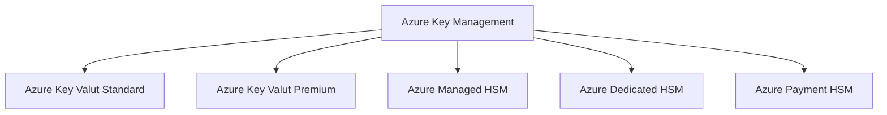
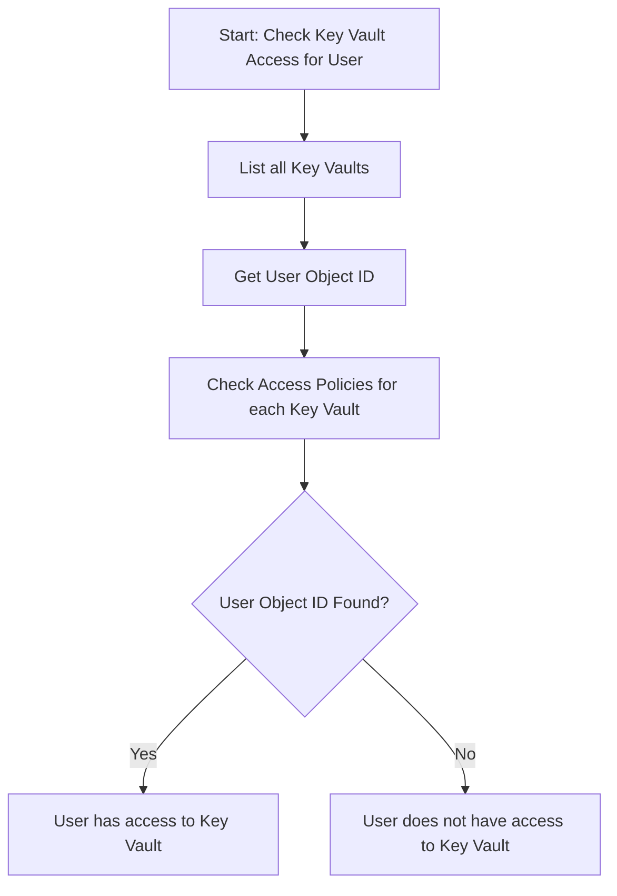

# 1.  Key types!
https://learn.microsoft.com/en-us/azure/security/fundamentals/key-management-choose



The following is the flow chart to choose right key for Azure Environment. 
HSM stands for Hardware Security Module


# 2. Enumerate


| **Step**                     | **Description**                                                | **Command**                                                                                               |
| ---------------------------- | -------------------------------------------------------------- | --------------------------------------------------------------------------------------------------------- |
| **List all Key Vaults**      | Lists all the Key Vaults in the subscription.                  | `az keyvault list --query "[].{Name:name, Location:location}" --output table`                             |
| **Get UserPrincipalName**    |                                                                | `az ad user list --query "[].{Name:displayName, UPN:userPrincipalName}" --output table`                   |
| **Get User Object ID**       | Retrieves the Object ID for the specific user.                 | `az ad user show --id <UserPrincipalName> --query "id"`                                                   |
| **Check Access Policies**    | Shows the access policies of a specific Key Vault.             | `az keyvault show --name <KeyVaultName> --query "properties.accessPolicies"`                              |
| **Filter for User's Access** | Filters the Key Vault’s access policies to check for the user. | `az keyvault show --name <KeyVaultName> --query "properties.accessPolicies[?objectId=='<UserObjectId>']"` |


## 2.1 Azure Key Secrets
https://learn.microsoft.com/en-us/cli/azure/keyvault?view=azure-cli-latest
```
az keyvault list --query "[].{Name:name, Location:location}" --output table

`az ad user list --query "[].{Name:displayName, UPN:userPrincipalName}" --output table`

`az ad user show --id <UserPrincipalName> --query "id"`

`az keyvault show --name <KeyVaultName> --query "properties.accessPolicies"`

`az keyvault show --name <KeyVaultName> --query "properties.accessPolicies[?objectId=='<UserObjectId>']"`


az keyvault secret list --vault-name <name>

az keyvault secret show --vault-name <vault-Name> --name <keyname>

az keyvault secret download  --vault-name <vault-Name> --name <keyname> --file <filename>


```


Good examples are located [../PwnedLabs/5. Unmask Privileged Access in Azure](<../../../0.2. Attack Cloud/0.2.3. Azure/PwnedLabs/5. Unmask Privileged Access in Azure.md>)
