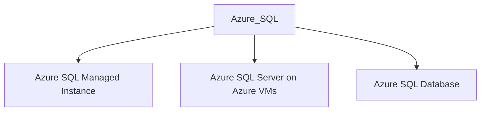

---
{"dg-publish":true,"permalink":"/0-learn-like-a-systems-engineer/clouds/azure/azure-services/azure-sql/","noteIcon":"","created":"2025-04-15T14:11:19.585-04:00"}
---


https://cloud.hacktricks.xyz/pentesting-cloud/azure-security/az-services/az-sql



https://learn.microsoft.com/en-us/azure/azure-sql/azure-sql-iaas-vs-paas-what-is-overview?view=azuresql


# 1. What is Azure SQL?
[Azure SQL is a family of managed, secure, and intelligent products that use the SQL Server database engine in the Azure cloud.](https://learn.microsoft.com/en-us/azure/azure-sql/azure-sql-iaas-vs-paas-what-is-overview?view=azuresql)

>[Azure SQL Database](https://learn.microsoft.com/en-us/azure/azure-sql/database/sql-database-paas-overview?view=azuresql): Support modern cloud applications on an intelligent, managed database service that includes serverless compute.
  
  >[Azure SQL Managed Instance](https://learn.microsoft.com/en-us/azure/azure-sql/managed-instance/sql-managed-instance-paas-overview?view=azuresql): Modernize your existing SQL Server applications at scale with an intelligent fully managed instance as a service, with almost 100% feature parity with the SQL Server database engine. Best for most migrations to the cloud.
  
  >[SQL Server on Azure VMs](https://learn.microsoft.com/en-us/azure/azure-sql/virtual-machines/windows/sql-server-on-azure-vm-iaas-what-is-overview?view=azuresql): Lift-and-shift your SQL Server workloads with ease and maintain 100% SQL Server compatibility and operating system-level access.


# 2. Enum with AZ

## 2.1 For database

```powershell
az login # login with creds
az sql server list
az sql server show --resource-group <res-grp> --name <name>
az sql db list --server <server> --resource-group <res-grp>
```

## 2.2 For Managed Instance

```
az sql mi list
az sql mi show --resource-group <res-grp> --name <name>
az sql midb list
az sql midb show --resource-group <res-grp> --name <name>

```

## 2.3 For Azure SQL Server on Azure VMs
```powershell
az sql vm list
az sql vm show --resource-group <res-grp> --name <name>
```


# 3 Tools
## 3.1 sqlcmd
https://learn.microsoft.com/en-us/sql/tools/sqlcmd/sqlcmd-utility?view=sql-server-ver16&tabs=go%2Cwindows&pivots=cs1-bash#syntax

https://github.com/microsoft/go-sqlcmd

https://github.com/microsoft/go-sqlcmd/releases


### 3.1.1 Login

For 
```bash
./sqlcmd -S mbt-finance.database.windows.net -U financereports -d Finance   

# -S for Server

# -U for Username

# -d for database
Password:                                                                                                                                                    
1> SELECT * FROM sys. databases;                                                                                                                             
2> go 


# Enum
1> select @@version
2> go

Microsoft SQL Azure (RTM) - 12.0.2000.8 
        Sep  3 2024 11:34:29 
        Copyright (C) 2022 Microsoft Corporation

(1 row affected)


```

### 3.1.2 Use Database

```
1> Use <database>

2> go                                                                                                                                                        
Changed database context to '<database>'.    
```

### 3.1.3 Get available Tables
```


1> select table_name from information_schema.Tables
2> go
table_name                                                                                                                      
--------------------------------------------------------------------------------------------------------------------------------
database_firewall_rules                                                                                                         
Subscribers  


OR 

1> select name from sys.Tables                                                                                                                                  
2> go  

```

### 3.1.4 Get Column info
```bash

selec


USE YourDatabaseName; -- Replace with your actual database name

SELECT 

    COLUMN_NAME, DATA_TYPE

FROM 

    INFORMATION_SCHEMA.COLUMNS

WHERE 

    TABLE_NAME = 'YourTableName'; -- Replace with your actual table name


# OR sometimes doesn't need to provide the table_name. So delete after "WHERE"

```


### 3.1.5 Troubleshooting sqlcmd.
Initially I was not able to make the binary work even though I have the right username/password.

```bash
 ./sqlcmd -S "mbt-finance.database.windows.net" -U financereports -P "$reporting$123" -d "Finance"                                                        
panic: runtime error: index out of range [0] with length 0                   
```
https://stackoverflow.com/questions/14998491/connecting-to-a-sql-server-in-a-network-via-command-line-and-windows-authenticat
So apparently the binary does not like `"` double quote. Once I remove the `"` and password, the syntax worked. 


## 3.2 Powershell

```powershell
$conn = New-Object System.Data.SqlClient.SqlConnection
$password='$reporting$123'
$conn.ConnectionString = "Server=mbt-finance.database.windows.net;Database=Finance;User ID=financereports;Password=$password;"
$conn.Open()

$sqlcmd = $conn.CreateCommand()
$sqlcmd.Connection = $conn
$query = "SELECT * FROM Subscribers;"
$sqlcmd.CommandText = $query
$adp = New-Object System.Data.SqlClient.SqlDataAdapter $sqlcmd
$data = New-Object System.Data.DataSet
$adp.Fill($data) | Out-Null
$data.Tables | ft
```


From [cloud.hacktricks.xyz](https://cloud.hacktricks.xyz/pentesting-cloud/azure-security/az-services/az-sql)


```powershell
function invoke-sql{
    param($query)
    $Connection_string = "Server=tcp:supercorp.database.windows.net,1433;Initial Catalog=flag;Persist Security Info=False;User ID=db_read;Password=gAegH!324fAG!#1fht;MultipleActiveResultSets=False;Encrypt=True;TrustServerCertificate=False;Connection Timeout=30;"
    $Connection = New-Object System.Data.SqlClient.SqlConnection $Connection_string
    $Connection.Open()
    $Command = New-Object System.Data.SqlClient.SqlCommand
    $Command.Connection = $Connection
    $Command.CommandText = $query
    $Reader = $Command.ExecuteReader()
    while ($Reader.Read()) {
        $Reader.GetValue(0)
    }
    $Connection.Close()
}

invoke-sql 'Select Distinct TABLE_NAME From information_schema.TABLES;'
```

## 3.3 VS CODE!

Install extensions. 


Select SQL Server tab, Click Add Connection, 


Then provide  Server, Database, Username, and Password.
Username: financereports 
Password: $reporting$123 
Server: mbt-finance.database.windows.net 
Database: Finance 


Right click the server, then choose New query.


