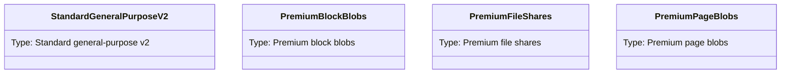
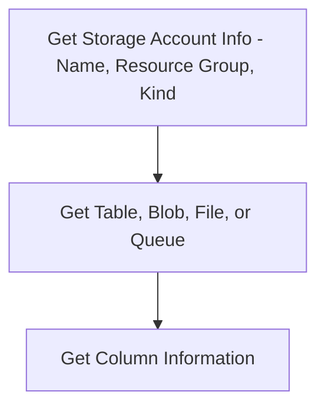

# 1. What is Azure Storage ?
>An Azure Storage Account is a unique namespace that provides a layer of abstraction over Azure Storage services, allowing us to manage and segregate our storage resources.


> An Azure storage account contains all of your Azure Storage data objects: blobs, files, queues, and tables. The storage account provides a unique namespace for your Azure Storage data that is accessible from anywhere in the world over HTTP or HTTPS.

https://learn.microsoft.com/en-us/azure/storage/common/storage-account-create?tabs=azure-portal
https://learn.microsoft.com/en-us/azure/storage/common/storage-account-overview




Azure Storage supports three types of blobs:
> 
> **Block blobs** store text and binary data. Block blobs are made up of blocks of data that can be managed individually. Block blobs can store up to about 190.7 TiB.
> **Append blobs** are made up of blocks like block blobs, but are optimized for append operations. Append blobs are ideal for scenarios such as logging data from virtual machines.
> Page blobs store random access files up to 8 TiB in size. 
> **Page blobs** store virtual hard drive (VHD) files and serve as disks for Azure virtual machines. For more information about page blobs, see Overview of Azure page blobs


# 2. Gui

From Azure Home --> Storage Accounts


I can create a storage account. Once again, the most important item is the subscription, which is an identifier for MS to charge me!!


## Storage Browser
Storage can have Blob containers, File shares, Tables, and Queues


---


# 3. Overall Process


## 3.1 Enumeration with AZ CLI. 
Storage Account info 
```
az storage account list 

az storage account list |ConvertFrom-Json|select-Object name,resourcegroup, kind,sku


az storage account show --name <databaseName> --resource-group <resourceGroupName> --query "{name:name, kind:kind, sku:sku.name}" --output table


```

Once Again, there are four major types of storage. 

../Azure Services/Azure Storage Account

```
az storage table list --account-name custdatabase --auth-mode login
az storage container list --auth-mode login --account-name storageqaenv --output table


```

Get Column information

```
az storage entity query --table-name customers --account-name custdatabase --output table --auth-mode login
```


## 3.2 Enumeration with AZ powershell
```powershell
# Get storage accounts
Get-AzStorageAccount | fl
# Get rules to access the storage account
Get-AzStorageAccount | select -ExpandProperty NetworkRuleSet
# Get IPs
(Get-AzStorageAccount | select -ExpandProperty NetworkRuleSet).IPRules
# Get containers of a storage account
Get-AzStorageContainer -Context (Get-AzStorageAccount -name <NAME> -ResourceGroupName <NAME>).context
# Get blobs inside container
Get-AzStorageBlob -Container epbackup-planetary -Context (Get-AzStorageAccount -name <name> -ResourceGroupName <name>).context
# Get a blob from a container
Get-AzStorageBlobContent -Container <NAME> -Context (Get-AzStorageAccount -name <NAME> -ResourceGroupName <NAME>).context -Blob <blob_name> -Destination .\Desktop\filename.txt
```


# 4. Blob?

Blob can be access via url using the following schematic. 
`https://<account>.blob.core.windows.net/<container>/<blob-name>`

In Blob, versioning matter.
 

https://learn.microsoft.com/en-us/azure/storage/blobs/versioning-overview
>You can enable Blob storage versioning to automatically maintain previous versions of an object. When blob versioning is enabled, you can access earlier versions of a blob to recover your data if it's modified or deleted.

More on. [1. Azure Blob Container to Initial Access](<../../../0.2. Attack Cloud/0.2.3. Azure/PwnedLabs/1. Azure Blob Container to Initial Access.md>)


