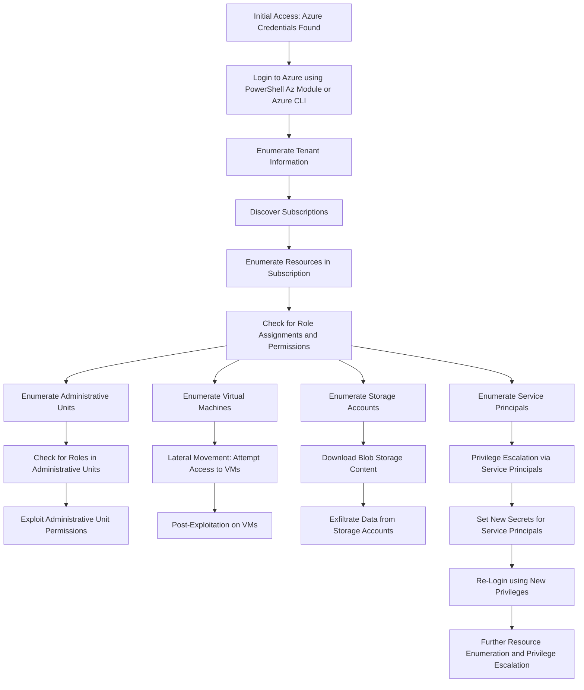

---
{"dg-publish":true,"permalink":"/1-hack-like-a-script-kiddie/clouds/azure/enumerate-with-credentials/","noteIcon":"","created":"2025-04-15T14:11:19.593-04:00"}
---





```bash
az account list 
az account tenant list # Current tenant info
az account subscription list # Current subscription info
az ad signed-in-user show # Current signed-in user
az ad signed-in-user list-owned-objects # Get owned objects by current user
az account management-group list #Not allowed by default
az resource list

# Role assignment
$ az account show --query user.type -o tsv
$ az role assignment list --assignee <APP_ID> --all

$ az role assignment list --assignee $(az account show --query user.name -o tsv) --all


```