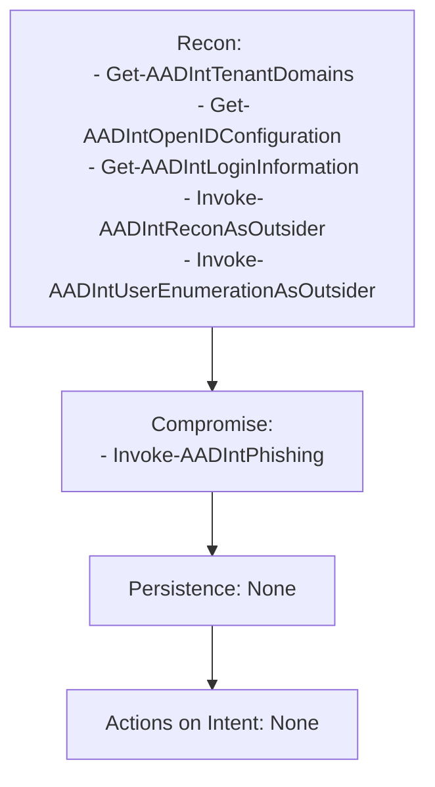
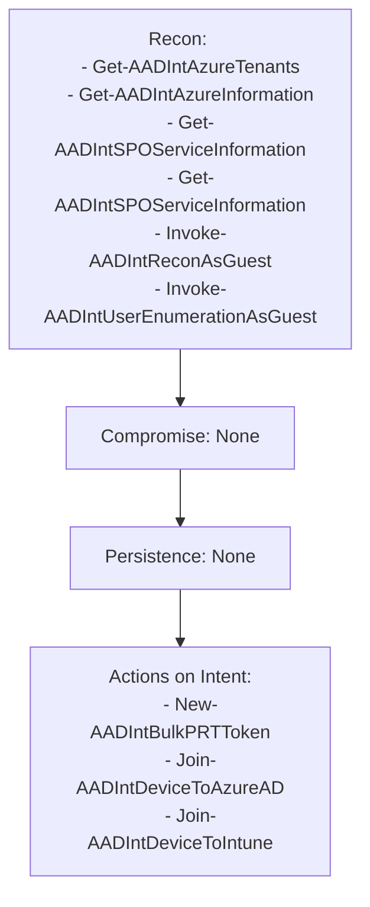
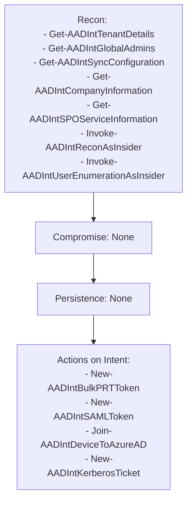
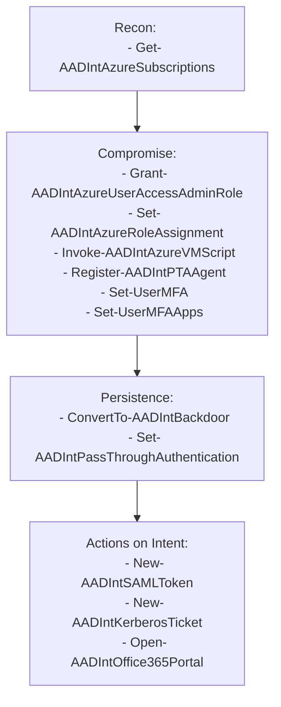
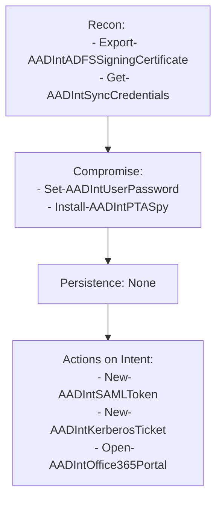

---
{"dg-publish":true,"permalink":"/1-hack-like-a-script-kiddie/clouds/azure/tool-aad-internal/","noteIcon":"","created":"2025-04-15T14:11:19.596-04:00"}
---


# Azure AD and Microsoft 365 Kill Chain
https://aadinternals.com/aadkillchain/


Image from [AADinternals](https://aadinternals.com/aadkillchain/)

```powershell
# Install the module
Install-Module -Name "AADInternals"

# Import the module
Import-Module -Name "AADInternals"
```

---

# Markdown Table

| User Level        | Recon Commands                                                                                                                                                                                                 | Compromise Commands                                                                                                                                                                    | Persistence Commands                                                  | Actions on Intent Commands                                                                  |
| ----------------- | -------------------------------------------------------------------------------------------------------------------------------------------------------------------------------------------------------------- | -------------------------------------------------------------------------------------------------------------------------------------------------------------------------------------- | --------------------------------------------------------------------- | ------------------------------------------------------------------------------------------- |
| Add Cache         | Get-AADIntAccessTokenForAADGraph  -SaveToCache<br>                                                                                                                                                             |                                                                                                                                                                                        |                                                                       |                                                                                             |
| **Outsider**      | `Get-AADIntTenantDomains`,<br>`Get-AADIntOpenIDConfiguration`, <br>`Get-AADIntLoginInformation`, <br>`Invoke-AADIntReconAsOutsider`,<br> `Invoke-AADIntUserEnumerationAsOutsider`                              | `Invoke-AADIntPhishing`                                                                                                                                                                |                                                                       |                                                                                             |
| **Guest**         | `Get-AADIntAzureTenants`,<br> `Get-AADIntAzureInformation`,<br> `Get-AADIntSPOSiteUsers`,<br> `Invoke-AADIntReconAsGuest`,<br> `Invoke-AADIntUserEnumerationAsGuest`                                           |                                                                                                                                                                                        |                                                                       | `New-AADIntBulkPRTToken`,<br> `Join-AADIntDeviceToAzureAD`, <br>`Join-AADIntDeviceToIntune` |
| **User**          | `Get-AADIntTenantDetails`,<br> `Get-AADIntGlobalAdmins`,<br> `Get-AADIntSyncConfiguration`,<br> `Get-AADIntCompanyInformation`, <br>`Invoke-AADIntReconAsInsider`, <br>`Invoke-AADIntUserEnumerationAsInsider` |                                                                                                                                                                                        |                                                                       | `New-AADIntSAMLToken`, <br>`New-AADIntKerberosTicket`,<br> `Open-AADIntOffice365Portal`     |
| **Admin**         | `Get-AADIntAzureSubscriptions`                                                                                                                                                                                 | `Grant-AADIntAzureUserAccessAdminRole`, <br>`Set-AADIntAzureRoleAssignment`, <br>`Invoke-AADIntAzureVMScript`, <br>`Register-AADIntPTAAgent`, <br>`Set-UserMFA`,<br> `Set-UserMFAApps` | `ConvertTo-AADIntBackdoor`,<br> `Set-AADIntPassThroughAuthentication` | `New-AADIntSAMLToken`, <br>`New-AADIntKerberosTicket`, <br>`Open-AADIntOffice365Portal`     |
| **On-prem Admin** | `Export-AADIntADFSSigningCertificate`, <br>`Get-AADIntSyncCredentials`, <br>`Set-AADIntUserPassword`, <br>`Install-AADIntPTASpy`                                                                               |                                                                                                                                                                                        |                                                                       | `New-AADIntSAMLToken`, <br>`New-AADIntKerberosTicket`, <br>`Open-AADIntOffice365Portal`     |


# Mermaid
Here are the full diagrams including all commands per user level:

### 1. Outsider



### 2. Guest



### 3. User



### 4. Admin



### 5. On-prem Admin


