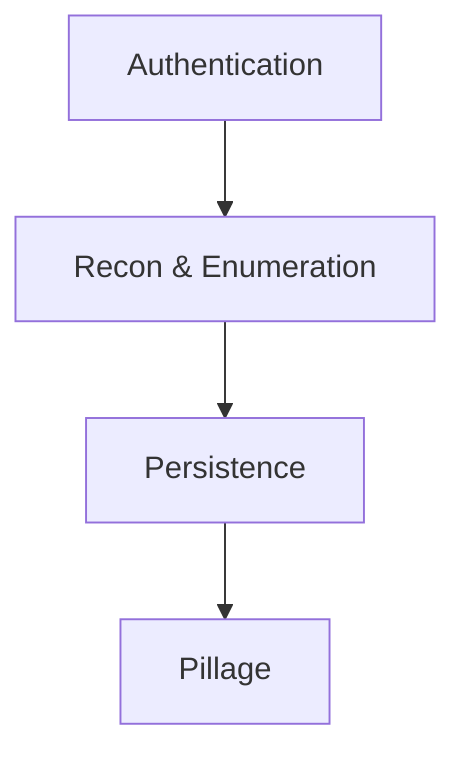
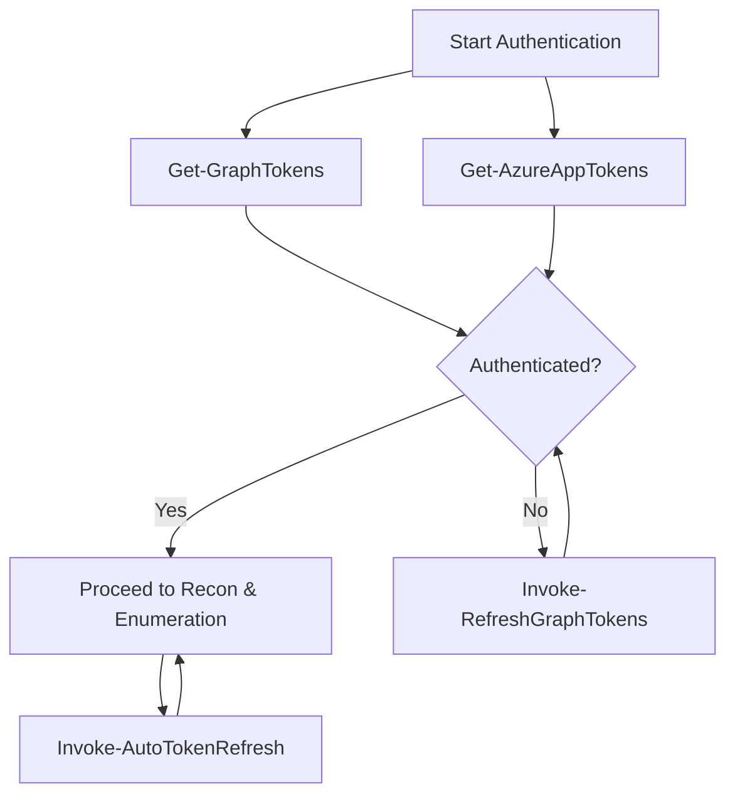
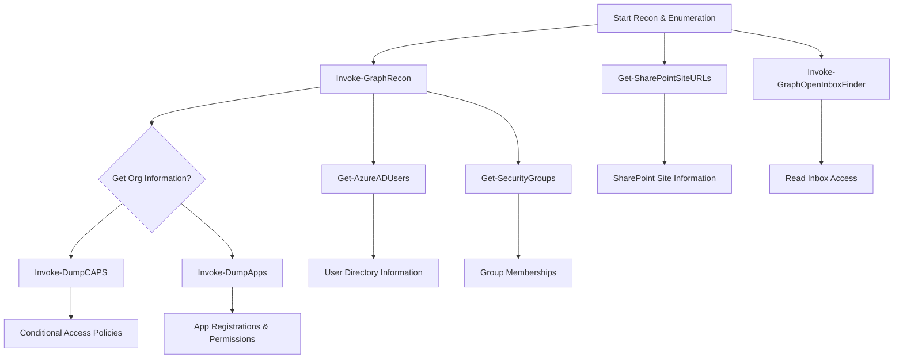
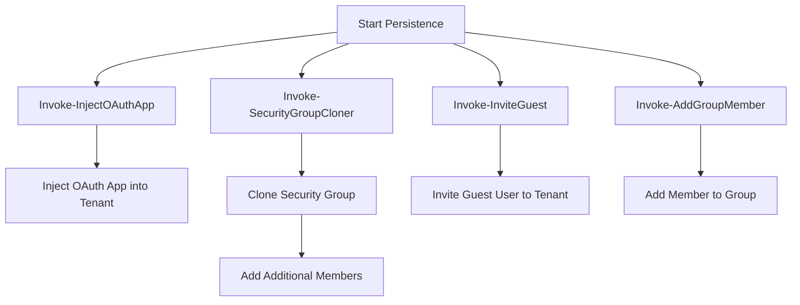
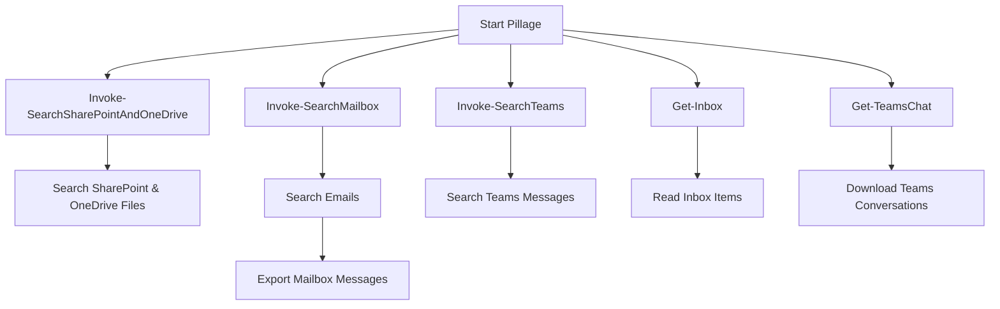

---
{"dg-publish":true,"permalink":"/1-hack-like-a-script-kiddie/clouds/azure/tool-graph-runner/","noteIcon":"","created":"2025-04-15T14:11:19.596-04:00"}
---


# 4. Tools
# 4.1 GraphRunner - Black Hill
According to Black Hill, GraphRunner is a post exploitation tool to get information regarding Graph API. [Video](https://www.youtube.com/watch?v=o29jzC3deS0)
```
IEX (iwr 'https://raw.githubusercontent.com/dafthack/GraphRunner/main/GraphRunner.ps1')
```

The github repository: [GraphRunner](https://github.com/dafthack/GraphRunner/) 

If you don't know where to start, `List-GraphRunnerModules` is a good start.

The best examples are here. [[PwnedLabs/4. Loot Exchange, Teams and SharePoint with GraphRunner\|../PwnedLabs/4. Loot Exchange, Teams and SharePoint with GraphRunner]]


| **Category**            | **Command**                          | **Description**                                                                |
| ----------------------- | ------------------------------------ | ------------------------------------------------------------------------------ |
| **Authentication**      | `Get-GraphTokens`                    | Authenticate as a user to Microsoft Graph                                      |
|                         | `Invoke-RefreshGraphTokens`          | Use a refresh token to obtain new access tokens                                |
|                         | `Get-AzureAppTokens`                 | Complete OAuth flow as an app to obtain access tokens                          |
|                         | `Invoke-RefreshAzureAppTokens`       | Use a refresh token and app credentials to refresh a token                     |
|                         | `Invoke-AutoTokenRefresh`            | Refresh tokens at an interval                                                  |
| **Recon & Enumeration** | `Invoke-GraphRecon`                  | General recon for org info, user settings, directory sync settings, etc.       |
|                         | `Invoke-DumpCAPS`                    | Gets conditional access policies                                               |
|                         | `Invoke-DumpApps`                    | Gets app registrations and external enterprise apps, along with consent info   |
|                         | `Get-AzureADUsers`                   | Retrieves user directory                                                       |
|                         | `Get-SecurityGroups`                 | Retrieves security groups and their members                                    |
|                         | `Get-UpdatableGroups`                | Finds groups that can be modified by the current user                          |
|                         | `Get-DynamicGroups`                  | Displays membership rules for dynamic groups                                   |
|                         | `Get-SharePointSiteURLs`             | Lists SharePoint site URLs visible to the user                                 |
|                         | `Invoke-GraphOpenInboxFinder`        | Checks inboxes in a list to see if they are readable                           |
|                         | `Get-TenantID`                       | Retrieves the tenant GUID from the domain name                                 |
| **Persistence**         | `Invoke-InjectOAuthApp`              | Injects an app registration into the tenant                                    |
|                         | `Invoke-SecurityGroupCloner`         | Clones a security group with an identical name, injecting another user as well |
|                         | `Invoke-InviteGuest`                 | Invites a guest user to the tenant                                             |
|                         | `Invoke-AddGroupMember`              | Adds a member to a group                                                       |
| **Pillage**             | `Invoke-SearchSharePointAndOneDrive` | Searches across SharePoint sites and OneDrive drives                           |
|                         | `Invoke-ImmersiveFileReader`         | Opens restricted files with the immersive reader                               |
|                         | `Invoke-SearchMailbox`               | Performs deep searches across a user's mailbox and exports messages            |
|                         | `Invoke-SearchTeams`                 | Searches all Teams messages in readable channels                               |
|                         | `Invoke-SearchUserAttributes`        | Searches for terms across user attributes                                      |
|                         | `Get-Inbox`                          | Gets latest inbox items, can read shared mailboxes                             |
|                         | `Get-TeamsChat`                      | Downloads full Teams chat conversations                                        |
| **GraphRunner**         | `Invoke-GraphRunner`                 | Runs multiple recon and search commands in sequence                            |
| **Supplemental**        | `Invoke-AutoOAuthFlow`               | Automates OAuth flow to obtain access/refresh tokens                           |
|                         | `Invoke-DeleteOAuthApp`              | Deletes an OAuth App                                                           |
|                         | `Invoke-DeleteGroup`                 | Deletes a group                                                                |
|                         | `Invoke-RemoveGroupMember`           | Removes a user from a group                                                    |
|                         | `Invoke-DriveFileDownload`           | Downloads files from SharePoint/OneDrive                                       |
|                         | `Invoke-CheckAccess`                 | Checks if tokens are valid                                                     |
|                         | `Invoke-HTTPServer`                  | Basic web server for accessing emailviewer output                              |
|                         | `Invoke-BruteClientIDAccess`         | Tests different client IDs to determine permissions                            |
|                         | `Invoke-ImportTokens`                | Imports tokens from other tools for GraphRunner                                |
|                         | `Get-UserObjectID`                   | Retrieves Object ID for a user                                                 |


---

## 4.2 Complete Workflow of System Information Gaining

This complete flow shows how testers can move from authentication to recon, persistence, and ultimately data extraction.



Each stage flows into the next, allowing the tester to progressively gain more access and extract more information from the system.
### 4.2.1 Authentication Flow

Testers need to authenticate with the system to gain access to its data and services. Here's a flow showing how the authentication process works.



This flow shows how a tester authenticates with Microsoft Graph using either **user tokens** or **app tokens**. If tokens are expired, they can be refreshed.

---

### 4.2.2. Recon & Enumeration Flow

After authentication, testers move on to gathering system information through recon and enumeration commands.



This flow covers general recon like getting org information, app registrations, conditional access policies, user directories, group memberships, SharePoint site URLs, and inbox access.

---

### 4.2.3. Persistence Flow

Once testers have basic access, they may attempt to maintain their access by creating persistence mechanisms in the system.



In the persistence stage, testers can inject OAuth apps, clone security groups to create persistence backdoors, or add new group members.

---

### 4.2.4. Pillage Flow

After gaining persistence, testers can move on to extracting sensitive information from the system, such as files, emails, and Teams conversations.



In the pillage phase, testers can search SharePoint sites, OneDrive, mailboxes, and Teams for sensitive data that may be available to them.

---


