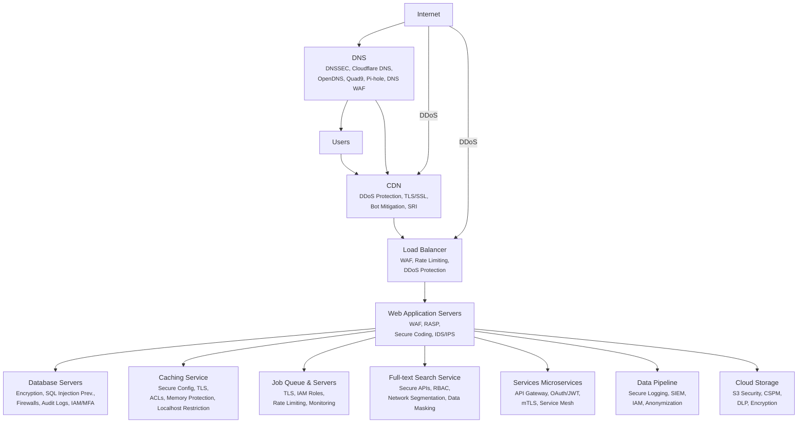

---
{"dg-publish":true,"permalink":"/0-learn-like-a-systems-engineer/web/1-attack-web-application/","noteIcon":"","created":"2025-04-15T14:11:19.587-04:00"}
---

Learn the basic Web architecture from here.
[[0. Web Architecture 101\|0. Web Architecture 101]]

| **Component**                      | **Defense Mechanism**                                                | **Attack Tactics**                                                                                                           |
| ---------------------------------- | -------------------------------------------------------------------- | ---------------------------------------------------------------------------------------------------------------------------- |
| **DNS (Domain Name System)**       | DNSSEC, Cloudflare DNS, OpenDNS, Quad9, Pi-hole, DNS WAF             | DNS Spoofing, DNS Cache Poisoning, DDoS on DNS, Subdomain Takeover                                                           |
| **Load Balancer**                  | WAF, Rate Limiting, DDoS Protection                                  | HTTP Flood, SYN Flood, Smurf Attack, Slowloris, Layer 7 Bypass, API Rate-Limiting Bypass                                     |
| **Web Application Servers**        | WAF, RASP, Secure Coding, IDS/IPS                                    | SQL Injection, XSS, SSRF, CSRF, Command Injection, RCE, LFI, Directory Traversal, Log Forging, User-Agent Spoofing           |
| **Database Servers**               | Encryption, SQL Injection Prevention, Firewalls, Audit Logs, IAM/MFA | SQL Injection, NoSQL Injection, Privilege Escalation, Credential Stuffing, Brute Force, Data Exfiltration                    |
| **Caching Service**                | Secure Config, TLS, ACLs, Memory Protection, Localhost Restriction   | Cache Poisoning, Cache Side-Channel Attacks, Race Conditions, Unauthorized Access (Improper ACLs), Exploiting Unexpired Data |
| **Job Queue & Servers**            | TLS, IAM Roles, Rate Limiting, Monitoring                            | Message Queue Injection, Privilege Escalation, Job Overload (Denial-of-Service), Race Conditions, IAM Policy Bypass          |
| **Full-text Search Service**       | Secure APIs, RBAC, Network Segmentation, Data Masking                | Search Query Injection, Data Leakage, Index Corruption, Unauthorized Query Execution                                         |
| **Services (Microservices)**       | API Gateway, OAuth/JWT, mTLS, Service Mesh                           | API Token Theft, JWT Manipulation, OAuth Token Reuse, Microservices Pivoting, API Rate Limit Bypass                          |
| **Data Pipeline**                  | Secure Logging, SIEM, IAM, Anonymization                             | Log Forging, SIEM Evasion, Data Manipulation, Insider Threats, Log Injection                                                 |
| **Cloud Storage**                  | S3 Security, CSPM, DLP, Encryption                                   | Misconfigured Buckets, Privilege Escalation, Object Poisoning, Data Exfiltration, Ransomware on Cloud Storage                |
| **CDN (Content Delivery Network)** | DDoS Protection, TLS/SSL, Bot Mitigation, SRI                        | HTTP Flood, Slowloris Attack, SSL Stripping, Cache Poisoning, Credential Stuffing                                            |

