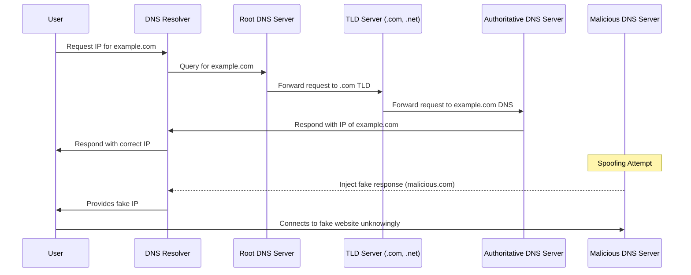
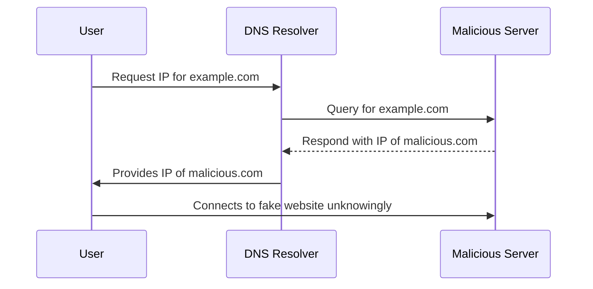
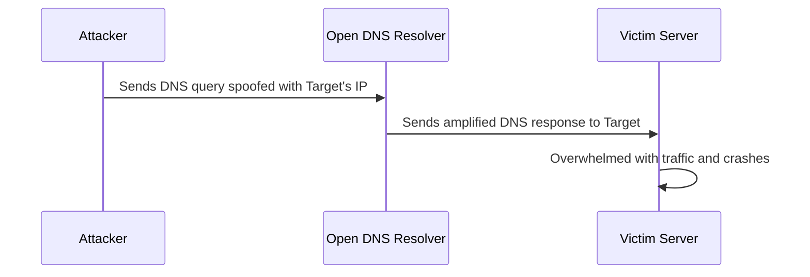
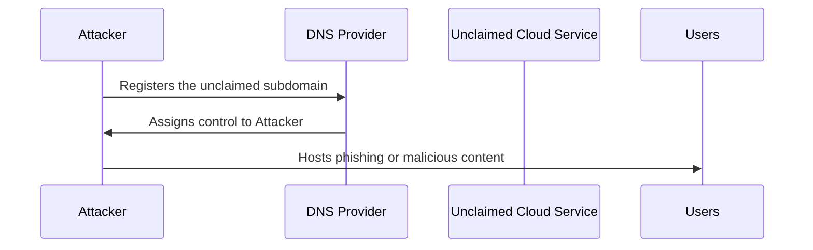

---
{"dg-publish":true,"permalink":"/0-learn-like-a-systems-engineer/web/2-dns-security-defen-ding-against-attacks/","noteIcon":"","created":"2025-04-15T14:11:19.588-04:00"}
---

# **1. DNS Reconnaissance Tools**
Here’s a **consolidated table** organizing all the techniques into **categories** for better readability and quick reference.

---

## **1.1. Reconnaissance & Enumeration Techniques**

| **Category**                   | **Tools & Commands**                                                        | **Purpose**                                                         |
| ------------------------------ | --------------------------------------------------------------------------- | ------------------------------------------------------------------- |
| **Domains & Subdomains**       | `whois <domain>`, [`whois.domaintools.com`](https://whois.domaintools.com/) | Retrieves domain registration info                                  |
|                                | `nslookup <domain>` / `dig <domain> @1.1.1.1`                               | Resolves domain to IP                                               |
|                                | [`dnscan`](https://github.com/rbsec/dnscan)                                 | Subdomain enumeration                                               |
|                                | `theHarvester -d <domain> -b all`                                           | OSINT subdomain harvesting                                          |
| **IP Ranges & Infrastructure** | [`BGP Toolkit`](https://bgp.he.net/)                                        | Finds ASN, netblocks, and hosting providers                         |
|                                | [`Shodan.io`](https://www.shodan.io/)                                       | Finds exposed infrastructure                                        |
|                                | `nslookup -query=A/PTR/MX/TXT <domain>`                                     | Finds infrastructure details                                        |
| **Virtual Hosts**              | `ffuf -w vhosts.txt -u http://<IP> -H "Host: FUZZ.<domain>"`                | Virtual host discovery                                              |

---

### **1.2. Passive Reconnaissance**

|**Category**|**Tools & Commands**|**Purpose**|
|---|---|---|
|**WHOIS & DNS Lookup**|`whois <domain>` / [`viewdns.info`](https://viewdns.info/)|Gets ownership & registration data|
||`dig any <domain> @8.8.8.8`|Fetches all DNS records|
|**Certificate Transparency**|[`crt.sh`](https://crt.sh) / [`censys.io`](https://censys.io)|Finds issued SSL/TLS certificates|
|**Archived Data**|[`sitereport.netcraft.com`](https://sitereport.netcraft.com)|Retrieves historical domain info|
||[`Wayback Machine`](http://web.archive.org/)|Finds past versions of web pages|
|**Social Media & OSINT**|[`LinkedInt`](https://github.com/vysecurity/LinkedInt)|Scrapes LinkedIn for employee emails|
||`hunter.io` / `epieos.com`|Finds public email addresses|

---

### **1.3. Active Reconnaissance**

| **Category**              | **Tools & Commands**                                   | **Purpose**                      |
| ------------------------- | ------------------------------------------------------ | -------------------------------- |
| **Web Enumeration**       | `curl -I "http://<TARGET>"`                            | Checks HTTP headers              |
|                           | `whatweb -a3 <domain> -v`                              | Identifies technologies          |
|                           | `wafw00f -v <domain>`                                  | Detects web application firewall |
| **Subdomain Enumeration** | `amass enum -d <domain>`                               | Finds subdomains                 |
|                           | `subfinder -d <domain>`                                | Discovers active subdomains      |
|                           | `gobuster dns -d <domain> -w wordlist.txt`             | Brute-force subdomains           |
|                           | `sublist3r -d <domain>`                                | Passive subdomain discovery      |
| **Zone Transfers**        | `nslookup -type=NS <domain>`                           | Finds authoritative nameservers  |
|                           | `nslookup -type=any -query=AXFR <domain> <Nameserver>` | Attempts zone transfer           |

---

### **1.4. Web Application Attack Surface**

| **Category**                      | **Tools & Commands**                                                   | **Purpose**                    |
| --------------------------------- | ---------------------------------------------------------------------- | ------------------------------ |
| **Directory & File Discovery**    | `dirsearch -u <domain>`                                                | Finds hidden files/directories |
|                                   | `ffuf -w directories.txt -u http://<domain>/FUZZ`                      | Fuzzes web directories         |
|                                   | `cewl -m5 --lowercase -w wordlist.txt <domain>`                        | Generates custom wordlists     |
| **Parameter Fuzzing**             | `ffuf -w params.txt -u http://<domain>/index.php?FUZZ=value`           | Detects hidden parameters      |
| **Subdomain Fuzzing**             | `ffuf -w subdomains.txt -u https://FUZZ.<domain>`                      | Discovers subdomains           |
| **Virtual Host Fuzzing**          | `ffuf -w vhosts.txt -u http://<domain>:PORT/ -H "Host: FUZZ.<domain>"` | Finds virtual hosts            |
| **Web Technology Fingerprinting** | `whatweb -a3 <domain>`                                                 | Detects CMS & web stack        |
|                                   | `Wappalyzer`                                                           | Identifies technologies used   |

---

### **1.5. Web Exploitation & Attacks**

| **Category**                           | **Tools & Commands**                                                                                           | **Purpose**                         |
| -------------------------------------- | -------------------------------------------------------------------------------------------------------------- | ----------------------------------- |
| **SQL Injection**                      | `sqlmap -u "<url>" --dbs`                                                                                      | Automated SQL injection             |
| **Command Injection**                  | `curl -X POST -d 'cmd=id' http://<domain>/admin.php`                                                           | Tests for command injection         |
| **File Upload Vulnerability**          | `curl -F 'file=@shell.php' http://<domain>/upload.php`                                                         | Tests for unrestricted file uploads |
| **Cross-Site Scripting (XSS)**         | `echo "alert(1)"                                                                                               | curl -d @- http:///search.php`      |
| **Server-Side Request Forgery (SSRF)** | `curl -X POST -d 'url=http://localhost/admin' http://<domain>/fetch.php`                                       | Attempts internal requests          |
| **Brute-Forcing Credentials**          | `hydra -l admin -P passwords.txt <domain> http-form-post "/login:username=^USER^&password=^PASS^:F=incorrect"` | Tries password lists                |

---

### **1.6. Miscellaneous Reconnaissance**

|**Category**|**Tools & Commands**|**Purpose**|
|---|---|---|
|**Google Dorking**|`site:<domain> filetype:pdf`|Finds leaked PDFs|
||`intext:"@<domain>"`|Searches for public email addresses|
|**Reverse Email Lookup**|[`epieos.com`](https://epieos.com/)|Finds accounts linked to an email|
|**Credential Leaks**|[`dehashed.com`](https://dehashed.com/)|Checks for leaked credentials|
|**Cloud Bucket Exposure**|[`GrayHat Warfare`](https://buckets.grayhatwarfare.com/)|Finds exposed AWS/Azure buckets|
|**Spiderfoot (OSINT automation)**|[`Spiderfoot`](https://github.com/smicallef/spiderfoot)|Automates reconnaissance|

# **2. Introduction to DNS** - Number to Letter

The **Domain Name System (DNS)** is fundamental to how the internet works, translating **human-readable domain names** (e.g., `example.com`) into **machine-readable IP addresses** (e.g., `192.168.1.1`). 

---

# **3. Common DNS Attack Tactics**

### **3.1 DNS Spoofing (Cache Poisoning)**

DNS Spoofing, also known as **DNS Cache Poisoning**, occurs when an attacker injects **fraudulent DNS records** into a resolver’s cache. This redirects users from a legitimate website to a **malicious** one.

#### **Example Attack Flow**

---

### **3.2 DNS Amplification (DDoS on DNS)**

A **Distributed Denial-of-Service (DDoS) attack** abuses misconfigured DNS servers to generate **large responses to small requests**, overwhelming a target server.

#### **Example Attack Flow**

---

### **3.3 Subdomain Takeover**

Subdomain takeover occurs when a **dangling DNS record** (pointing to an unclaimed cloud service) is hijacked by an attacker.

#### **Example Attack Flow**

---

## **4. Tools for DNS Security**

To mitigate DNS-based attacks, organizations use a combination of **preventive** and **reactive** security tools:

|**Tool**|**Purpose**|
|---|---|
|**DNSSEC**|Digitally signs DNS records to prevent spoofing and cache poisoning|
|**Cloudflare DNS**|Provides **DDoS protection**, encrypted DNS queries, and domain filtering|
|**OpenDNS**|Offers **malware and phishing protection** via DNS filtering|
|**Quad9**|Blocks access to **malicious domains** using real-time threat intelligence|
|**Pi-hole**|Blocks **malicious and tracking DNS requests** at the network level|
|**DNS WAF**|Protects against **malicious DNS traffic and query flooding** (e.g., AWS Route 53 DNS Firewall)|

---
