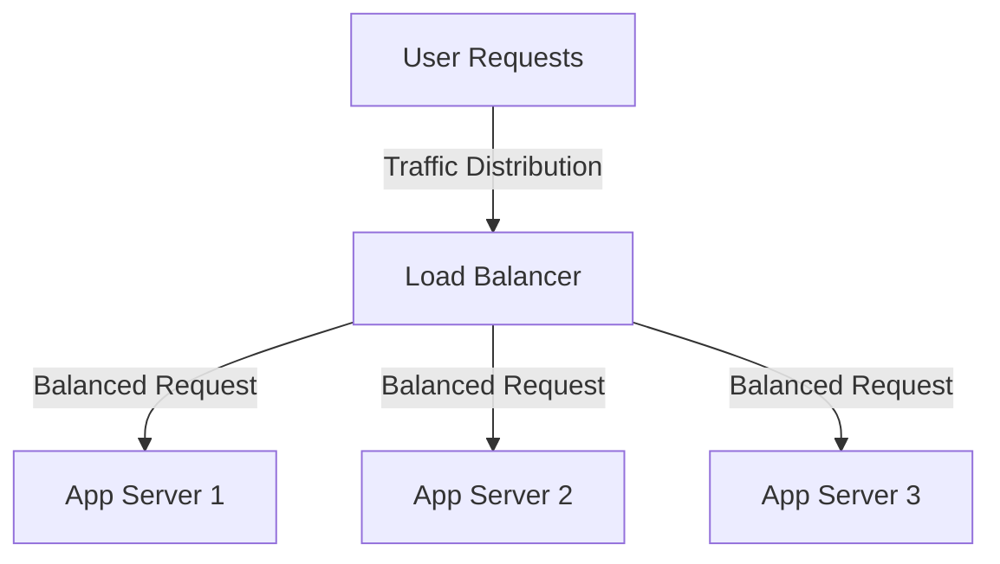

---
{"dg-publish":true,"permalink":"/0-learn-like-a-systems-engineer/web/3-load-balancer-security-defending-against-attacks/","noteIcon":"","created":"2025-04-15T14:11:19.588-04:00"}
---


### **Bypassing Load Balancers: Techniques & Methods**

Load balancers act as **traffic distributors**, ensuring high availability and security. However, **attackers can bypass load balancers** using misconfigurations, direct server access, or evasion techniques. 


| **Bypass Technique**                       | **Attack Method**                                         | **Tools/Example Commands**                                                                                                                                                                                                                                                  | **Mitigation Strategies**                                               |
| ------------------------------------------ | --------------------------------------------------------- | --------------------------------------------------------------------------------------------------------------------------------------------------------------------------------------------------------------------------------------------------------------------------- | ----------------------------------------------------------------------- |
| **1. Direct IP Access**                    | Discover origin server and bypass Load Balancer           | `dig A <domain>` `shodan host <domain>`                                                                                                                                                                                                                                     | Restrict access to origin using **firewall rules & Cloudflare masking** |
| **2. Host Header Injection**               | Manipulate `Host` header to access internal services      | `curl -H "Host: internal.target.com" http://target.com`                                                                                                                                                                                                                     | Enable **Strict Host Header Validation** in Load Balancer               |
| **3. X-Forwarded-For (XFF) Spoofing**      | Spoof client IP to bypass WAF/rate limits                 | `curl -H "X-Forwarded-For: 127.0.0.1" http://target.com`<br><br>Other Common Host Header:<br>    - `X-Forwarded-Host`<br>    - `X-HTTP-Host-Override`<br>    - `Forwarded`<br>    - `X-Host`<br>    - `X-Forwarded-Server`                                                  | Validate **only trusted proxies**, rate-limit via **session tokens**    |
| **3a. Exploiting Blacklist-Based Filters** | Alternative ways to represent `localhost                  | <br>\| Decimal\| `2130706433`\|<br>\| Hexadecimal\| `0x7f000001`\|<br>\| Octal\| `0177.0000.0000.0001`\|<br>\| Zero\| `0`\|<br>\| Short Form\| `127.1`\|<br>\| IPv6\| `::1`\|<br>\| IPv4 in IPv6\| `[0:0:0:0:0:ffff:127.0.0.1]` \|<br>\| External Domain \|`localtest.me`\| |                                                                         |
| **4. Slow HTTP Attack (Slowloris)**        | Send partial HTTP headers to exhaust server resources     | `slowhttptest -c 1000 -H -g -o output -u http://target.com`                                                                                                                                                                                                                 | Set **aggressive timeouts** for incomplete requests                     |
| **5. WebSocket Bypass**                    | Exploit unprotected WebSocket connections                 | `var ws = new WebSocket("ws://target.com/admin"); ws.send("GET /bypass")`                                                                                                                                                                                                   | Enable **Layer 7 WebSocket inspection** and authentication              |
| **6. API Rate Limit Bypass**               | Rotate IPs, use multiple tokens to exceed rate limits     | `for i in {1..1000}; do curl -H "Authorization: Bearer token_$i" http://api.target.com; done`                                                                                                                                                                               | Implement **behavior-based rate limiting** instead of IP-based          |
| **7. Load Balancer Cache Poisoning**       | Inject malicious responses into cached content            | `GET /search?q=<script>alert(1)</script>`                                                                                                                                                                                                                                   | Disable **caching for dynamic pages**, sanitize **user input**          |
| **8. Bursting Traffic (DDoS Evasion)**     | Send short bursts of high traffic to overwhelm the system | `hping3 -c 5000 -d 120 -S -w 64 -p 443 --flood target.com`                                                                                                                                                                                                                  | Deploy **AI-based WAF & auto-scaling** to handle traffic anomalies      |

---

## **1. Direct IP Access (Origin Server Exposure)**

### 🔥 **Attack Method**

- Many websites have an **origin server** (actual backend server) that sits **behind a load balancer**.

### **🛠 How Attackers Find Origin Servers:**

| **Technique**                | **Tool/Command**                                          |
| ---------------------------- | --------------------------------------------------------- |
| **DNS Enumeration**          | `dig A <domain>`                                          |
| **Historical DNS Data**      | [SecurityTrails](https://securitytrails.com/)             |
| **Shodan / Censys**          | `shodan host <domain>`                                    |
| **SNI Sniffing**             | `openssl s_client -connect <IP>:443 -servername <domain>` |
| **Email Headers**            | `dig MX <domain>`                                         |
| **Common Misconfigurations** | Check HTTP response headers for real IP                   |

### **🔒 Mitigation**

✅ Use **Cloudflare / AWS Route 53 DNS masking**  
✅ Restrict **direct access** to the origin server (allow only LB IPs)  
✅ Configure **firewall rules** to allow traffic **only from the load balancer**

---

## **2. Host Header Injection (Server-Side Confusion)**

### 🔥 **Attack Method**

- Some backend servers **trust the `Host` header** to determine which domain to serve.
- If the load balancer forwards the request **without validation**, an attacker can manipulate the header to access **internal apps**.

### **🛠 Exploit Example**

```http
GET /admin HTTP/1.1
Host: internal.target.com
```

### **🔒 Mitigation**

✅ Enable **Strict Host Header Validation**  
✅ Use **WAF rules** to block unexpected **Host headers**

---

## **3. X-Forwarded-For (XFF) Header Abuse**

### 🔥 **Attack Method**

- Many load balancers **forward the client’s IP** using the `X-Forwarded-For` header.
- Attackers can spoof this header to **evade rate limits and WAF rules**.

### **🛠 Exploit Example**

```http
X-Forwarded-For: 127.0.0.1
```

### **🔒 Mitigation**

✅ Use **rate limiting based on session tokens** instead of IP  
✅ Configure WAF to verify **only trusted proxies**

---

## **4. Slow HTTP Attacks (Slowloris Bypass)**

### 🔥 **Attack Method**

- **Slowloris Attack** keeps connections open without completing requests, **exhausting server resources**.
- Some **Layer 7 Load Balancers** fail to detect this if request timeouts aren’t enforced.

### **🛠 Exploit Example**

```bash
slowhttptest -c 1000 -H -g -o output -u http://target.com -r 200 -l 300
```

### **🔒 Mitigation**

✅ Set **aggressive timeout policies** on incomplete HTTP headers  
✅ Block clients with **high connection persistence**

---

## **5. WebSocket Load Balancer Bypass**

### 🔥 **Attack Method**

- Many load balancers don’t inspect **WebSocket traffic (`ws://`)**, allowing attackers to tunnel **malicious payloads**.

### **🛠 Exploit Example**

```javascript
var ws = new WebSocket("ws://target.com/admin");
ws.send("GET /bypass-admin HTTP/1.1");
```

### **🔒 Mitigation**

✅ Use **Layer 7 WAF with WebSocket inspection**  
✅ Restrict **unauthenticated WebSocket connections**

---

## **6. API Rate Limiting Bypass**

### 🔥 **Attack Method**

- **Rotate IPs** using botnets to bypass **API rate limits**.
- Use **different tokens** (JWT, OAuth) to bypass per-user restrictions.

### **🛠 Exploit Example**

```bash
for i in {1..1000}; do curl -H "Authorization: Bearer token_$i" http://api.target.com/login; done
```

### **🔒 Mitigation**

✅ Use **behavior-based rate limiting** (not just IP-based)  
✅ Implement **reCAPTCHA** for sensitive API endpoints

---

## **7. Load Balancer Cache Poisoning**

### 🔥 **Attack Method**

- If the load balancer **caches user input**, an attacker can inject **malicious responses** into the cache.
- This leads to **stored XSS, CSRF, or HTML Injection**.

### **🛠 Exploit Example**

```http
GET /search?q=<script>alert(1)</script> HTTP/1.1
```

### **🔒 Mitigation**

✅ Disable **caching for dynamic pages**  
✅ Sanitize **user input before caching**

---

## **8. Bursting Traffic to Overload Load Balancer**

### 🔥 **Attack Method**

- Instead of a sustained **DDoS**, attackers send **bursts of high-volume traffic** to exhaust **rate limits and WAF rules**.

### **🛠 Exploit Example**

```bash
hping3 -c 5000 -d 120 -S -w 64 -p 443 --flood target.com
```

### **🔒 Mitigation**

✅ Use **behavior-based** traffic analysis (AI-based WAFs)  
✅ Enable **auto-scaling** to absorb spikes

---

### **💡 Final Thoughts**

🔹 **Load balancers help mitigate attacks, but attackers can still find ways to bypass them**.  
🔹 **Combining WAF, rate limiting, strict origin access, and anomaly detection** is key.

Would you like a **hands-on demo** of any technique? 🚀


## **A. Introduction to Load Balancers**

A **Load Balancer** distributes incoming traffic across multiple backend servers to ensure **high availability, fault tolerance, and optimal resource utilization**. It operates at **Layer 4 (Transport Layer)** and **Layer 7 (Application Layer)**, helping to **mitigate failures, balance workloads, and provide security enhancements** like **Web Application Firewall (WAF), Rate Limiting, and DDoS Protection**.



---
## **B. Load Balancer Security Tools & Defenses**

|**Tool / Feature**|**Purpose**|
|---|---|
|**Web Application Firewall (WAF)**|Filters and blocks **malicious HTTP traffic**|
|**Rate Limiting**|Prevents excessive requests from a single IP **(API protection)**|
|**DDoS Protection**|Mitigates **SYN Floods, Smurf Attacks, and HTTP Floods**|
|**TCP SYN Cookies**|Protects against **SYN Floods** by ensuring only legitimate connections get established|
|**ICMP Rate-Limiting**|Mitigates **Smurf attacks** by limiting ICMP requests per second|
|**Connection Timeout Settings**|Prevents **Slowloris** attacks by enforcing **request completion time**|
|**Geo-IP Filtering**|Blocks requests from known malicious regions|
|**Behavioral Analysis (AI-based WAFs)**|Detects **Layer 7 Bypass techniques and API abuse**|

---

## **C. Load Balancer Attack Detection & Prevention Tools**

|**Attack Type**|**Detection Tools**|**Mitigation Techniques**|
|---|---|---|
|**HTTP Flood**|AWS Shield, Cloudflare WAF|CAPTCHA, JavaScript Challenge, Rate Limiting|
|**SYN Flood**|Wireshark, Snort, Suricata|SYN Cookies, TCP RST Thresholds|
|**Smurf Attack**|Netflow Analysis, Cloudflare DDoS|ICMP Filtering, Anti-Spoofing Measures|
|**Slowloris**|ModSecurity WAF, Fail2Ban|Timeout Policies, Rate Limiting|
|**Layer 7 Bypass**|OWASP CRS, Cloudflare Bot Management|Machine Learning-Based WAFs|
|**API Rate-Limiting Bypass**|API Gateway Analytics, AWS WAF|API Key-Based Rate Limits, Token Throttling|
