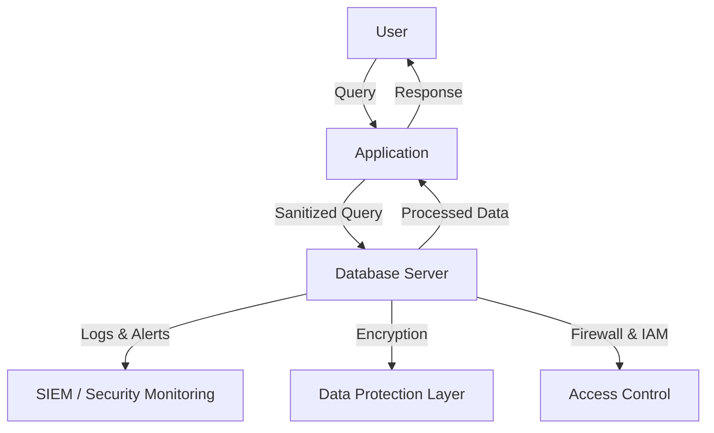

---
{"dg-publish":true,"permalink":"/0-learn-like-a-systems-engineer/web/5-databases/","noteIcon":"","created":"2025-04-15T14:11:19.589-04:00"}
---


| **SQL Injection (SQLi)** | Injection of malicious SQL statements to **read, modify, or delete database records**. | `' OR 1=1 --`<br>B: Boolean-based blind<br>	AND 1=1<br>E: Error-based<br>	AND GTID_SUBSET(@@version,0)<br>U: Union query-based<br>	UNION ALL SELECT 1,@@version,3<br>S: Stacked queries<br>	; DROP TABLE users<br>T: Time-based blind<br>	AND 1=IF(2>1,SLEEP(5),0)<br>Q: Inline queries<br>	SELECT (SELECT @@version) from<br><br>[[../../../unpublished/OSWE/References/MYSQL/SQLI Flow\|SQLI Flow]]<br>[[../../../unpublished/Web Pentesting Checklist/2.1 SQLMAP\|2.1 SQLMAP]]<br><br><br>regex <br>[[../../../unpublished/OSWE/References/Regex/regex for sqli\|regex for sqli]]<br><br><br>Setting up Debugger/logger for <br>[[../../../unpublished/OSWE/References/Debugger and Logger/Debugger-Maria\|Debugger-Maria]]<br>[[../../../unpublished/OSWE/References/Debugger and Logger/Logger - mysql\|Logger - mysql]]<br>[[../../../unpublished/OSWE/References/Debugger and Logger/Logger - SQLite\|Logger - SQLite]]<br>[[../../../unpublished/OSWE/References/Debugger and Logger/Logger - MongoDB\|Logger - MongoDB]]<br>[[../../../unpublished/OSWE/References/Debugger and Logger/Logger - PostgreSQL\|Logger - PostgreSQL]]<br>[[../../../unpublished/OSWE/References/Debugger and Logger/Logger - MS SQL Server\|Logger - MS SQL Server]]<br>[[../../../unpublished/OSWE/References/Debugger and Logger/Logger - Oracle Database\|Logger - Oracle Database]]<br><br> |
| ------------------------ | -------------------------------------------------------------------------------------- | ------------------------------------------------------------------------------------------------------------------------------------------------------------------------------------------------------------------------------------------------------------------------------------------------------------------------------------------------------------------------------------------------------------------------------------------------------------------------------------------------------------------------------------------------------------------------------------------------------------------------------------------------------------------------------------------------------------------------------------------------------------------------------------------------------------------------------------------------------------------------------------------------------------------------------------------------------------------------------------------------------------------------------------------------ |
# **1. Introduction to Database Security**

Database servers store and manage sensitive data, making them prime targets for cyberattacks. A well-secured database must incorporate **encryption, access controls, firewalls, and monitoring** to prevent unauthorized access, data leaks, and privilege escalation.


### **Database Security Model**



---

# **2. Common Database Attack Techniques**

## **2.1 SQL Injection (SQLi)**

**Description:** Attackers inject malicious SQL queries to **manipulate or extract** data.  
**Example:**

```sql
SELECT * FROM users WHERE username = 'admin' --' AND password = 'password';
```

**Exploitation:**

```bash
# Bypass login using SQLi
curl -X POST -d "username=admin' --&password=123" http://target.com/login.php
```

**Prevention:**  
✅ Use **prepared statements**  
✅ Validate **user input**  
✅ Implement a **Web Application Firewall (WAF)**

---

## **2.2 NoSQL Injection**

**Description:** Injecting malicious NoSQL queries (e.g., MongoDB, Firebase) to bypass authentication or extract data.  
**Example:**

```json
{"username": {"$ne": null}, "password": {"$ne": null}}
```

**Prevention:**  
✅ Use **ORMs with parameterized queries**  
✅ Sanitize **user inputs**  
✅ Implement **rate limiting**

---

## **2.3 Privilege Escalation**

**Description:** Attackers exploit **misconfigured privileges** to gain **higher access** in the database.  
**Example:** Exploiting a weak database user with excessive privileges:

```sql
GRANT ALL PRIVILEGES ON *.* TO 'guest'@'%';
```

**Prevention:**  
✅ Follow **Principle of Least Privilege (PoLP)**  
✅ Use **role-based access controls (RBAC)**

---

## **2.4 Credential Stuffing & Brute Force**

**Description:** Attackers attempt **known username-password pairs** to gain access.  
**Example:** Using automated tools to brute-force a database login:

```bash
Example: hydra -L users.txt -P passwords.txt target.com mysql
```

**Prevention:**  
✅ Implement **multi-factor authentication (MFA)**  
✅ Enable **account lockout policies**

---

## **2.5 Data Exfiltration**

**Description:** Attackers extract large amounts of data undetected.  
**Example:**

```sql
SELECT * INTO OUTFILE '/tmp/exported_data.txt' FROM users;
```

**Prevention:**  
✅ Restrict **file system access**  
✅ Monitor **query logs for anomalies**  
✅ Use **Database Activity Monitoring (DAM)**

---

# **3. Security Best Practices for Database Servers**

|**Security Measure**|**Implementation**|**Benefits**|
|---|---|---|
|**Encryption**|Encrypt data at rest and in transit using **AES-256, TLS**|Prevents unauthorized data access|
|**Firewall Rules**|Restrict database access to **specific IP ranges**|Blocks unauthorized connections|
|**SQL Injection Prevention**|Use **parameterized queries** instead of string concatenation|Prevents SQL injection attacks|
|**Audit Logs & Monitoring**|Enable **query logging, anomaly detection, SIEM integration**|Detects suspicious activities|
|**IAM & MFA (Identity & Access Management)**|Enforce **least privilege**, implement **role-based access**|Limits user access to necessary data|
|**Brute-Force Protection**|Implement **rate limiting, CAPTCHAs, and lockout mechanisms**|Prevents password guessing attacks|
|**Data Masking**|Hide sensitive data in logs and non-privileged queries|Reduces risk of data leakage|
|**Database Hardening**|Disable unused features, enable **strict authentication**|Reduces attack surface|

---

# **4. Database Security Tools & Detection Mechanisms**

|**Tool**|**Function**|**Example Usage**|
|---|---|---|
|**SQLmap**|Automated SQL injection testing|`sqlmap -u "http://target.com?id=1" --dump`|
|**NoSQLMap**|Detects NoSQL injection vulnerabilities|`nosqlmap -u "http://target.com/api"`|
|**Fail2Ban**|Detects & blocks brute-force attacks|`fail2ban-client set mysql banip <IP>`|
|**OSSEC/Wazuh**|Monitors database logs & anomalies|`ossec-control enable mysql`|
|**Metasploit (Auxiliary Modules)**|Exploits weak DB authentication|`use auxiliary/scanner/mysql/mysql_login`|
|**Database Activity Monitoring (DAM)**|Logs & analyzes suspicious DB activity|IBM Guardium, Oracle Audit Vault|

---
