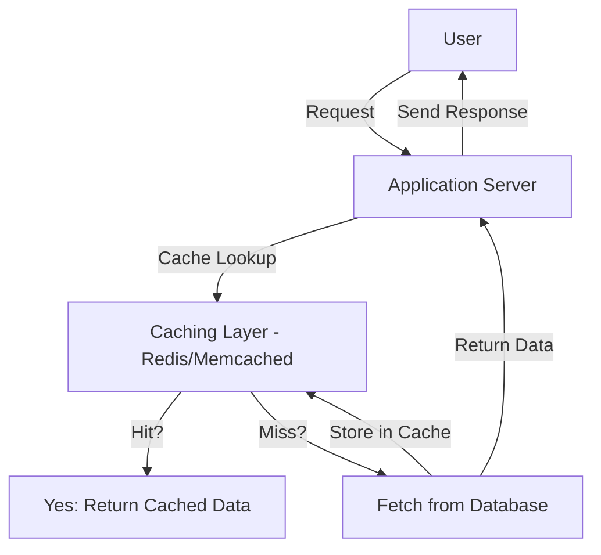

| **Name**              | **Location**                  | **Examples**                                   | **Check Locations**                                          |
| --------------------- | ----------------------------- | ---------------------------------------------- | ------------------------------------------------------------ |
| **Client-Side Cache** | User’s browser/local storage  | Browser Cache, Service Workers, IndexedDB      | `chrome://cache` (Chrome), `about:cache` (Firefox)           |
| **CDN Cache**         | Edge servers worldwide        | Cloudflare, AWS CloudFront, Akamai, Fastly     | `curl -I [https://example.com](https://example.com)          |
| **Web Server Cache**  | Web server before application | Nginx FastCGI Cache, Apache mod_cache, Varnish | `sudo ls /var/cache/nginx`                                   |
| **Application Cache** | Application runtime memory    | Laravel Cache, Spring Cache, Express LRU Cache | Depends on framework (`config/cache.php` for Laravel)        |
| **In-Memory Cache**   | RAM (ephemeral storage)       | Redis, Memcached                               | `redis-cli KEYS *` or `memcached-tool 127.0.0.1:11211 stats` |
| **Database Cache**    | Database engine               | MySQL Query Cache, PostgreSQL Shared Buffers   | `SHOW STATUS LIKE 'Qcache%';` (MySQL)                        |
| **OS Cache**          | System RAM                    | Linux Page Cache, Windows System Cache         | `free -m`, `cat /proc/meminfo                                |
| **Proxy Cache**       | Proxy servers                 | Squid Proxy, Nginx Reverse Proxy Cache         | `sudo ls /var/cache/squid`                                   |


## **1. Introduction to Caching Security**

Caching services like **Redis, Memcached, and Varnish** improve performance by reducing database queries and server load. 

https://kinsta.com/blog/what-is-cache/

https://portswigger.net/web-security/web-cache-deception

http://www.cs.umd.edu/~shankar/417-F01/Slides/chapter2a-aus/sld024.htm
https://www.geeksforgeeks.org/web-proxy-caching-in-distributed-system/
https://www.freecodecamp.org/news/the-hidden-components-of-web-caching-970854fe2c49/

https://cpdos.org/


### **Caching Architecture**



---

## **2. Common Caching Attack Techniques**

| **Attack**                     | **Description**                                             | **Example Exploitation**                                         |
| ------------------------------ | ----------------------------------------------------------- | ---------------------------------------------------------------- |
| **Cache Poisoning**            | Attackers inject **malicious responses** into the cache.    | `curl -H "X-Forwarded-Host: evil.com" http://target.com`         |
| **Cache Side-Channel Attacks** | Attackers infer sensitive data through **timing analysis**. | Measure response time to extract cryptographic keys.             |
| **Race Conditions**            | Exploit delays in cache updates to retrieve stale data.     | Simultaneous requests expose **stale balances** in banking apps. |
| **Unauthorized Access**        | Open caching services allow **unauthenticated access**.     | `redis-cli -h target.com` exposes database entries.              |
| **Exploiting Unexpired Data**  | Retrieve **expired but still available** cache entries.     | `curl -H "Cache-Control: max-stale=3600" http://target.com`      |

---

## **3. Web Cache Poisoning Attacks**

### **3.1 Understanding Web Cache Poisoning**

Attackers **exploit unkeyed parameters** or **headers** to inject malicious payloads into cached responses, affecting multiple users.

### **3.2 Identifying Keyed & Unkeyed Parameters**

|**Parameter Type**|**Cache Behavior**|
|---|---|
|**Keyed Parameters**|Change cache key → Different responses stored|
|**Unkeyed Parameters**|Do not affect cache key → Same cached response|

**Example: Identifying Unkeyed Parameters**

```http
GET /index.php?lang=en&ref=test123 HTTP/1.1
Host: example.com
```

✅ **Keyed:** Changing `lang` results in a **cache miss**.  
❌ **Unkeyed:** Changing `ref` results in a **cache hit**, meaning it's exploitable.

### **3.3 Exploitation: Injecting Malicious Content**

```http
GET /index.php?lang=en&ref="><script>alert(1)</script> HTTP/1.1
Host: webcache.htb
```

🔹 **Impact:** Injected script affects all users served from the cache.

---

## **4. Advanced Cache Poisoning Techniques**

| **Technique**              | **Description**                                      | **Example Exploitation**                                               |
| -------------------------- | ---------------------------------------------------- | ---------------------------------------------------------------------- |
| **Fat GET Requests**       | Servers process GET bodies, caches ignore them.      | `GET /index.php` with payload in `Content-Length` body.                |
| **Parameter Cloaking**     | Cache and server interpret parameters differently.   | `GET /index.php?lang=en;a=b;lang=fr`                                   |
| **Header-Based Poisoning** | Abuse unkeyed headers to inject malicious responses. | `X-Backend-Server: testserver.htb"></script><script>alert(1)</script>` |

---

## **5. Security Best Practices for Caching Services**

|**Security Measure**|**Implementation**|**Benefits**|
|---|---|---|
|**Secure Configuration**|Disable **anonymous access**, enforce **ACLs**|Prevents unauthorized access|
|**TLS Encryption**|Encrypt data in transit|Protects against MITM attacks|
|**Cache Key Validation**|Ensure **all relevant parameters** are keyed|Prevents cache poisoning|
|**Rate Limiting**|Limit the number of **cache lookups per second**|Mitigates brute force attacks|
|**Cache Invalidation Policies**|Use **time-based expiration**|Prevents stale data retrieval|

---

## **6. Caching Security Tools & Detection Mechanisms**

|**Tool**|**Function**|**Example Usage**|
|---|---|---|
|**Redis ACLs**|Restricts **access and permissions**|`redis-cli ACL SETUSER limited -n -r`|
|**Memcached Security**|Enables authentication & TLS|`memcached -S -m 64 --ssl`|
|**Burp Suite Cache Poisoning**|Detects **cache-based injection flaws**|Automated testing in Burp Suite|
|**SIEM / Log Monitoring**|Analyzes cache logs for anomalies|Splunk, Graylog, ELK|

---

