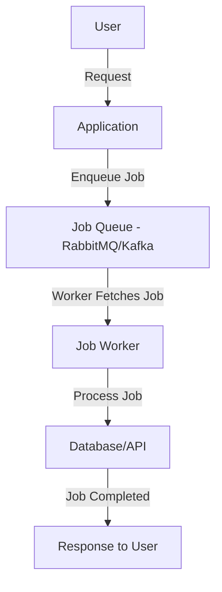

---
{"dg-publish":true,"permalink":"/0-learn-like-a-systems-engineer/web/7a-introduction-to-job-queue-security/","noteIcon":"","created":"2025-04-15T14:11:19.589-04:00"}
---


Job queue systems like **RabbitMQ, Redis Queue (RQ), Apache Kafka, and AWS SQS** process asynchronous tasks such as **email notifications, data processing, and background jobs**. However, if **misconfigured**, they can be exploited for **privilege escalation, job overload, and injection attacks**.

### **1. How Job Queues Work**



While job queues improve scalability, they introduce security risks like **message queue injection, DoS attacks, and race conditions**.

---

## **2. Common Job Queue Attack Techniques**

### **2.1 Message Queue Injection**

**Description:**  
An attacker **injects malicious messages** into the queue, leading to **arbitrary command execution, privilege escalation, or data leakage**.

**Example:**

```python
import pika
connection = pika.BlockingConnection(pika.ConnectionParameters('target.com'))
channel = connection.channel()
channel.basic_publish(exchange='', routing_key='jobs', body='{"cmd": "rm -rf /"}')
```

**Prevention:**  
✅ **Validate message structure** before processing  
✅ **Restrict queue access with IAM roles & authentication**

---

### **2.2 Privilege Escalation via Misconfigured Queues**

**Description:**  
If **workers process jobs with elevated privileges**, attackers may **escalate access** by injecting high-privilege tasks.

**Example Exploit:**

```bash
# Exploit insecure SQS permissions to send an admin-level job
aws sqs send-message --queue-url "https://sqs.amazonaws.com/123456789/jobs" --message-body '{"cmd": "create-admin-user"}'
```

**Prevention:**  
✅ Use **IAM least privilege roles**  
✅ Implement **job type validation**

---

### **2.3 Job Overload (Denial-of-Service)**

**Description:**  
Attackers **flood the job queue** with a high volume of jobs, causing service degradation.

**Example:**

```python
import requests
for i in range(100000):
    requests.post("http://target.com/queue", data={"job": "intensive_task"})
```

**Prevention:**  
✅ Implement **rate limiting**  
✅ Enforce **job execution quotas**

---

### **2.4 Race Conditions in Job Processing**

**Description:**  
Two or more workers **simultaneously process** the same job, leading to **data corruption or unintended behavior**.

**Example:**

```python
import threading

def process_job():
    # Simultaneously update a shared resource
    balance = get_balance("user1")
    balance -= 100  # Withdraw
    update_balance("user1", balance)

# Start multiple threads processing the same job
for _ in range(10):
    threading.Thread(target=process_job).start()
```

**Prevention:**  
✅ Implement **transactional locking mechanisms**  
✅ Use **idempotent job execution**

---

### **2.5 IAM Policy Bypass**

**Description:**  
Attackers escalate privileges by **abusing weak IAM policies** to access or manipulate job queues.

**Example:**

```bash
aws sqs list-queues --region us-east-1
aws sqs get-queue-attributes --queue-url "https://sqs.amazonaws.com/123456789/jobs"
```

**Prevention:**  
✅ Use **explicit deny rules** for sensitive operations  
✅ Enable **logging & monitoring** for unauthorized access

---

## **3. Security Best Practices for Job Queues**

|**Security Measure**|**Implementation**|**Benefits**|
|---|---|---|
|**TLS Encryption**|Encrypt traffic between **producers & consumers**|Prevents **MITM attacks & sniffing**|
|**IAM Roles & Policies**|Use **least privilege IAM roles**|Prevents **unauthorized queue access**|
|**Rate Limiting**|Restrict job submissions per user/IP|Mitigates **DoS attacks**|
|**Monitoring & Logging**|Enable **queue activity logging & anomaly detection**|Detects **suspicious job injection attempts**|
|**Input Validation**|Validate **job parameters** before execution|Prevents **message queue injection**|
|**Job Expiration**|Enforce **TTL (time-to-live) on queued jobs**|Reduces **stale job execution risks**|

---

## **4. Tools for Job Queue Security**

| **Tool**                 | **Function**                               | **Example Command**                                                                                                          |
| ------------------------ | ------------------------------------------ | ---------------------------------------------------------------------------------------------------------------------------- |
| **AWS CloudTrail**       | Tracks **SQS activity logs**               | `aws cloudtrail lookup-events --lookup-attributes AttributeKey=EventName,AttributeValue=SendMessage`                         |
| **RabbitMQ Shovel**      | Detects **queue overload attacks**         | `rabbitmqctl list_queues name messages`                                                                                      |
| **Burp Suite**           | Detects **injection vulnerabilities**      | Intercept and modify job queue messages                                                                                      |
| **Prometheus + Grafana** | Monitors **queue latency & failure rates** | Custom alert rules for abnormal job processing times                                                                         |
| **IAM Policy Simulator** | Tests **AWS job queue permissions**        | `aws iam simulate-principal-policy --policy-source-arn arn:aws:iam::123456789:role/test-role --action-names sqs:SendMessage` |

---
