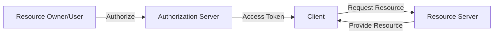
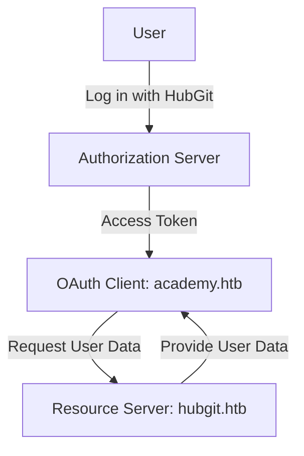

# **1. OAuth Security Overview**

OAuth is a widely used authorization framework that enables **secure access delegation** for web, mobile, and desktop applications without sharing credentials.

## **1.1 OAuth Workflow**



**Key Entities in OAuth**:

1. **Resource Owner (User)**: Grants access to their data.
2. **Client (App)**: Requests access to user data.
3. **Authorization Server**: Issues access tokens.
4. **Resource Server**: Hosts protected resources.

---

# **2. OAuth Flows and Security Considerations**

## **2.1 Authorization Code Grant vs. Implicit Grant**

|**Aspect**|**Authorization Code Grant**|**Implicit Grant**|
|---|---|---|
|**Security**|More secure (tokens not exposed to browser).|Less secure (tokens exposed to browser).|
|**Token Storage**|Server-side|Client-side (e.g., browser)|
|**Flow Complexity**|Requires extra step (authorization code exchange).|Direct token issuance in URL.|
|**Use Case**|Secure web applications & APIs.|Single-page applications (SPA) (deprecated in OAuth 2.1).|

✅ **Mitigation**: Avoid **Implicit Grant** in modern applications due to its security risks.

---

## **2.2 OAuth Attack Vectors & Exploits**

Attackers commonly exploit OAuth misconfigurations in **redirect URIs, token storage, or validation processes**.

### **2.2.1 Redirect URI Manipulation (Access Token Theft)**

Improper validation of the `redirect_uri` parameter allows an attacker to **intercept access tokens**.

#### **Attack Steps**

1. **Victim clicks a crafted authorization request** with a malicious redirect URI:

```http
http://hubgit.htb/authorization/auth?response_type=code&client_id=0e8f12335b0bf225&redirect_uri=http://attacker.htb/callback&state=somevalue
```

2. Victim logs in, and the authorization server redirects them to `attacker.htb/callback` with the access token.
3. The attacker **steals the access token** and impersonates the victim.

✅ **Mitigation**:

- **Strict URI validation**: Use exact matching instead of wildcard matching (`*.domain.com`).
- **Use PKCE (Proof Key for Code Exchange)** to prevent token theft.

---

### **2.2.2 CSRF in OAuth Flow (Login CSRF)**

OAuth uses the `state` parameter to prevent **Cross-Site Request Forgery (CSRF)**.

#### **Attack Scenario**

1. Attacker **prepares an OAuth login request** with a valid `code` but without a `state` parameter.
2. Victim unknowingly **clicks the crafted link**, logging them into the attacker's account.
3. The victim's session is hijacked.

✅ **Mitigation**:

- **Enforce the `state` parameter** in OAuth requests.
- **Use a cryptographically secure `state` value** (e.g., a random nonce).

---

### **2.2.3 Token Reuse & Token Replay Attacks**

OAuth tokens **without expiration** can be **stolen and reused** indefinitely.

#### **Attack Scenario**

1. Attacker **steals a valid access token** from session storage.
2. The attacker **reuses the token** to impersonate the victim.

✅ **Mitigation**:

- Use **short-lived access tokens** with **refresh tokens**.
- Implement **token revocation mechanisms**.

---

### **2.2.4 Weak JWT Token Signature Verification**

OAuth **often uses JWTs for access tokens**. If the signature verification is weak, an attacker can:

- Change the `alg` to `none` (Algorithm Confusion Attack).
- Brute-force weak HS256 secrets.

#### **Attack Example**

Modify JWT Header:

```json
{
  "alg": "none",
  "typ": "JWT"
}
```

Use a token without a signature:

```
eyJhbGciOiJub25lIiwidHlwIjoiSldUIn0.eyJ1c2VyIjoiYWRtaW4ifQ.
```

✅ **Mitigation**:

- **Enforce RS256 over HS256**.
- **Reject `none` algorithm**.

---

### **2.2.5 OAuth Open Redirect Exploitation**

If a service allows open redirects, attackers can chain them with OAuth flows.

#### **Attack Example**

Attacker exploits an open redirect:

```http
http://hubgit.htb/redirect?target=http://attacker.htb
```

OAuth authentication redirects the victim **via the open redirect**, exposing the token.

✅ **Mitigation**:

- **Block open redirects**.
- **Use a strict allowlist for redirect URIs**.

---

### **2.2.6 Malicious OAuth Clients**

Attackers can register **fake OAuth apps** to steal credentials.

#### **Attack Steps**

1. Victim logs in via **a fake OAuth provider**.
2. The attacker harvests access tokens.
3. Tokens are used for **API abuse or impersonation**.

✅ **Mitigation**:

- **Use Trusted OAuth Providers Only**.
- **Enforce client registration review processes**.

---

# **3. OAuth Security Best Practices**

|**Best Practice**|**Description**|
|---|---|
|**Use PKCE (Proof Key for Code Exchange)**|Protects against token interception (OAuth 2.1 requirement).|
|**Short Token Expiry**|Access tokens should expire quickly to reduce misuse risk.|
|**Use Refresh Tokens**|Enables **re-authentication** without exposing credentials.|
|**Token Binding**|Bind tokens to **specific clients** to prevent replay attacks.|
|**Enforce HTTPS**|Prevents MITM attacks intercepting OAuth requests.|
|**Restrict Scope**|Limit token permissions (Principle of Least Privilege).|
|**Use Signed JWTs**|Prevents token forgery.|

---

# **4. Exploit & Lab Setup**



### **Exploit 1: Stealing OAuth Access Tokens**

Use **Burp Suite** to **intercept and modify OAuth flows**.

```bash
# Capture OAuth Authorization Request
http://hubgit.htb/auth?client_id=xyz&redirect_uri=http://attacker.com
```

✅ **Mitigation**:

- **Enforce exact redirect URI validation**.
- **Use a strict allowlist**.

---

### **Exploit 2: Brute-Forcing Weak OAuth Secrets**

If an OAuth service uses **weak JWT signing**, attackers can brute-force it:

```bash
hashcat -m 16500 jwt.txt /opt/SecLists/Passwords/rockyou.txt
```

✅ **Mitigation**:

- **Use RS256 instead of HS256**.
- **Rotate secrets regularly**.

---

# **5. OAuth Vulnerabilities Table**

|**Attack**|**Description**|**Mitigation**|
|---|---|---|
|**Redirect URI Manipulation**|Trick user into redirecting tokens to attacker.|Strict URI validation.|
|**OAuth Login CSRF**|Victim logs into attacker’s account unknowingly.|Enforce `state` parameter.|
|**Token Replay Attack**|Attacker steals and reuses access tokens.|Short-lived tokens + token binding.|
|**JWT `none` Algorithm**|Remove signature to bypass verification.|Enforce RS256 and reject `none`.|
|**OAuth Open Redirect**|Use open redirect to steal OAuth tokens.|Disable open redirects.|
|**Malicious OAuth Clients**|Fake OAuth apps steal credentials.|Use trusted providers only.|

---

