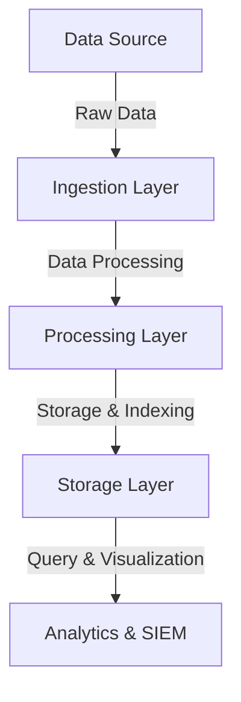

---
{"dg-publish":true,"permalink":"/0-learn-like-a-systems-engineer/web/9-introduction-to-data-pipeline-security/","noteIcon":"","created":"2025-04-15T14:11:19.590-04:00"}
---


A **data pipeline** moves and processes data between systems, including **log collection, transformation, and analysis**. Security is crucial to prevent **log forging, SIEM evasion, and data manipulation** that could lead to **misleading analytics and compromised investigations**.

### **1.2 Components of a Secure Data Pipeline**



- **Ingestion Layer**: Captures data from logs, databases, or applications.
- **Processing Layer**: Normalizes, filters, and enriches data.
- **Storage Layer**: Securely stores logs in a tamper-proof system.
- **Analytics & SIEM**: Monitors for anomalies and security incidents.

---

# **2. Common Data Pipeline Threats**

|**Threat**|**Description**|**Example Exploitation**|**Mitigation Strategies**|
|---|---|---|---|
|**Log Forging**|Attackers inject false log entries.|`curl -X POST 'http://log-server' -d '{"event":"Login success"}'`|Implement **log integrity validation** (e.g., HMAC signing).|
|**SIEM Evasion**|Modify logs to avoid detection.|Replace attack payloads with benign-looking commands.|Use **WORM (Write Once, Read Many) storage** for logs.|
|**Data Manipulation**|Tampering with records for fraud or cover-up.|Modify timestamps to make events appear later/earlier.|Enable **tamper-proof logging** using cryptographic methods.|
|**Insider Threats**|Malicious admins modify or delete logs.|Deleting security logs after unauthorized access.|Enforce **role-based access controls (RBAC)** for logging.|
|**Log Injection**|Attackers inject unescaped characters into logs for exploitation.|`echo "CRLF Injection \r\n[New Log Entry]" >> /var/log/auth.log`|Properly **sanitize and escape log inputs**.|

---

# **3. Attack Techniques & Exploitation**

## **3.1 Log Forging & Log Injection**

Attackers manipulate log data to **cover tracks or introduce false information**.

### **Example: Injecting Fake Logs**

```bash
echo "2025-03-17 10:00:00 [INFO] Successful login for admin" >> /var/log/auth.log
```

✅ **Mitigation**:

- Use **cryptographic signatures** on logs.
- Implement **log timestamp validation**.

---

## **3.2 SIEM Evasion**

### **Example: Obfuscating Malicious Commands**

- Attacker replaces direct payloads with **encoded or padded strings**.

```bash
echo "File access: $(echo Y3JvbiAtc2ggbWFsaWNpb3VzLnNo | base64 -d)" >> /var/log/system.log
```

✅ **Mitigation**:

- Use **behavior-based anomaly detection**.
- Implement **alert correlation across multiple logs**.

---

## **3.3 Data Manipulation**

### **Example: Altering Timestamps to Cover Tracks**

```sql
UPDATE security_logs SET event_time = NOW() WHERE user_id = 'attacker';
```

✅ **Mitigation**:

- Use **immutable storage** (e.g., **AWS CloudTrail with object lock**).
- Implement **append-only logging**.

---

## **3.4 Insider Threats**

### **Example: Deleting Security Logs**

```bash
rm -rf /var/log/auth.log
journalctl --vacuum-time=1s
```

✅ **Mitigation**:

- Enforce **audit trails** and **access controls**.
- Enable **log forwarding** to a secure **remote storage**.

---

# **4. Secure Logging Practices**

## **4.1 Key Security Controls**

|**Control**|**Implementation**|**Benefit**|
|---|---|---|
|**Immutable Logs**|Use **WORM storage** (e.g., AWS S3 Object Lock).|Prevents unauthorized log deletions.|
|**Encryption at Rest**|Encrypt logs using **AES-256 or TLS 1.3**.|Prevents unauthorized log access.|
|**Role-Based Access (RBAC)**|Limit log access by user role.|Protects against insider threats.|
|**SIEM Integration**|Use **ELK, Splunk, or Graylog** for real-time monitoring.|Detects anomalies and security incidents.|
|**Automated Log Rotation**|Rotate logs daily or on size limits.|Prevents log overflow and corruption.|

---

# **5. SIEM Security & Hardening**

## **5.1 SIEM Evasion Techniques & Detection**

|**Evasion Technique**|**Example Exploit**|**Detection & Prevention**|
|---|---|---|
|**Base64-encoded logs**|`echo d2hvYW1pCg==|base64 -d`|
|**Unicode Homoglyph Attacks**|`l00k = (char)108+(char)48+(char)48+(char)107`|Normalize and analyze **character variations**.|
|**Time Delayed Attacks**|Spread actions over multiple days.|Detect **low-and-slow attack patterns**.|

---

# **6. Monitoring & Detection Strategies**

## **6.1 Implementing SIEM Use Cases**

|**Use Case**|**Example SIEM Rule**|**Purpose**|
|---|---|---|
|**Unauthorized Log Access**|`source_ip != trusted_ip_list`|Detects unauthorized access to log files.|
|**Log Deletion Attempts**|`DELETE FROM security_logs`|Alerts when logs are tampered with.|
|**Repeated Authentication Failures**|`failed_logins > 10`|Detects brute-force login attempts.|

✅ **Recommended SIEM Tools**:

- **Splunk**
- **Elastic Security (ELK)**
- **Graylog**
- **Microsoft Sentinel**

---

# **7. Tools for Securing Data Pipelines**

|**Tool**|**Function**|**Example Usage**|
|---|---|---|
|**Auditd**|Logs system events & file access.|`auditctl -w /var/log/auth.log -p wa`|
|**Filebeat**|Ships logs to SIEM solutions.|`filebeat modules enable system`|
|**Logstash**|Parses & filters log data before ingestion.|`logstash -f pipeline.conf`|
|**Wazuh**|Open-source SIEM for threat detection.|`wazuh-agentd -f`|
|**Elastic Security**|Real-time log analysis & anomaly detection.|`sudo systemctl start elasticsearch`|

---

# **8. Summary Table**

|**Threat**|**Exploitation**|**Mitigation**|
|---|---|---|
|**Log Forging**|Fake log entries|Log integrity validation|
|**SIEM Evasion**|Encoded/masked logs|Behavior-based anomaly detection|
|**Data Manipulation**|Altering timestamps|Append-only logging|
|**Insider Threats**|Deleting logs|RBAC & log forwarding|
|**Log Injection**|Injecting commands into logs|Proper log sanitization|

---

# **9. Conclusion**

A **secure data pipeline** is essential for **threat detection and forensic investigations**. By implementing **cryptographic log integrity, strict access controls, and SIEM-based anomaly detection**, organizations can mitigate threats like **log forging, data manipulation, and insider attacks**.

✅ **Use secure logging frameworks** (e.g., Auditd, Filebeat).  
✅ **Enforce access controls** to prevent unauthorized modifications.  
✅ **Leverage SIEM for real-time log monitoring** and **threat hunting**.

Let me know if you need **further refinements!** 🚀