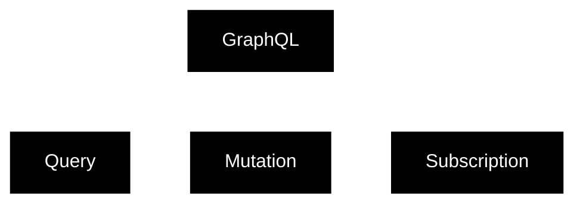

---
{"dg-publish":true,"permalink":"/1-hack-like-a-script-kiddie/web/graph-ql/1-graph-ql/","noteIcon":"","created":"2025-04-15T14:11:19.603-04:00"}
---


While I was working on testing, I ran into GraphQL. I knew GraphQL is somewhat difference from restful API, but I wouldn't say I really knew it. So I decided to dig a little more!


Before dive in to GraphQL, I am going to take a step back.

# 0. What is API?
According to wiki, 
> An **application programming interface** (**API**) is a way for two or more [computer programs](https://en.wikipedia.org/wiki/Computer_program "Computer program") or components to communicate with each other. It is a type of [software interface](https://en.wikipedia.org/wiki/Software_interface "Software interface"), offering a service to other pieces of [software](https://en.wikipedia.org/wiki/Software "Software").

Many common phrases I have received, the most stick out one was "It is like a waitress/waiter in a restaurant. It receives an order from a customer, then sends it back to kitchen. Once the food is ready, the server brings the dish to the customer"
The below screenshot indicates what is API. 


https://www.akamai.com/glossary/how-do-apis-work

There are many different types of APIs, which is not specific to web. e.g. [Windows API](https://learn.microsoft.com/en-us/windows/win32/api/?source=recommendations)

However, I will focus on web application API, specifically GraphQL.
## What are common Web APIs?

https://blog.postman.com/different-types-of-apis/

According to the above websites,  

| **API Type**   | **Pros**                                                                                                                                    | **Cons**                                                                                                                                    |
| -------------- | ------------------------------------------------------------------------------------------------------------------------------------------- | ------------------------------------------------------------------------------------------------------------------------------------------- |
| **REST**       | - Decoupled client-server architecture<br>- Cache-friendly<br>- Supports multiple data formats (JSON, XML)<br>- Flexible and widely adopted | - Can result in over- or under-fetching<br>- No binding contract for message structure<br>- Rich metadata can create large payloads         |
| **SOAP**       | - Platform and language agnostic<br>- Built-in error handling<br>- Standardized, good for high-security data transfers                      | - Verbose and formal message structure<br>- XML format can be clunky and large<br>- Declining popularity, harder to find specialized talent |
| **GraphQL**    | - Precise data retrieval<br>- Transparent and well-documented queries<br>- Flexible permissions and error messages                          | - Performance issues with many nested fields<br>- Lacks built-in HTTP caching<br>- Steeper learning curve                                   |
| **gRPC**       | - Simple and high-performance<br>- Supports a wide range of functions<br>- Ideal for microservices and Docker-based applications            | - Tightly coupled to the underlying system<br>- No abstraction layer, raising security concerns                                             |
| **WebSockets** | - Real-time, event-driven communication<br>- Single TCP connection for dynamic communication                                                | - Based on HTTP/1.1, whereas gRPC uses HTTP/2<br>- Depends on specific use cases; may not always be the best choice                         |

I commonly saw restful api. Websocket sometimes, and this is one of few times I saw GraphQL. 


# 1. What is GraphQL?
https://portswigger.net/web-security/graphql/what-is-graphql

According to portswigger,
> GraphQL is an API query language that is designed to facilitate efficient communication between clients and servers. **It enables the user to specify exactly what data they want in the response, helping to avoid the large response objects and multiple calls that can sometimes be seen with REST APIs.**

I'd like to focus on the last sentence. Restful tends to drop all information at once, however, GraphQL requires user to specify which information the user wants via query. 

# 2. Basic Operation Types - Query, Mutation, Subscription




Query displays data.
Mutation modifies data.
Subscription continuously receives data from server.

```
type User {

  id: ID
  name: String
  email: String
  age: Int
}

```

## 2.1 Query syntax
```
query {
  user(id: 1) {
    name
    email
  }
}

```
## 2.2 Mutation Syntax
```
mutation {
  updateUser(id: "1", email: "new.email@example.com") {
    id
    name
    email
  }
}

```

## 2.3 Subscription syntax
```
subscription {
  messageAdded(chatRoomId: "123") {
    id
    content
    author {
      id
      name
    }
  }
}

```

# 3. Object, field, Argument, Variable, Fragment?
## 3.1 Object
It is a collection of field. The below is an example of an object type name **User**.
```graphql
type User {
  id: ID
  name: String
  email: String
  age: Int
}
```

## 3.2 Fields
The above example has four fields, which are id, name, email, and age. 

## 3.3  Argument
Arguments are the ones that pass parameters to fields in query or mutation. `(age:30)` from the below example indicates argument. 
```
{
  users(age: 30) {
    id
    name
  }
}

```

## 3.4 Variables

Instead of hardcoding values, we can use it as variables.  `$` indicates it is a variable.
This is mutation request.
```
mutation UpdateUserEmail($userId: ID!, $newEmail: String!) {
  updateUser(id: $userId, email: $newEmail) {
    id
    name
    email
  }
}

```
And this is variable that will be supplied. 
```
{
  "userId": "1",
  "newEmail": "new.email@example.com"
}
```

## 3.5 `!`?

From the above example, the exclamation mark indicates it is a `non-nullable` value. 


## 3.6 Fragment?
>  a fragment is a reusable piece of a query that can be shared across multiple queries, mutations, or subscriptions. Fragments allow you to define a set of fields that can be used in different parts of your GraphQL operations, making your code more modular, DRY (Don't Repeat Yourself), and easier to maintain.


So a fragment has to be defined prior to be used.  The below `UserFields` is the name of this fragment. `on User` specifies where this fragment will applies to. 
```
fragment UserFields on User {
  id
  name
  email
}

```

And this `...UserFields` is how we call the fragment UserFields
```
query GetUser {
  user(id: "1") {
    ...UserFields
  }
}

```

