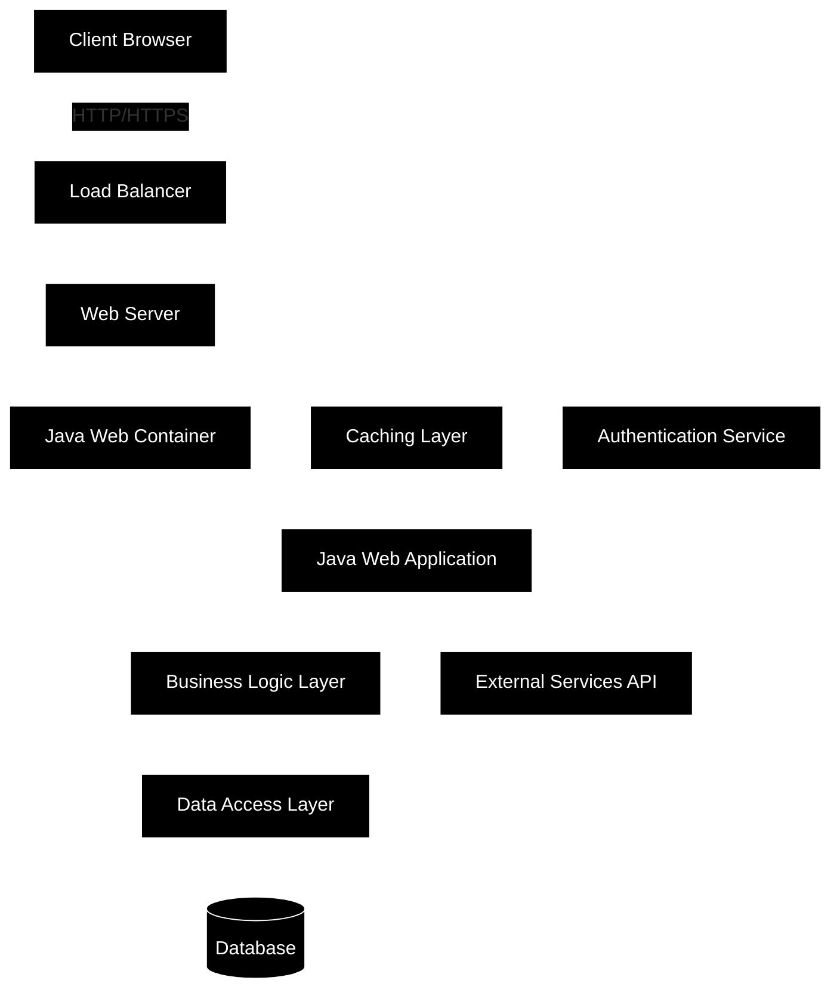

# What is JAVA?

https://dev.java/learn/
https://www.java.com/en/download/help/whatis_java.html
https://aws.amazon.com/what-is/java/

---

# JAVA Web Application

	Client Browser: Where users interact with the application
	Load Balancer: Distributes incoming traffic across multiple web servers
	Web Server: Handles HTTP requests (e.g., Apache, Nginx)
	Java Web Container: Runs Java web applications (e.g., Tomcat, Jetty)
	Java Web Application: The actual application code
	Business Logic Layer: Contains core application logic
	Data Access Layer: Manages database interactions
	Database: Stores application data
	External Services API: Integrations with third-party services
	Caching Layer: Improves performance by caching frequently accessed data
	Authentication Service: Manages user authentication and authorization
---

# What is Servlet?

https://javatrainingschool.com/servlet-life-cycle/
