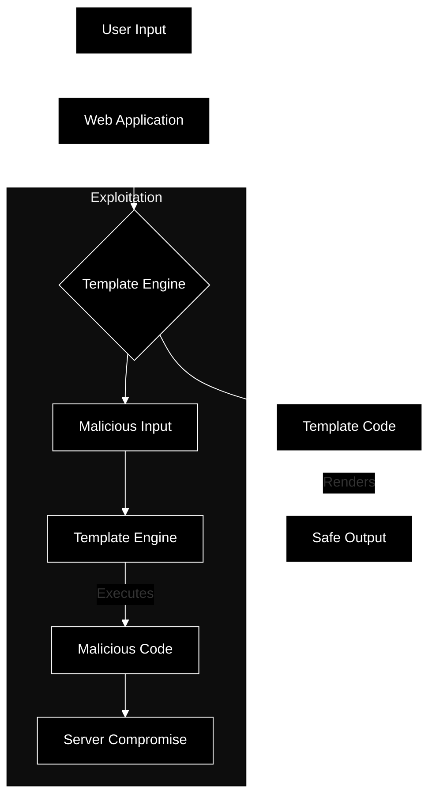

```mermaid
---
config:
  theme: base
  themeVariables:
    nodeTextColor: "#FFFFFF"
    primaryColor: "#000000"
    lineColor: "#FFFFFF"
    edgeLabelBackground: "#000000"
  gitGraph:
    showBranches: false
---
graph TD
    A[User Input] --> B[Web Application]
    B --> C{Template Engine}
    C --> D[Template Code]
    D -->|Renders| E[Safe Output]
    
    subgraph Exploitation
    C --> F[Malicious Input]
    F --> G[Template Engine]
    G -->|Executes| H[Malicious Code]
    H --> I[Server Compromise]
    end
classDef default fill:#000000,stroke:#FFFFFF,color:#FFFFFF;

```

Using Frappe as an example, inject SSTI payload to a template. Then call the template to verify results.
