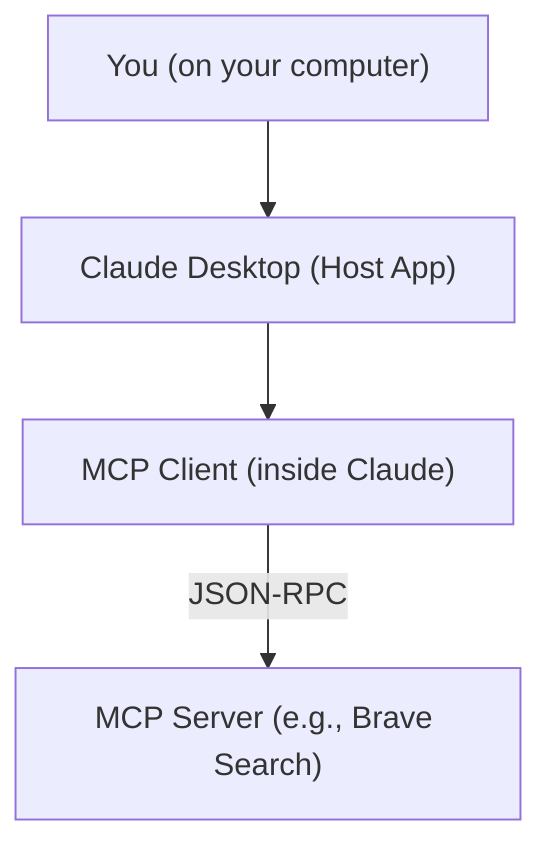
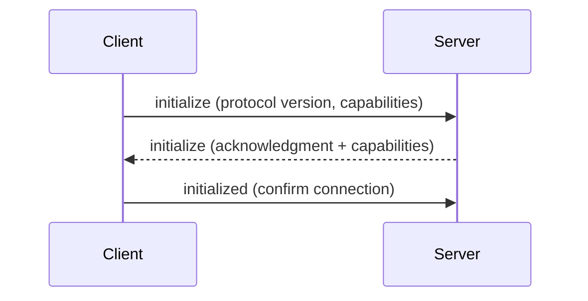

---
{"dg-publish":true,"permalink":"/0-learn-like-a-systems-engineer/llm/model-context-protocol/","noteIcon":"","created":"2025-04-15T14:11:19.587-04:00"}
---

https://modelcontextprotocol.io/introduction

Tester here. 
I recently encountered the Model Context Protocol through a podcast. I forgot the name of the podcast, but it sounded like MCP has amazing capabilities and can interact with the localhost—unlike most LLMs, which are typically isolated from the local environment. Isn't that amazing? This could solve so many headaches... but at the same time, it introduces a range of new challenges. Before I take any action, I need to understand what MCP is—otherwise, I'll remain a ScriptKiddie... forever.

Once again, there is no better methodology than systems engineering to break a big concept down into something I can easily understand. Just like how I explain [[../../0. Clouds/0.1. Learn Cloud/0.1.1. General/0.1.1.1. Clouds\|0. Clouds]], I am going to use a systems engineering approach to understand MCP.

# 1. System Context

## 1.1 Stakeholders

| Stakeholder                       | Concern                                                                |
| --------------------------------- | ---------------------------------------------------------------------- |
| LLM Users (This is us)            | Want context-aware, interactive AI assistance.                         |
| App Developers (This could be us) | Need reusable, standardized integrations with AI tools.                |
| Tool Providers                    | Need visibility and invocation capability via standardized interfaces. |

# 2. System Decomposition

- **MCP Hosts**: Applications such as Claude Desktop, IDEs, or other LLM-powered tools that initiate connections to access external data.
    
- **MCP Servers**: Modular tools or services such as Brave Search, PostgreSQL interfaces, Slack bots, file systems, or web APIs that provide capabilities through the protocol.
    
- **Transport Mechanisms**: JSON-RPC 2.0 over **Stdio** (for local processes) or **HTTP with SSE** (for web-accessible services).
https://modelcontextprotocol.io/docs/concepts/transports

| **Term**          | **What It Typically Refers To**                                                                                                          |
| ----------------- | ---------------------------------------------------------------------------------------------------------------------------------------- |
| **Host**          | The **application** that initiates and manages the interaction. Think of this as **Claude Desktop**, Zed, or any tool with LLM features. |
| **Client**        | The **protocol client module inside the host** that handles the connection to MCP servers. Claude Desktop **includes** a client.         |
| **Your Computer** | Hosts the entire stack (host app + client + optional local servers).                                                                     |

---

# 3. Interface Definitions

## 3.1 Message Types

| Type           | Description                           |
| -------------- | ------------------------------------- |
| `Request`      | Client to server, expects a response. |
| `Notification` | Fire-and-forget style message.        |
| `Result`       | Response to a request.                |
| `Error`        | Error response to a failed request.   |

## 3.2 Protocol Flow (Initialization Phase)

---

# 4. System Qualities

| Quality              | MCP Approach                                               |
| -------------------- | ---------------------------------------------------------- |
| **Modularity**       | Tools as independently launched servers                    |
| **Interoperability** | Standard JSON-RPC and open transport mechanisms            |
| **Extensibility**    | New tools added via config, with no change to host logic   |
| **Transparency**     | Inspector and schemas provide introspection and debugging  |
| **Portability**      | Supports cross-platform tooling via Node.js or Python SDKs |

---

# 5. Limitations and Risks

|Limitation|Mitigation Strategy|
|---|---|
|Manual setup on Claude Desktop|Automate config generation with a helper tool|
|No internet-based server support|Implement HTTP+SSE bridge transport|
|Protocol still maturing|Monitor spec evolution and maintain compliance|

---

# 6. Extended Understanding (from MCP Homepage)

MCP is like a **USB-C port** for AI applications—standardizing how LLMs connect to tools and data. MCP enables:

- Plug-and-play access to a growing library of server integrations
    
- Vendor-neutral flexibility (supporting multiple LLMs)
    
- Secure access to both local and remote resources
    

## 6.1 Core Concepts

- **Resources**: Data the server can expose (e.g., file systems, databases)
    
- **Tools**: Server functions that models can call
    
- **Prompts**: Templates that LLMs can reuse
    
- **Sampling**: Where the server may ask an LLM to complete content
    
- **Roots**: Static content bound to the server
    

MCP makes automation via LLMs more powerful and context-rich.

---

# 7. What’s Next for Me

I want to repeat those great works. 

https://www.linkedin.com/posts/joas-antonio-dos-santos_redteamexercises-redteam-mcp-ugcPost-7316907472479256577-t76D?utm_source=share&utm_medium=member_desktop&rcm=ACoAABBkRXsBB1LtrgHL8V1U0C4uXHIN0XFU1fo

https://glama.ai/blog/2024-11-25-model-context-protocol-quickstart

https://modelcontextprotocol.io/introduction#general-architecture

https://nae-bo.medium.com/building-your-first-offensive-security-mcp-server-dd655e258d5f

#mcp #llm 
