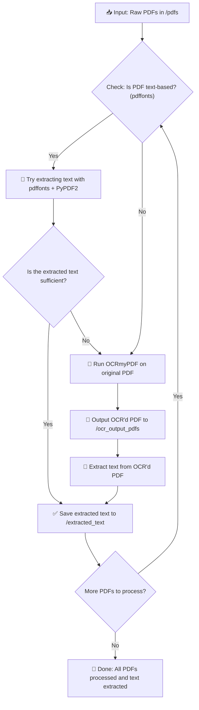

# 1.  Simple System Flow

BLUF: Finalized Script on Venv is here. 
[1. main_streamlit.py](<Venv/1. main_streamlit.py.md>)
[2. requirements.txt](<Venv/2. requirements.txt.md>)s
[3. start_tmux.sh](<Venv/3. start_tmux.sh.md>)




---
## 1. PDF Input

> **Purpose:** Supply raw, unstructured data in a format accessible to humans.

- **Why?** Most real-world knowledge is locked in PDFs — policies, reports, academic work, manuals.
    
- **System View:** Static file input; varies wildly in structure and size.
    
- **Failure Mode:** PDFs can be encrypted, malformed, or image-only (which complicates downstream processing).
    

---

## 2. Text Extraction

> **Purpose:** Convert human-readable documents into machine-readable text.

- **Why?** LLMs can't “see” what's inside PDFs — they need tokenized strings.
    
- **Tools:**
    
    - For text PDFs: `pdfplumber`, `PyMuPDF`, `langchain` loaders.
        
    - For image PDFs: `pdf2image` → `pytesseract` (OCR).
        
- **Failure Mode:** OCR might misread poor-quality images; wrong encoding (e.g., ligatures) might distort content.
    

---

## 3. Text Chunking

> **Purpose:** Break large documents into logical, overlapping pieces for LLM input.

- **Why?** LLMs have **limited context windows** (e.g., 4K–8K tokens). Full documents won’t fit.
    
- **Chunking logic:**
    
    - Maintain semantic structure (avoid mid-sentence breaks).
        
    - Add overlap (e.g., 10–20%) to preserve context across chunks.
        
- **Failure Mode:** Bad chunking = broken context = reduced retrieval quality.
    

---

## 4. Embedding

> **Purpose:** Convert text chunks into vectors representing **semantic meaning**.

- **Why?** Enables searching by **meaning**, not exact keywords.
    
- **Example:**
    
    - “Employees must attend training.” ≈ “Annual training is mandatory.”
        
    - Both will generate **similar embeddings**, enabling powerful recall.
        
- **Failure Mode:** Wrong embedding model = bad semantic matches.
    

---

## 5. Vector Database

> **Purpose:** Store and index high-dimensional vectors efficiently.

- **Why?** With 5,000+ documents, you need sub-second search based on vector proximity (cosine similarity, etc).
    
- **Tools:** `FAISS`, `Chroma`, `Qdrant`, `Weaviate`
    
- **Failure Mode:** Large vector sets may grow out of RAM; poorly indexed DBs will be slow.
    

---

## 6. Similarity Search (Retriever)

> **Purpose:** Match a query to the most relevant content chunks.

- **Why?** LLMs are smart — but only **within the context you give them**.
    
- **Process:**
    
    - Query → embedding → search → top-k relevant chunks.
        
- **Failure Mode:** Bad retrieval = hallucination. Garbage in, garbage out.
    

---

## 7. Prompt Construction

> **Purpose:** Assemble retrieved content + user question into a prompt the LLM can reason over.

- **Why?** LLMs are **stateless** and context-blind. You must feed them relevant information at runtime.
    
- **Example Prompt:**
    
    ```text
    Context:
    [Chunk 1]
    [Chunk 2]
    
    Question: What should employees do after a breach?
    
    Answer:
    ```
    
- **Failure Mode:** Unstructured prompts = poor reasoning = inconsistent output.
    

---

## 8. LLM Response

> **Purpose:** Generate human-readable, natural-language answers.

- **Why?** This is the final output — the **"consultant's answer"** based on retrieved knowledge + language modeling.
    
- **Tools:** `llama.cpp`, `vllm`, `text-generation-webui`, `Ollama`, etc.
    
- **Failure Mode:** If context is weak or too generic, LLM will fabricate or be vague.
    


---
Next Process

[1. Text Extraction](<1. Text Extraction.md>)