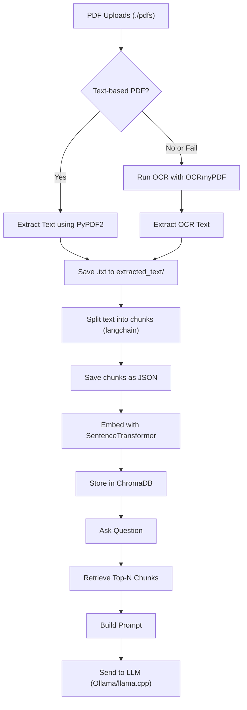

**BLUF:**

This script builds a **full local RAG (Retrieval-Augmented Generation) pipeline** from scratch: it processes PDFs (including OCR if needed), chunks and embeds them, stores them in a local ChromaDB vector database, and allows question-answering via local LLMs (e.g., Ollama).

---

### **Purpose**

To automate an end-to-end **RAG-based document question-answering system**, **fully offline**, using:

- ocrmypdf for OCR    
- PyPDF2 for text extraction
- langchain for chunking
- sentence-transformers for embeddings
- chromadb as the vector DB
- Ollama or llama.cpp for offline inference
    

---

### **Core Pipeline (High-Level Stages)**



---

### **Command-Line Options**

| **Argument**   | **Purpose**                                                              |
| -------------- | ------------------------------------------------------------------------ |
| --process_pdfs | Extracts text from all PDFs, using OCR if needed.                        |
| --chunk        | Chunks text files into overlapping segments using LangChain.             |
| --embed        | Embeds all chunks and stores in ChromaDB.                                |
| --query_only   | Prompts user to ask a question and retrieves top matching chunks.        |
| --all          | Runs the full pipeline from PDF processing to query prompt + LLM output. |

Example usage:

```
python main.py --all
```

---

### **Key Functional Parts**

|**Function**|**Description**|
|---|---|
|is_text_based_pdf()|Checks if a PDF likely has embedded fonts (i.e., it’s not just scanned).|
|process_pdf_with_ocrmypdf()|Uses ocrmypdf to convert scanned image PDFs into searchable ones.|
|extract_text_from_ocr_pdf()|Pulls text from OCR’d PDFs using PyPDF2.|
|text_chunk()|Splits long text into ~1000 character chunks with 150-character overlap.|
|embed_chunks()|Encodes chunks using sentence-transformers and stores in ChromaDB.|
|query_rag()|Lets user ask a question, retrieves top-3 relevant chunks, builds a prompt, and queries an LLM.|

---

### **You Can Customize**

- 💬 Swap out ollama with your own LLM call or llama.cpp.
- 📄 Adjust chunk size or overlap in text_chunk().
- 🧠 Change embedding model (all-mpnet-base-v2 is better than MiniLM for accuracy, slightly slower).
    

---


```python
from pathlib import Path
import logging
import subprocess
from tqdm import tqdm
import json
import ocrmypdf
from langchain.text_splitter import RecursiveCharacterTextSplitter
from sentence_transformers import SentenceTransformer
import chromadb
import argparse
import sys

# Setup logging
logging.basicConfig(level=logging.INFO, format='%(asctime)s - %(levelname)s - %(message)s')

def create_directory(directories):
    """Create a directory if it does not exist."""
    for p in directories:
        if not p.exists():
            try:
                p.mkdir(parents=True, exist_ok=True)
                logging.info(f"Created directory: {p}")
            except Exception as e:
                logging.error(f"Error creating directory {p}: {e}")
        else:
            logging.info(f"Directory already exists: {p}")

def is_text_based_pdf(pdf_path):
    """Quickly check if a PDF might be text-based (less rigorous than before)."""
    try:
        result = subprocess.run(
            ["pdffonts", str(pdf_path)], capture_output=True, text=True, check=True
        )
        return "CIDFont" in result.stdout or "Type" in result.stdout
    except FileNotFoundError:
        logging.warning("pdffonts not found. Assuming image-based PDF.")
        return False
    except subprocess.CalledProcessError:
        logging.warning(f"Error running pdffonts on {pdf_path}. Assuming image-based PDF.")
        return False

def process_pdf_with_ocrmypdf(pdf_path, output_dir):
    """Processes a PDF using OCRmyPDF."""
    output_path = output_dir / (pdf_path.stem + "_ocr.pdf")
    try:
        logging.info(f"Running OCRmyPDF on: {pdf_path.name} -> {output_path.name}")
        result = subprocess.run(
            ["ocrmypdf", "--output-type", "pdf", str(pdf_path), str(output_path)],
            capture_output=True,
            text=True,
            check=True,
        )
        logging.info(f"OCRmyPDF completed for {pdf_path.name}. Output saved to {output_path}")
        logging.debug(f"OCRmyPDF stdout:\n{result.stdout}")
        if result.stderr:
            logging.warning(f"OCRmyPDF stderr:\n{result.stderr}")
        return output_path
    except FileNotFoundError:
        logging.error("Error: OCRmyPDF command not found. Please ensure it's installed and in your PATH.")
        return None
    except subprocess.CalledProcessError as e:
        logging.error(f"Error running OCRmyPDF on {pdf_path.name}: {e}")
        logging.error(f"OCRmyPDF stdout:\n{e.stdout}")
        logging.error(f"OCRmyPDF stderr:\n{e.stderr}")
        return None

def extract_text_from_ocr_pdf(pdf_path, output_text_path):
    """Extract text from the OCR'd PDF using PyPDF2."""
    try:
        from PyPDF2 import PdfReader
        reader = PdfReader(str(pdf_path))
        text = ""
        for page in reader.pages:
            text += page.extract_text() or ""
        output_text_path.write_text(text)
        logging.info(f"Text extracted from OCR'd PDF {pdf_path.name} and saved to {output_text_path}")
        return True
    except ImportError:
        logging.error("Error: PyPDF2 is required to extract text from the OCR'd PDF.")
        return False
    except Exception as e:
        logging.error(f"Error extracting text from OCR'd PDF {pdf_path}: {e}")
        return False

def text_chunk():
    """Splits extracted text files into smaller chunks and saves them as JSON."""
    input_dir = Path("extracted_text")
    output_dir = Path("chunks")
    output_dir.mkdir(parents=True, exist_ok=True)
    splitter = RecursiveCharacterTextSplitter(chunk_size=1000, chunk_overlap=150)
    text_files = list(input_dir.glob("*.txt"))

    for text_file in tqdm(text_files, desc="Chunking text files"):
        raw_text = text_file.read_text(encoding="utf-8")
        docs = splitter.create_documents([raw_text])
        chunk_output = [{"chunk_id": i, "text": doc.page_content} for i, doc in enumerate(docs)]
        output_path = output_dir / (text_file.stem + "_chunks.json")
        with open(output_path, "w", encoding="utf-8") as f:
            json.dump(chunk_output, f, indent=2)
        tqdm.write(f"Chunked {text_file.name} into {len(docs)} segments.")

def embed_chunks():
    """Embeds chunked text using a sentence transformer and stores them in ChromaDB."""
    chunks_dir = Path("chunks")
    model = SentenceTransformer('all-mpnet-base-v2')
    chroma_client = chromadb.Client()
    collection = chroma_client.create_collection("rag_chunks")

    for file in tqdm(chunks_dir.glob("*_chunks.json"), desc="Embedding chunks"):
        with open(file, "r", encoding="utf-8") as f:
            chunks = json.load(f)

        texts = [chunk["text"] for chunk in chunks]
        embeddings = model.encode(texts).tolist()

        for i, (chunk, emb) in enumerate(zip(chunks, embeddings)):
            collection.add(
                documents=[chunk["text"]],
                embeddings=[emb],
                ids=[f"{file.stem}_{i}"]
            )
    print("All chunks embedded and stored in ChromaDB.")

def query_rag():
    """Prompts user for a question, constructs prompt, and auto-queries local LLM."""
    model = SentenceTransformer('all-mpnet-base-v2')
    chroma_client = chromadb.Client()
    collection = chroma_client.get_or_create_collection("rag_chunks")
    query = input("🔎 Ask your question: ")
    query_vector = model.encode(query).tolist()
    results = collection.query(query_embeddings=[query_vector], n_results=3)
    contexts = results['documents'][0]

    context_str = "\n---\n".join(contexts)
    prompt = f"""Context:
{context_str}

Question: {query}
Answer:"""

    with open("prompt.txt", "w") as f:
        f.write(prompt)

    print("📄 Prompt saved to prompt.txt")

    # === Step H: Call Ollama or llama.cpp ===
    try:
        # Option 1: Ollama (default)
        result = subprocess.run(
            ["ollama", "run", "llama3"],
            input=prompt,
            text=True,
            capture_output=True,
            check=True
        )
        print("\n🤖 LLM Response:")
        print(result.stdout.strip())

        # === OPTIONAL: Save LLM output ===
        with open("response.txt", "w") as f:
            f.write(result.stdout.strip())

    except subprocess.CalledProcessError as e:
        print("❌ Error running Ollama:")
        print(e.stderr)

if __name__ == "__main__":
    parser = argparse.ArgumentParser(
        description="🧠 RAG Pipeline CLI — Extract, Embed, and Query PDFs"
    )
    parser.add_argument("--process_pdfs", action="store_true", help="📄 Extract and OCR all PDFs in ./pdfs/")
    parser.add_argument("--chunk", action="store_true", help="🧩 Chunk extracted text into segments")
    parser.add_argument("--embed", action="store_true", help="🔗 Generate embeddings and store in ChromaDB")
    parser.add_argument("--query_only", action="store_true", help="🔍 Ask a question using current index")
    parser.add_argument("--all", action="store_true", help="🚀 Run full pipeline (process → chunk → embed → query)")

    args = parser.parse_args()

    if len(sys.argv) == 1:
        parser.print_help()
        sys.exit(0)

    base_path = Path(".")
    pdf_dir = base_path / "pdfs"
    ocr_output_dir = base_path / "ocr_output_pdfs"
    text_output_dir = base_path / "extracted_text"
    create_directory([pdf_dir, ocr_output_dir, text_output_dir])
    print("📂 Folder structure initialized.")

    if args.all or args.process_pdfs:
        pdf_files = list(pdf_dir.glob("*.pdf"))
        for pdf_file in tqdm(pdf_files, desc="📄 Processing PDFs"):
            logging.info(f"📥 Processing PDF: {pdf_file.name}")
            output_text_path = text_output_dir / (pdf_file.stem + ".txt")

            if is_text_based_pdf(pdf_file):
                logging.info(f"🧾 Text-based PDF detected: {pdf_file.name}")
                try:
                    from PyPDF2 import PdfReader
                    reader = PdfReader(str(pdf_file))
                    text = ""
                    for page in reader.pages:
                        text += page.extract_text() or ""
                    if len(text.strip()) >= 100:
                        output_text_path.write_text(text)
                        logging.info(f"✅ Direct text extraction successful for {pdf_file.name}")
                    else:
                        logging.info(f"⚠️ Text too short. Running OCR on {pdf_file.name}")
                        ocr_pdf_path = process_pdf_with_ocrmypdf(pdf_file, ocr_output_dir)
                        if ocr_pdf_path:
                            extract_text_from_ocr_pdf(ocr_pdf_path, output_text_path)
                except Exception as e:
                    logging.error(f"❌ Direct text extraction error: {e}")
                    ocr_pdf_path = process_pdf_with_ocrmypdf(pdf_file, ocr_output_dir)
                    if ocr_pdf_path:
                        extract_text_from_ocr_pdf(ocr_pdf_path, output_text_path)
            else:
                logging.info(f"📷 Image-based PDF assumed: {pdf_file.name}. Running OCR.")
                ocr_pdf_path = process_pdf_with_ocrmypdf(pdf_file, ocr_output_dir)
                if ocr_pdf_path:
                    extract_text_from_ocr_pdf(ocr_pdf_path, output_text_path)

            logging.info(f"🏁 Finished processing {pdf_file.name}")

        print("✅ All PDFs processed.")

    if args.all or args.chunk:
        text_chunk()

    if args.all or args.embed:
        embed_chunks()

    if args.all or args.query_only:
        query_rag()
        
        
```

---

Requirements.txt
```txt
# Core dependencies
streamlit==1.33.0
ocrmypdf==14.0.0
PyPDF2==3.0.1
sentence-transformers==2.2.2
chromadb==0.4.24
tqdm==4.66.4
langchain==0.1.17

# Optional but recommended
pdfminer.six==20221105  # Sometimes used by ocrmypdf internally
tabulate==0.9.0         # Handy for debugging output
```


Install
```bash
sudo apt install ocrmypdf ghostscript tesseract-ocr qpdf
```

[7. Ollama](<7. Ollama.md>)
