# 🧠 Project Transition: test3_mac → test4_RAG_CAG_Docling


Docker Build & Execution Flow

  Upgrading  current basic RAG implementation to a more efficient and modular system using LangChain, Chroma, and Docling. This improves speed, scalability, and accuracy.

```mermaid
graph TD

A[docker-compose.yml] --> B[Dockerfile builds image]
B --> C[Install requirements.txt + copy all files]
C --> D[Run streamlit main.py]
D --> E[Streamlit UI loads]

E --> F[User uploads PDF]
F --> G[pdf_utils.py → DoclingLoader]
G --> H[embed_utils.py OR ollama_embed.py → embed chunks]

H --> I[User types question]
I --> J[Top-k retrieval from embed_utils.py]
J --> K["api.py → query_ollama(prompt)"]
K --> L[Ollama generates answer]
L --> M[main.py → Render answer + chunks in UI]

```




[1. Dockerfile](<1. Dockerfile.md>)
[2. requirements.txt](<2. requirements.txt.md>)
[3. main.py](<3. main.py.md>) 
[4. doc_processor.py](<4. doc_processor.py.md>)
[5a. vectorizer.py](<5a. vectorizer.py.md>)
[5b. ollama_embed.py](<5b. ollama_embed.py.md>)
[6. api.py](<6. api.py.md>)  
[6a. config.py](<6a. config.py.md>) 
[6b. env](<6b. env.md>)
[uploader.py - CLI TOOL](<uploader.py - CLI TOOL.md>)
[docker-compose.yml](../docker-compose.yml.md)


| File                                         | Purpose                                       |
| -------------------------------------------- | --------------------------------------------- |
| `api.py`                                     | Interfaces with Ollama and/or Open WebUI      |
| `config.py`                                  | Loads `.env` variables like API keys and URLs |
| `doc_processor.py --> formerly pdf_utils.py` | Uses Docling to chunk documents               |
| `vectorizer.py --> formerly embed_utils.py`  | Embeds text chunks using SentenceTransformer  |
| `uploader.py`                                | *(Optional)* Uploads docs to Open WebUI       |
| `.env`                                       | Holds config for URLs, tokens                 |
| `requirements.txt`                           | Python dependencies                           |
| `Dockerfile`                                 | Backend build process                         |
| `docker-compose.yml`                         | Brings all services together                  |


Let me know if you want a version with descriptions shortened for column width or tagged by priority (e.g., must-have vs optional).

---

##  Current Architecture (test3_mac)

|Layer|Tool / Method|
|---|---|
|Document Parsing|PyPDF2 + OCR + Manual Split|
|UI|Streamlit|
|LLM Backend|Ollama via `query_ollama()`|
|Prompting|Inject top-N chunked text as prompt|
|Retrieval|Manual string matching (no vectors)|
|Speed Tradeoff|Slow due to full document tokenization|


---

##  Target Architecture (test4_RAG_CAG_Docling)

|Layer|Replaced with / Added|
|---|---|
|Document Parsing|`DoclingLoader`|
|Vector Search|`Chroma` + LangChain retriever|
|Prompting|LangChain’s RAG-CAG chain|
|LLM Backend|Ollama via custom wrapper|
|UI|Same Streamlit UI|
|Speed Tradeoff|Only relevant chunks sent to LLM|


---

## What is “RAG-CAG”?

**RAG-CAG** (Retrieval-Augmented Generation with Context-Aware Generation) improves performance and accuracy by:
- Sending only the top-K relevant chunks (retrieved from Chroma) to the LLM.
- Automating context injection using LangChain’s `RetrievalQAWithSourcesChain`.
- Optionally formatting sources/citations in output.
- Avoiding the inefficiency of sending full documents or large token blocks (3k+).


---

##  Implementation Plan

| File               | Change Summary                                                                                                          |
| ------------------ | ----------------------------------------------------------------------------------------------------------------------- |
| `pdf_utils.py`     | Replace `extract_text_from_pdf()` and `split_text_into_chunks()` with `build_vectordb_from_pdf()` using `DoclingLoader` |
| `api.py`           | Keep `query_ollama()` as-is for LLM backend communication                                                               |
| `main.py`          | Integrate LangChain’s `RetrievalQAWithSourcesChain` and wrap `query_ollama()`                                           |
| `requirements.txt` | Add: `langchain`, `chromadb`, `docling`, and dependencies                                                               |

  
# 🧠 Local RAG Chatbot with Ollama, Docling, and Streamlit

  
This project is a fully local Retrieval-Augmented Generation (RAG) system using:

- `Ollama` for running LLMs
- `Docling` for smart PDF/Doc chunking
- `sentence-transformers` or `Chroma` for retrieval
- `Streamlit` for the front-end UI
- `Open WebUI` for optional document management

---

  
### 📄 Breakdown by Script

| Script               | Role                                                                  |
| -------------------- | --------------------------------------------------------------------- |
| `main.py`            | Entry point launched by Streamlit; handles UI and logic orchestration |
| `pdf_utils.py`       | Converts PDF to chunks using Docling and optionally stores in Chroma  |
| `embed_utils.py`     | Embeds text chunks via SentenceTransformer (or Ollama)                |
| `api.py`             | Sends prompts to Ollama and optionally Open WebUI                     |
| `config.py`          | Loads API URLs and tokens from `.env`                                 |
| `uploader.py`        | Optional CLI tool for batch uploading to WebUI                        |
| `requirements.txt`   | Declares all dependencies for `pip install`                           |
| `Dockerfile`         | Defines the image build (Python base, install, expose, CMD)           |
| `docker-compose.yml` | Starts and connects all containers: Ollama, backend, WebUI            |

  
  

## 🧠 Install Ollama (macOS example)

```bash

brew install ollama

ollama serve

  

# Pull some models

ollama pull llama3

ollama pull codellama:7b # for code generation

ollama pull mistral # fast general-purpose

ollama pull phi3 # small and performant

  

# Run a model manually

ollama run llama3

ollama list

  
  

⸻

  

Docker Commands

  

Start or Stop the App

  

sudo docker compose up --build -d

docker-compose pull

docker-compose up -d

sudo docker compose down

sudo docker ps

  

Wipe Everything (Clean Reset)

  

sudo docker compose down --volumes --remove-orphans

sudo docker system prune -af --volumes

  
  

⸻

  

 Interfaces

  

Component URL

Streamlit App http://localhost:8501

Open WebUI http://localhost:3000

Ollama API http://localhost:11434

  
  

⸻

  

Notes

• .env files configure ports, model names, and tokens.

• main.py uses LangChain OR pure local embedding depending on mode.

• Ollama must be running and have models pulled before querying.

• Optional: You can connect Open WebUI to your own knowledge bases.

  

⸻
```
