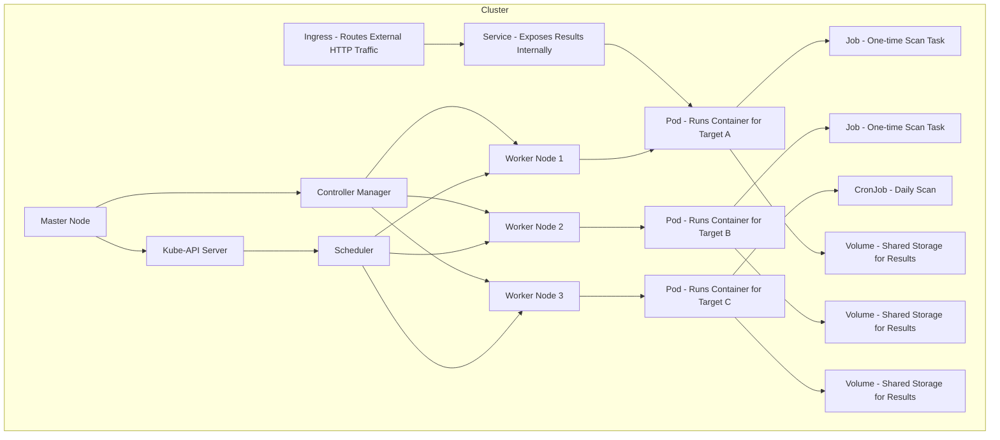

---
{"dg-publish":true,"permalink":"/0-learn-like-a-systems-engineer/kubernetes/kubernetes/","noteIcon":"","created":"2025-04-15T14:11:19.587-04:00"}
---

# 1. Intro

**Tester here.**

 With terms like Pods, Services, and Ingress, it can feel overwhelming—especially if you're coming from a systems engineering or traditional infrastructure background.

As a **simple person**, I decided to approach Kubernetes with a **systems engineering mindset**—stepping back to get a **50,000 ft view** of the big picture.

---

# 2. What & Why Systems Engineering?

A systems engineering approach breaks down complex systems into manageable pieces. This helps us understand, analyze, and eventually build or exploit them.

Let’s oversimplify the process:

1. **Need:** Define the problem (use cases & feasibility)
2. **Requirements:** Identify functional, physical, interface, and constraint requirements
3. **Architecture & Design:** Develop high-level and low-level blueprints
4. **Implementation:** Build and configure the solution
5. **Integration:** Connect the new system with existing ones
6. **Verification & Validation:** Ensure the system works as expected
7. **Deployment & Operations:** Maintain, monitor, and scale the solution

Let’s apply this to Kubernetes.

---

# 3. Enter Kubernetes

## 3.1 The Problem

Even with Docker, managing multiple containers across different systems is hard:
- What if one crashes?
- How do you scale it to 10 or 100 systems?
- How do you update without downtime?
- How do you ensure logs, storage, and networking are working?

## 3.2 Kubernetes to the Rescue

Kubernetes is an orchestration system designed to solve all of these problems. It acts like a robotic cluster manager.

**With Kubernetes, you can:**
- Deploy and run containers at scale
- Automatically restart or reschedule failed containers
- Distribute workloads across many machines
- Manage configuration, secrets, and storage cleanly
- Schedule one-time jobs or recurring tasks

---

# 4. Kubernetes from a Systems Engineer's POV

| Stage | Kubernetes Mapping |
|-------|---------------------|
| **1. Need** | Want to run multiple containers with high availability |
| **2. Requirements** | Define cluster size, container image needs, scaling rules |
| **3. Architecture & Design** | Plan Pods, Services, Deployments, Ingress, and Volumes |
| **4. Implementation** | Write YAML files (manifests), deploy using kubectl |
| **5. Integration** | Hook up with CI/CD, cloud storage, networking, auth |
| **6. Verification & Validation** | Use `kubectl logs`, probes, and metrics to verify behavior |
| **7. Deployment & Operations** | Use Helm, ArgoCD, autoscaling, and observability tools |

---

# 5. Two Use Cases

## 5.1 Use Case 1: Bob the Researcher

Bob wants to scan websites for research. He builds a Docker image with tools like ffuf and nikto. With Kubernetes, he can:
- Write a Job YAML
- Deploy it with `kubectl apply`
- Collect results from logs or shared volumes
- Scale to 50+ domains easily

**Bonus:** Bob sets up a CronJob to scan weekly.

## 5.2 Use Case 2: AtoZ Cyber LLC

AtoZ Cyber LLC does automated recon for clients. They use Kubernetes to:
- Run parallel recon jobs per client
- Route results to object storage
- Expose dashboards via Ingress and TLS
- Use node pools to separate staging vs. prod workloads

This lets their 2-person team handle work like a much bigger company.

---

# 6. How it works?

---

| Concept                | Description                                              |
| ---------------------- | -------------------------------------------------------- |
| **Pod**                | Smallest unit that runs 1 or more containers             |
| **Node**               | A machine that runs Pods                                 |
| **Cluster**            | All nodes managed together                               |
| **Job**                | One-time task (e.g. scan a target)                       |
| **CronJob**            | Repeatable task (e.g. daily scans)                       |
| **Deployment**         | Keeps services running 24/7                              |
| **Service**            | Lets Pods talk to each other or be accessed from outside |
| **Ingress**            | Routes HTTP(S) traffic to services                       |
| **Volume**             | Shared storage for Pods                                  |
| **ConfigMap / Secret** | Pass environment settings or credentials securely        |

# 7. Security & Ops Requirements

## 7.1 General
- Use Role-Based Access Control (RBAC)
- Isolate namespaces by client/team/project
- Use labels/annotations for tracking workloads

## 7.2 Security
- Use Network Policies to control Pod communication
- Enable TLS on all Ingress routes
- Scan images before use
- Rotate Secrets regularly

## 7.3 Performance
- Use Horizontal Pod Autoscaler for burst traffic
- Prefer native container logging (stdout/stderr)

## 7.4 Resilience
- Use readiness/liveness probes
- Spread workloads across zones or nodes
- Define PodDisruptionBudgets for safety during upgrades

---

