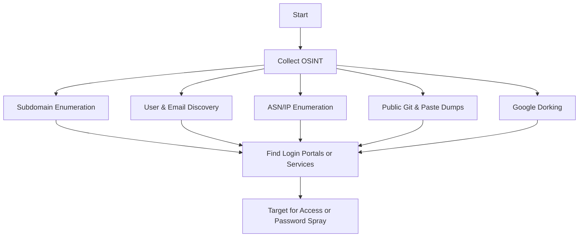

_Unauthenticated attacker with no access to the domain or internal network_
### **Objectives**

- Discover public-facing infrastructure
- Find leaked credentials or misconfigurations
- Collect intel on users, domains, emails, and IP ranges
- Identify weak points for initial foothold (e.g., VPN, OWA, RDP, misconfigured websites)

### **Reconnaissance Techniques**

| **Technique**         | **Tool/Source**                     | **Notes**                                        |
| --------------------- | ----------------------------------- | ------------------------------------------------ |
| Subdomain Enumeration | dnscan, fierce, amass               | Internal naming conventions, DNS structure       |
| Passive DNS           | crt.sh, dnsdumpster, shodan         | Certificate transparency and public exposure     |
| Email/User Discovery  | hunter.io, LinkedInt, theHarvester  | Emails, usernames, OSINT profiles                |
| ASN/IP Discovery      | whois, asnmap, bgp.he.net           | Find public IPs assigned to target org           |
| Breach Dumps          | dehashed, haveibeenpwned, snusbase  | Stolen credentials tied to target domain         |
| GitHub Secrets Search | truffleHog, GitLeaks, GitHub search | API keys, secrets, and passwords in public repos |
| Google Dorking        | Manual / tools                      | "site:domain.com" inurl:login, "filetype:pdf"    |

  

---

### **Common Targets**

- Public login portals: VPN, Citrix, OWA, RDP gateways
- Misconfigured exposed services: SMB, FTP, databases
- Public dev artifacts: .git, .svn, backup files
- Cloud buckets and misconfigured storage (e.g., S3, Azure Blob)
    
