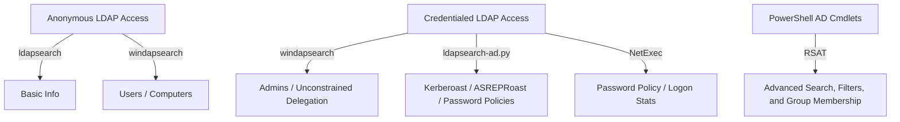

#  LDAP & Active Directory Enumeration Notes

## 1. Overview & Ports

**Protocol:** LDAP  
**Default Ports:**

- 389 (LDAP)
    
- 636 (LDAPS)
    
- 3268 (Global Catalog LDAP)
    
- 3269 (Global Catalog LDAPS)
    

**Use Cases:**

- User Authentication
- Centralized Management 
- Resource Access Control
- Information Lookup

---

## 2. Tools Overview

|Tool|Purpose|
|---|---|
|`ldapsearch`|Raw LDAP queries|
|`windapsearch`|Python tool to query LDAP (users, groups, computers)|
|`ldapsearch-ad.py`|Simplified AD enumeration|
|`netexec` (nxc)|Credential-based AD enumeration|
|PowerShell AD|RSAT-based enumeration on Windows|

---

## 3. LDAP Search Filters – PowerShell Summary

### Basic Operators

|Operator|Function|
|---|---|
|`&`|AND|
|`|`|
|`!`|NOT|

### Common LDAP Filters

|Purpose|Filter|
|---|---|
|All users|`(&(objectCategory=person)(objectClass=user))`|
|All groups|`(objectClass=group)`|
|All workstations|`(objectCategory=computer)`|
|Domain controllers|`(&(objectCategory=Computer)(userAccountControl:1.2.840.113556.1.4.803:=8192))`|
|Disabled users|`(&(objectCategory=person)(objectClass=user)(userAccountControl:1.2.840.113556.1.4.803:=2))`|
|Smart card required|`(userAccountControl:1.2.840.113556.1.4.803:=262144)`|
|Unconstrained delegation|`(userAccountControl:1.2.840.113556.1.4.803:=524288)`|
|PASSWD_NOTREQD & adminCount|`(&(objectCategory=person)(objectClass=user)(userAccountControl:1.2.840.113556.1.4.803:=32)(adminCount=1))`|

---

## 4. LDAP Enumeration with Tools

### ldapsearch (Linux Built-in)

```bash
ldapsearch -H ldap://<IP> -x -b "dc=domain,dc=local"
ldapsearch -x -H ldap://<IP> -D 'DOMAIN\\user' -w 'password' -b "CN=Users,DC=domain,DC=local"
```

### windapsearch

```bash
python3 windapsearch.py --dc-ip <IP> -u "" -U  # Users
python3 windapsearch.py --dc-ip <IP> -u "" -C  # Computers
python3 windapsearch.py --dc-ip <IP> -u "" --functionality
python3 windapsearch.py --dc-ip <IP> -u "domain\\user" -p password --da
python3 windapsearch.py --dc-ip <IP> -u "domain\\user" -p password --unconstrained-users
```

### ldapsearch-ad.py

```bash
python3 ldapsearch-ad.py -l <IP> -t info
python3 ldapsearch-ad.py -l <IP> -d domain -u user -p pass -t pass-pols
python3 ldapsearch-ad.py -l <IP> -d domain -u user -p pass -t kerberoast
python3 ldapsearch-ad.py -l <IP> -d domain -u user -p pass -t asreproast
```

### NetExec (nxc)

> General syntax:

```
nxc ldap <IP> -u <user> -p <pass> [options]
```

**Anonymous Bind (No credentials)**

```
nxc ldap <IP>
```

**Basic Authenticated Bind**

```
nxc ldap <IP> -u <username> -p <password> --domain <DOMAIN>
```

 **AS-REP Roasting**

```
nxc ldap <IP> -u <username> -p <password> --asreproast
```

**Kerberoasting**

```
nxc ldap <IP> -u <username> -p <password> --kerberoast
```

 **List All Users**

```
nxc ldap <IP> -u <username> -p <password> --users
```

**List Domain Info (Naming Contexts, DSE)**

```
nxc ldap <IP> -u <username> -p <password> --domaindump
```

**Find Unconstrained Delegation Users**
```
nxc ldap <IP> -u <username> -p <password> --delegation
```

**Password Policy (if supported)**

```
nxc ldap <IP> -u <username> -p <password> --policy
```

 **Custom Search Filter**

```
nxc ldap <IP> -u <username> -p <password> --filter '(userAccountControl:1.2.840.113556.1.4.803:=262144)'
```
 **Use SSL (LDAPS)**
```
nxc ldap ldaps://<IP>:636 -u <username> -p <password>
```

---


## 5. PowerShell AD Cmdlets - On parameter

```powershell
Get-ADUser -Filter {adminCount -gt 0} -Properties admincount,useraccountcontrol
Get-ADUser -Filter * -SearchBase 'OU=Admin,DC=domain,DC=local'
Get-WmiObject -Class win32_group -Filter "Domain='DOMAIN'" | Select Caption, Name
([adsisearcher]"(&(objectClass=Computer))").FindAll() | select Path
Get-ADUser -LDAPFilter '(userAccountControl:1.2.840.113556.1.4.803:=262144)'  # SmartCard required
Get-ADUser -LDAPFilter '(userAccountControl:1.2.840.113556.1.4.803:=524288)'  # Unconstrained Delegation
Get-ADGroup -LDAPFilter '(member:1.2.840.113556.1.4.1941:=<user_dn>)'
```

---

## 6. Mermaid Diagram



---

## 7. userAccountControl Flags

|Flag|Decimal|
|---|---|
|`NORMAL_ACCOUNT`|512|
|`DONT_EXPIRE_PASSWORD`|65536|
|`ENCRYPTED_TEXT_PWD_ALLOWED`|128|
|`SMARTCARD_REQUIRED`|262144|
|`TRUSTED_FOR_DELEGATION`|524288|

---