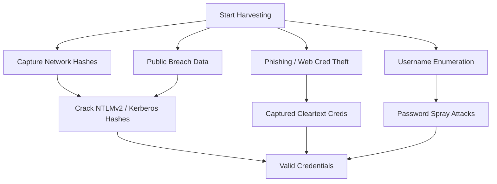

### **Objectives**

- Enumerate or guess valid usernames
- Harvest credentials via packet capture, phishing, public leaks
- Crack captured hashes or passwords to obtain usable credentials

   



---

### **Techniques and Tools**

|**Technique**|**Tool / Command**|**Notes**|
|---|---|---|
|**Username Enumeration**|kerbrute, rpcclient, enum4linux, ldapsearch|Discover valid usernames via Kerberos, LDAP, or SMB null sessions|
|**Password Spraying**|kerbrute, crackmapexec, DomainPasswordSpray.ps1|Use common passwords against many users, avoid lockouts|
|**LLMNR/NBT-NS Poisoning**|Responder, Inveigh|Capture NTLMv2 hashes from misconfigured network protocols|
|**Credential Dump Sites**|dehashed, snusbase, haveibeenpwned|Find reused or leaked credentials tied to domain emails|
|**GitHub Secret Search**|truffleHog, GitLeaks|API keys, database creds, hardcoded secrets in code|
|**Email Phishing**|Custom HTML or MS Word payloads|Trick users into submitting creds to a fake login portal|
|**Captured Hash Cracking**|hashcat, john|Offline cracking of captured hashes (e.g., NTLMv2, Kerberos)|

  

---

### **Example Password Spray with CrackMapExec**

```
crackmapexec smb 172.16.5.5 -u valid_users.txt -p 'Spring2024!' --pass-pol
```

### **Hashcat Example (NTLMv2)**

```
hashcat -m 5600 responder_ntlmv2.txt /usr/share/wordlists/rockyou.txt --force
```

  

---

### **Credential Targets**

- Domain user passwords
- Service account passwords
- NTLMv2 hashes
- Kerberos TGS-REP hashes (Kerberoasting)
- Cleartext from phishing or misconfigured systems
    

---

### **Pro Tips**

- **Track login failures** to avoid lockouts
- Combine **email recon** with brute-forcing tools
- Use **timing and jitter** with PowerShell-based sprays to evade detection
- Filter hash cracks for **reused weak passwords** across accounts or domains
    


  
