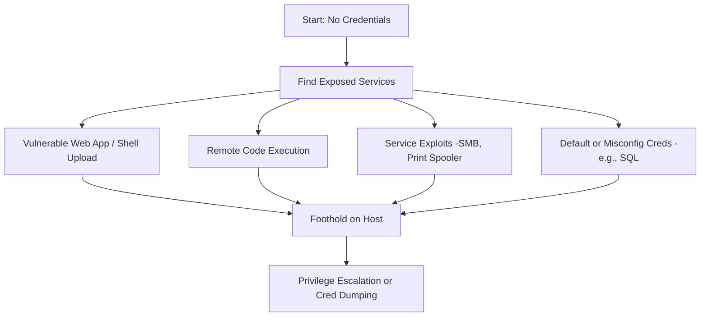

 

_Goal: Compromise a system or service without initially knowing any valid credentials._

---

### **Objectives**
- Exploit exposed services or interfaces
- Bypass authentication or abuse default credentials
- Achieve code execution on a domain-joined machine or internal service
   
---




  

---

### **Techniques and Tools**

| **Technique**                     | **Tool / Method**                                   | **Notes**                                           |
| --------------------------------- | --------------------------------------------------- | --------------------------------------------------- |
| **Web Shell Upload**              | Web app file upload → antak.aspx, php-reverse-shell | Drop and trigger reverse shell via HTTP             |
| **Default/Misconfig Credentials** | mssqlclient, xfreerdp, evil-winrm                   | Try sa:password, admin:admin, etc.                  |
| **SMB Exploits**                  | eternalblue, PrintNightmare, PetitPotam             | Gain access via unauthenticated SMB flaws           |
| **Print Spooler Abuse**           | PrintSpoofer64.exe                                  | Local privilege escalation or service impersonation |
| **RCE on SQL Server**             | PowerUpSQL, xp_cmdshell, mssqlclient                | Abusing command execution features inside SQL       |
| **Web Interface Exploits**        | Apache Struts, Tomcat RCEs, outdated CMS, etc.      | Exploit to gain shell or implant malware            |
| **Open RDP with No MFA**          | xfreerdp, ncrack                                    | Bruteforce login (e.g. on terminal servers)         |
| **Exposed Management Interfaces** | Jenkins, Elasticsearch, Redis                       | May allow unauthenticated access or weak secrets    |
  

---

### **Example 1: SQL Server RCE via xp_cmdshell**

```
EXEC sp_configure 'show advanced options', 1;
RECONFIGURE;
EXEC sp_configure 'xp_cmdshell', 1;
RECONFIGURE;
EXEC xp_cmdshell 'whoami';
```
  

---

### **Example 2: File Upload Webshell**

```
<!-- antak.aspx dropped to uploads folder -->
http://10.10.10.10/uploads/antak.aspx
```

  

---

### **Pro Tips**

- Map subnets early with fping, nmap, responder to catch protocols like LLMNR or NBNS   
- Check for weak file permissions in writable web roots    
- Review ipconfig /displaydns for domain controller names    
- Many SQL Servers run with **LOCAL SYSTEM**, which can lead to full machine compromise via xp_cmdshell
    
