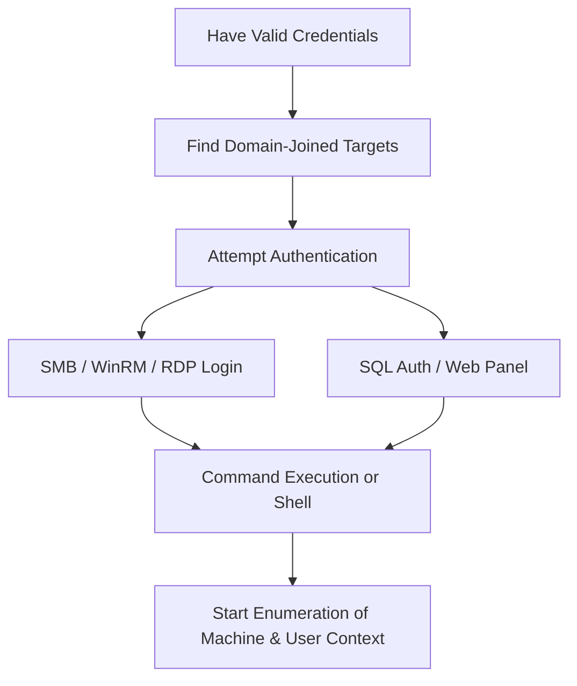

_Goal: Gain a shell or interactive session on a domain-joined system using captured or guessed credentials._

---
### **Objectives**

- Use valid credentials to authenticate to a domain-joined machine   
- Establish a stable foothold (CLI, shell, remote desktop, etc.)
- Identify the level of access and context of the current session
    

---



  

---

### **Techniques and Tools**

|**Technique / Protocol**|**Tool/Command**|**Notes**|
|---|---|---|
|SMB Authentication|crackmapexec smb <ip> -u <user> -p <pass>|Check access, enumerate shares or users|
|Remote Shell (WinRM)|evil-winrm -i <ip> -u <user> -p <pass>|Interactive shell with PowerShell support|
|RDP|xfreerdp /v:<ip> /u:<user> /p:<pass>|GUI session to interact with system|
|MSSQL|impacket-mssqlclient or PowerUpSQL|Authenticate to SQL instances for potential command exec|
|Local Enumeration via Shell|whoami, hostname, ipconfig, net user, etc.|Initial recon on the target box|
|Shared Folder Access|smbclient or smbmap|Browse file shares using authenticated session|
|Domain Enumeration (PowerView)|Get-Domain*, Get-Net* PowerShell commands|Confirm machine is domain-joined|

  

---

### **Example: WinRM Shell via** 

### **evil-winrm**

```
evil-winrm -i <IP> -u <USER> -p '<PASS>!'
```

  

---

### **Example: SMB Share Access with** 

### **smbmap**

```
smbmap -u <USERNAME> -p <PASSWORD> -d <DOMAIN> -H <IP>
```

  

---

### **Pro Tips**

- Use crackmapexec --local-auth if you suspect local accounts
- Drop tools via certutil, Invoke-WebRequest, or smbserver
- Verify domain membership with systeminfo or echo %userdomain%
- After connecting, check for **session tokens**, **credential files**, and **PowerShell logs**
   