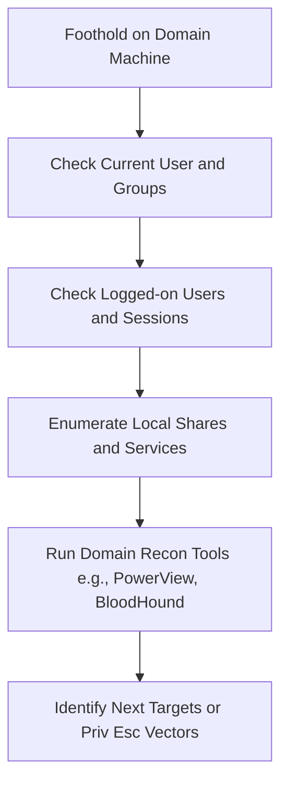

_Goal: Understand the machine’s role, who’s logged in, what privileges are available, and how it connects to the rest of the domain._

---

### **Objectives**

- Identify current user and their privileges  
- Enumerate local and domain groups
- Find active sessions, mapped shares, and cached credentials
   - Determine network topology and domain trust relationships
    

---



  

---

### **Techniques and Tools**

| **Task**                     | **Tool/Command**                                        | **Notes**                                           |
| ---------------------------- | ------------------------------------------------------- | --------------------------------------------------- |
| Whoami and System Info       | whoami, hostname, systeminfo, $env:UserDomain           | Check context and domain membership                 |
| Logged-on Users              | quser, query user, Get-WmiObject                        | See who else is active on the box                   |
| Local Groups and Members     | net localgroup, Get-LocalGroupMember, Get-NetLocalGroup | Check for Admins, RDP users                         |
| Mapped Drives and Shares     | net share, net use, Get-SmbShare, smbclient             | Look for sensitive shares                           |
| Scheduled Tasks and Services | schtasks /query, Get-Service                            | Possible persistence or privilege escalation vector |
| AD Enumeration (PowerView)   | Get-DomainUser, Get-DomainGroup, Find-LocalAdminAccess  | Gather domain layout and privilege mapping          |
| BloodHound Collection        | bloodhound-python, SharpHound.exe, IngestLDS.ps1        | Build graph of attack paths                         |
| File System Hunting          | where, dir /s, search -f *.kdbx or *.xml, *.config      | Hunt for secrets, passwords, configs                |
| Token Impersonation Check    | whoami /groups, whoami /priv                            | Look for impersonation or delegation rights         |

  

---

### **Example: PowerView Basic Usage**

```
Import-Module .\PowerView.ps1
Get-DomainUser -SPN
Get-DomainGroupMember -Identity "Domain Admins"
Find-LocalAdminAccess
```

  

---

### **Example: BloodHound Collection**

```
bloodhound-python -u <username> -p '<Password>!' -ns <DCIP> -d <DC> -c all
```

  

---

### **Pro Tips**

- Use native tools first for OPSEC (e.g., net, whoami, wmic)
- Watch for machines with multiple users or admin tokens
- Always record domain structure and user group mapping early
- Favor stealthier enumeration when in assumed compromise scenarios
    
