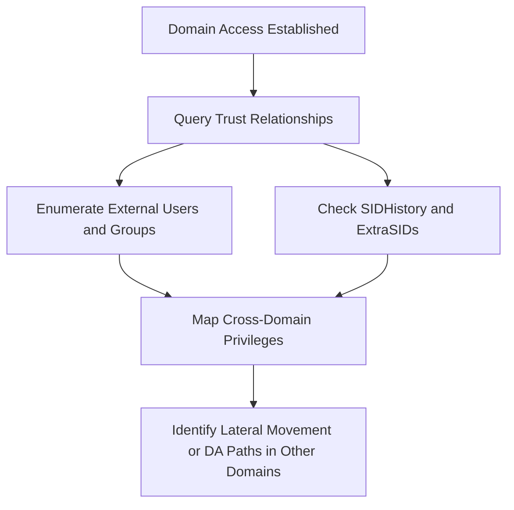

_Goal: Discover domain trusts, forest links, and cross-domain access paths to plan further movement or escalation._

---

### **Objectives**

- Identify trusted domains and forest relationships
    
- Enumerate users or groups from external domains
    
- Discover transitive trust paths or SID history abuse potential
    
- Map domain/forest topology for lateral movement or privilege escalation
    

---

### **Mermaid Diagram**



  

---

### **Techniques and Tools**

|**Task**|**Tool/Command**|**Notes**|
|---|---|---|
|Enumerate Domain Trusts|Get-DomainTrust, Get-ADTrust -Filter *|Lists all domain-to-domain trusts|
|Enumerate Forest Trusts|Get-ForestTrust, nltest /domain_trusts|View trans-forest trust relationships|
|Trust Mapping|Get-DomainTrustMapping (PowerView)|Resolve all visible trusts and how they connect|
|External Group Membership|Get-DomainForeignGroupMember, Get-DomainForeignUser|Show users/groups that belong to external domains|
|SIDHistory Checks|Get-DomainUser -Properties SIDHistory|Look for accounts with old or injected SIDs|
|BloodHound Forest View|bloodhound-python -c trusts, GUI Analysis|Visualize forest/domain links and user paths|
|Check Trust ACL Abuse|Get-DomainObjectACL, Find-InterestingDomainAcl|Find misconfigs in trust ACLs|
|Kerberos ExtraSID Attack Detection|Ticket decoding via Rubeus, mimikatz, BloodHound|Look for extra SIDs granting elevated access|

  

---

### **Example: PowerView Trust Enumeration**

```
Import-Module .\PowerView.ps1
Get-DomainTrust
Get-DomainForeignGroupMember
```

  

---

### **Example: BloodHound Trust Collection**

```
bloodhound-python -u user -p pass -ns <IP> -d <DOMAIN> -c trusts
```

  

---

### **Example: Check for SIDHistory Abuse**

```
Get-DomainUser -Properties SIDHistory | Where-Object { $_.SIDHistory -ne $null }
```

  

---

### **Pro Tips**

- Trusts can be **bidirectional**, **one-way**, or **external-only**
    
- External users in privileged groups can be **overlooked**
    
- Injected SIDs (via golden ticket) may **bypass trust controls**
    
- Use **SID history abuse** for stealthy domain hopping
    
