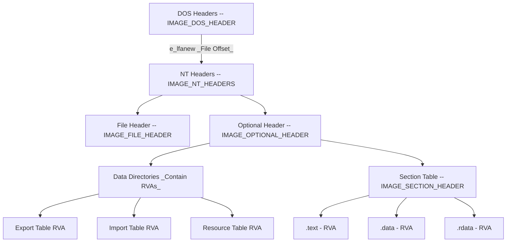
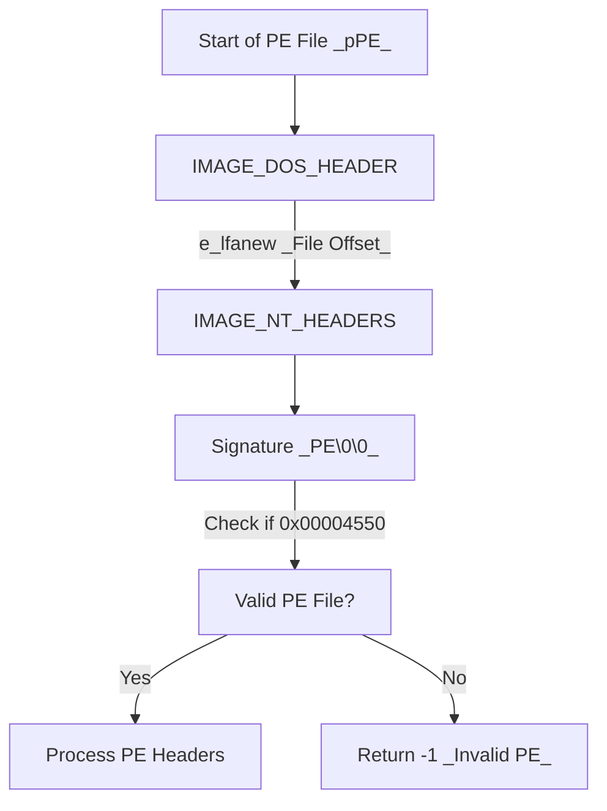
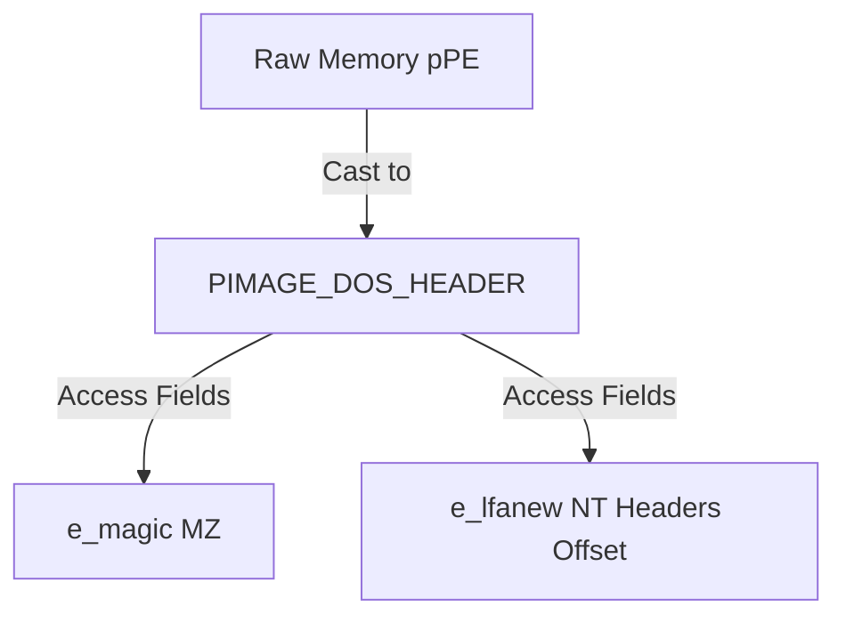
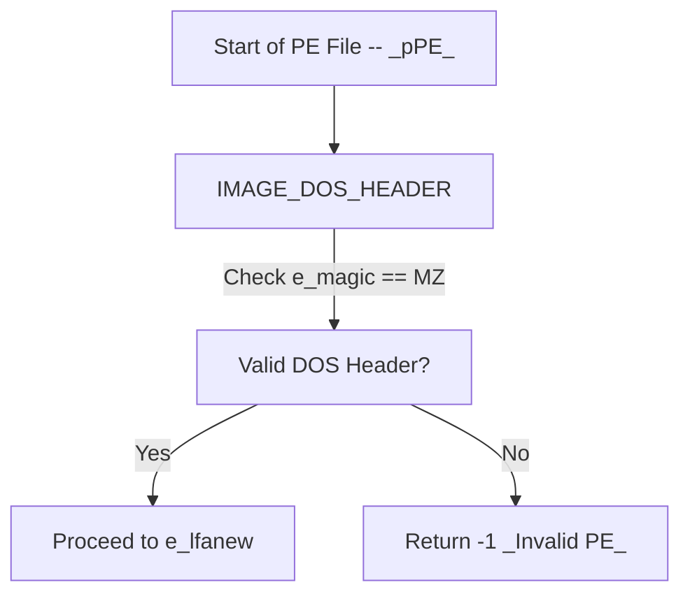

https://www.linkedin.com/pulse/understanding-portable-executable-pe-files-malware-ignatius-michael/


So much credit to this guy. 
https://library.mosse-institute.com/articles/2022/05/reverse-engineering-portable-executables-pe-part-2/reverse-engineering-portable-executables-pe-part-2.html


## **1. Portable Executable - PE**
The **Portable Executable (PE)** format is used for executables (`.exe`), dynamic-link libraries (`.dll`), and other system files in Windows. It contains various headers and sections that define how the file should be loaded and executed.


Overall, concept.



---




### **Relative Virtual Addresses (RVAs)**
- **RVAs** are **32-bit offsets** used in PE files to reference locations **relative** to the file’s start.
- They help locate **code, data, resources, and tables** (e.g., Import Table, Export Table).
- **Why RVAs?** They allow PE files to be loaded at different memory addresses without modification. ==RVA is only meaning after it is loaded to a memory==
- **Conversion to Virtual Address (VA):**  
  - **VA = Base Address + RVA**  
  - The OS adds the module’s base address to the RVA to determine the actual memory address.

### **1.1 PE Structure**
A PE file consists of:
* DOS/MZ Header
	* `e_magic`
	* `e_lfanew`
* NT Header  `IMAGE_NT_HEADERS`
	* Signature  
	* File Header  `IMAGE_FILE_HEADER`
	* Optional Header  `IMAGE_OPTIONAL_HEADER`
		* DataDirectory (IMAGE_DATA_DIRECTORY)
			* EXPORT
			* IMPORT
			* RESOURCE
			* etc...
* Section Table
	* Section Metadata
* Sections
	*  The actual data blocks in the PE file (e.g., code, resources, variables)
	* .text: Executable code.
	* .data: Initialized data.
	* .reloc
	* .rsrc: Resources.


---


#### DOS/MZ Header
- **DOS/MZ Header (`IMAGE_DOS_HEADER`)**: Ensures compatibility with old DOS systems.
	- `e_magic` - Signature: MZ. **Every portable executable will begin with this sequence**
	- `e_lfanew`: `DWORD` offset to new PE header that includes `PE\0\0`
		-  A DWORD (4-byte) value that specifies the file offset to the NT Headers.
		- Example
		 ` e_lfanew = 0xF0` --> Means at file offset 0XF0, we will find NT Headers (PE signature, COFF Header, Operational Header, and Section table) 
	- How to Retrieve DOS Header?
```cpp
// Pointer to the structure 
PIMAGE_DOS_HEADER pImgDosHdr = (PIMAGE_DOS_HEADER)pPE;		
//pPE is a pointer to the start of the PE file in memory
//This casts pPE into a pointer of type PIMAGE_DOS_HEADER (which is IMAGE_DOS_HEADER*).
//The Cast: (PIMAGE_DOS_HEADER)pPE takes the memory address stored in pPE and tells the compiler, "Treat this address as the starting point of an IMAGE_DOS_HEADER structure."
//interpreting the memory that pPE points to as being laid out in the format of an IMAGE_DOS_HEADER structure.
//This allows structured access to the PE file's DOS Header fields.
```

Visualization of (PIMAGE_DOS_HEADER)pPE : Type Casting

Why Casting?
==This allows structured access to the PE file's DOS Header fields.== Without casting, pPE is just a void* or BYTE* (raw memory).
The Cast: (PIMAGE_DOS_HEADER)pPE takes the memory address stored in pPE and tells the compiler, "Treat this address as the starting point of an IMAGE_DOS_HEADER structure."




Overall: 
```cpp
// Pointer to the structure 
PIMAGE_DOS_HEADER pImgDosHdr = (PIMAGE_DOS_HEADER)pPE;		
//pPE is a pointer to the start of the PE file in memory
//This casts pPE into a pointer of type PIMAGE_DOS_HEADER (which is IMAGE_DOS_HEADER*).
//The Cast: (PIMAGE_DOS_HEADER)pPE takes the memory address stored in pPE and tells the compiler, "Treat this address as the starting point of an IMAGE_DOS_HEADER structure."
//interpreting the memory that pPE points to as being laid out in the format of an IMAGE_DOS_HEADER structure.
//This allows structured access to the PE file's DOS Header fields.

if (pImgDosHdr->e_magic != IMAGE_DOS_SIGNATURE){
	return -1;
}
```




---


#### NT Header
- **NT Header (IMAGE_NT_HEADERS)**: Defines characteristics, entry point, and sections.
	- Signature → `"PE\0\0" (0x50 0x45 0x00 0x00)`
	- File Header → (`IMAGE_FILE_HEADER`, also called the COFF Header)
	- Optional Header → (`IMAGE_OPTIONAL_HEADER`, contains RVAs, load settings, and Data Directories)
	How to reach NT Header?
	
```cpp
PIMAGE_NT_HEADERS pImgNtHdrs = (PIMAGE_NT_HEADERS)(pPE + pImgDosHdr->e_lfanew);

//(pPE + pImgDosHdr->e_lfanewso) this is telling pPE (base) + e_flanew(offset) will be  interpreted into PIMAGE_NT_HEADER format

if (pImgNtHdrs->Signature != IMAGE_NT_SIGNATURE) {
	return -1;
}
//IMAGE_NT_SIGNATURE is a predefined value "PE\0\0"

```

Let's break it down -` IMAGE_NT_HEADERS`
```c
typedef struct _IMAGE_NT_HEADERS {
    DWORD Signature;                  // "PE\0\0"
    IMAGE_FILE_HEADER FileHeader;     // 20 bytes
    IMAGE_OPTIONAL_HEADER32 OptionalHeader; // Varies (e.g., 224 bytes for PE32)
} IMAGE_NT_HEADERS32, *PIMAGE_NT_HEADERS32;

// For 64-bit (PE32+), it’s IMAGE_NT_HEADERS64 with IMAGE_OPTIONAL_HEADER64
```

##### `IMAGE_FILE_HEADER` Structure
```c
typedef struct _IMAGE_FILE_HEADER {
    WORD  Machine;              // 2 bytes - Target machine type
    WORD  NumberOfSections;     // 2 bytes - Number of sections in the PE file
    DWORD TimeDateStamp;        // 4 bytes - File creation timestamp
    DWORD PointerToSymbolTable; // 4 bytes - Offset to the symbol table (deprecated)
    DWORD NumberOfSymbols;      // 4 bytes - Number of symbols in the table (deprecated)
    WORD  SizeOfOptionalHeader; // 2 bytes - Size of the optional header
    WORD  Characteristics;      // 2 bytes - Flags defining file characteristics
} IMAGE_FILE_HEADER, *PIMAGE_FILE_HEADER;
```

| Field                  | Size    | Description                                                                                                                         |
| ---------------------- | ------- | ----------------------------------------------------------------------------------------------------------------------------------- |
| `Machine`              | 2 bytes | The type of machine for which the PE file or object file is intended.                                                               |
| `NumberOfSections`     | 2 bytes | The number of sections in the PE file or object file.                                                                               |
| `TimeDateStamp`        | 4 bytes | Time and date when the PE file or object file was created.                                                                          |
| `PointerToSymbolTable` | 4 bytes | Offset in the file to the symbol table, if it exists.                                                                               |
| `NumberOfSymbols`      | 4 bytes | Number of symbols in the symbol table.                                                                                              |
| `SizeOfOptionalHeader` | 2 bytes | The size of the optional header.                                                                                                    |
| `Characteristics`      | 2 bytes | The characteristics of the PE file or object file. Defined by `IMAGE_FILE_*` constants to specify the file type (.exe, .dll, .sys).


##### `IMAGE_OPTIONAL_HEADER`


```c
typedef struct _IMAGE_OPTIONAL_HEADER32 {
    WORD  Magic;                          // 2 bytes
    BYTE  MajorLinkerVersion;             // 1 byte
    BYTE  MinorLinkerVersion;             // 1 byte
    DWORD SizeOfCode;                      // 4 bytes
    DWORD SizeOfInitializedData;           // 4 bytes
    DWORD SizeOfUninitializedData;         // 4 bytes
    DWORD AddressOfEntryPoint;             // 4 bytes
    DWORD BaseOfCode;                      // 4 bytes
    DWORD BaseOfData;                      // 4 bytes
    DWORD ImageBase;                       // 4 bytes
    DWORD SectionAlignment;                // 4 bytes
    DWORD FileAlignment;                   // 4 bytes
    WORD  MajorOperatingSystemVersion;     // 2 bytes
    WORD  MinorOperatingSystemVersion;     // 2 bytes
    WORD  MajorImageVersion;               // 2 bytes
    WORD  MinorImageVersion;               // 2 bytes
    WORD  MajorSubsystemVersion;           // 2 bytes
    WORD  MinorSubsystemVersion;           // 2 bytes
    DWORD Win32VersionValue;               // 4 bytes
    DWORD SizeOfImage;                     // 4 bytes
    DWORD SizeOfHeaders;                   // 4 bytes
    DWORD CheckSum;                        // 4 bytes
    WORD  Subsystem;                       // 2 bytes
    WORD  DllCharacteristics;              // 2 bytes
    DWORD SizeOfStackReserve;              // 4 bytes
    DWORD SizeOfStackCommit;               // 4 bytes
    DWORD SizeOfHeapReserve;               // 4 bytes
    DWORD SizeOfHeapCommit;                // 4 bytes
    DWORD LoaderFlags;                     // 4 bytes
    DWORD NumberOfRvaAndSizes;             // 4 bytes
    IMAGE_DATA_DIRECTORY DataDirectory[16]; // 128 bytes
} IMAGE_OPTIONAL_HEADER32, *PIMAGE_OPTIONAL_HEADER32;

typedef struct _IMAGE_OPTIONAL_HEADER64 {
    WORD  Magic;                          // 2 bytes
    BYTE  MajorLinkerVersion;             // 1 byte
    BYTE  MinorLinkerVersion;             // 1 byte
    DWORD SizeOfCode;                      // 4 bytes
    DWORD SizeOfInitializedData;           // 4 bytes
    DWORD SizeOfUninitializedData;         // 4 bytes
    DWORD AddressOfEntryPoint;             // 4 bytes
    DWORD BaseOfCode;                      // 4 bytes
    ULONGLONG ImageBase;                   // 8 bytes (different from 32-bit)
    DWORD SectionAlignment;                // 4 bytes
    DWORD FileAlignment;                   // 4 bytes
    WORD  MajorOperatingSystemVersion;     // 2 bytes
    WORD  MinorOperatingSystemVersion;     // 2 bytes
    WORD  MajorImageVersion;               // 2 bytes
    WORD  MinorImageVersion;               // 2 bytes
    WORD  MajorSubsystemVersion;           // 2 bytes
    WORD  MinorSubsystemVersion;           // 2 bytes
    DWORD Win32VersionValue;               // 4 bytes
    DWORD SizeOfImage;                     // 4 bytes
    DWORD SizeOfHeaders;                   // 4 bytes
    DWORD CheckSum;                        // 4 bytes
    WORD  Subsystem;                       // 2 bytes
    WORD  DllCharacteristics;              // 2 bytes
    ULONGLONG SizeOfStackReserve;          // 8 bytes (different from 32-bit)
    ULONGLONG SizeOfStackCommit;           // 8 bytes (different from 32-bit)
    ULONGLONG SizeOfHeapReserve;           // 8 bytes (different from 32-bit)
    ULONGLONG SizeOfHeapCommit;            // 8 bytes (different from 32-bit)
    DWORD LoaderFlags;                     // 4 bytes
    DWORD NumberOfRvaAndSizes;             // 4 bytes
    IMAGE_DATA_DIRECTORY DataDirectory[16]; // 128 bytes
} IMAGE_OPTIONAL_HEADER64, *PIMAGE_OPTIONAL_HEADER64;

```


| Field                                                         | Description                                                                              |
| ------------------------------------------------------------- | ---------------------------------------------------------------------------------------- |
| `Magic`                                                       | Specifies the type of optional header present in the file.                               |
| `MajorLinkerVersion` & `MinorLinkerVersion`                   | Version of the linker used to create the PE file.                                        |
| `SizeOfCode`                                                  | Size of the code section in the PE file.                                                 |
| `SizeOfInitializedData`                                       | Size of the initialized data section in the PE file.                                     |
| `SizeOfUninitializedData`                                     | Size of the uninitialized data section in the PE file.                                   |
| `AddressOfEntryPoint`                                         | RVA of the entry point function in the PE file.                                          |
| `BaseOfCode`                                                  | RVA of the base address of the code section.                                             |
| `BaseOfData` (Only in 32-bit)                                 | RVA of the base address of the data section.                                             |
| `ImageBase`                                                   | Preferred base address at which the PE file should be loaded.                            |
| `MajorOperatingSystemVersion` & `MinorOperatingSystemVersion` | Minimum OS version required to run the PE file.                                          |
| `MajorImageVersion` & `MinorImageVersion`                     | Version of the PE file.                                                                  |
| `DataDirectory`                                               | An array of `IMAGE_DATA_DIRECTORY`, which contains important directories in the PE file. |

###### DataDirectory (IMAGE_DATA_DIRECTORY)
```c
typedef struct _IMAGE_DATA_DIRECTORY {
    DWORD VirtualAddress;  // 4 bytes - RVA of the table
    DWORD Size;            // 4 bytes - Size of the table in bytes
} IMAGE_DATA_DIRECTORY, *PIMAGE_DATA_DIRECTORY;

```


| Index | Directory Entry                        | Description                                                                                                      |
| ----- | -------------------------------------- | ---------------------------------------------------------------------------------------------------------------- |
| 0     | `IMAGE_DIRECTORY_ENTRY_EXPORT`         | Contains information about the functions and data that are exported from the PE file.                            |
| 1     | `IMAGE_DIRECTORY_ENTRY_IMPORT`         | Contains information about the functions and data that are imported from other modules.                          |
| 2     | `IMAGE_DIRECTORY_ENTRY_RESOURCE`       | Contains information about the resources (such as icons, strings, and bitmaps) that are included in the PE file. |
| 3     | `IMAGE_DIRECTORY_ENTRY_EXCEPTION`      | Contains information about the exception handling tables in the PE file.                                         |
| 4     | `IMAGE_DIRECTORY_ENTRY_SECURITY`       | Contains digital signature data.                                                                                 |
| 5     | `IMAGE_DIRECTORY_ENTRY_BASERELOC`      | Holds base relocation entries for address adjustments.                                                           |
| 6     | `IMAGE_DIRECTORY_ENTRY_DEBUG`          | Contains debugging information.                                                                                  |
| 7     | `IMAGE_DIRECTORY_ENTRY_ARCHITECTURE`   | Reserved, usually unused.                                                                                        |
| 8     | `IMAGE_DIRECTORY_ENTRY_GLOBALPTR`      | Used for IA64 architecture, generally not present.                                                               |
| 9     | `IMAGE_DIRECTORY_ENTRY_TLS`            | Contains Thread Local Storage (TLS) data.                                                                        |
| 10    | `IMAGE_DIRECTORY_ENTRY_LOAD_CONFIG`    | Holds system security settings and mitigation policies.                                                          |
| 11    | `IMAGE_DIRECTORY_ENTRY_BOUND_IMPORT`   | Lists precomputed binding information for imports.                                                               |
| 12    | `IMAGE_DIRECTORY_ENTRY_IAT`            | Stores addresses of imported functions for runtime resolution.                                                   |
| 13    | `IMAGE_DIRECTORY_ENTRY_DELAY_IMPORT`   | Stores delayed-load import information.                                                                          |
| 14    | `IMAGE_DIRECTORY_ENTRY_COM_DESCRIPTOR` | Used for .NET assemblies.                                                                                        |
| 15    | `IMAGE_DIRECTORY_ENTRY_RESERVED`       | Unused, reserved for future use.                                                                                 |

```c
// IMAGE_EXPORT_DIRECTORY - Stores information about exported functions and data
typedef struct _IMAGE_EXPORT_DIRECTORY {
    DWORD   Characteristics;
    DWORD   TimeDateStamp;
    WORD    MajorVersion;
    WORD    MinorVersion;
    DWORD   Name;                    // RVA to the name of the module
    DWORD   Base;                    // Starting ordinal number
    DWORD   NumberOfFunctions;        // Total number of exported functions
    DWORD   NumberOfNames;            // Number of exported function names
    DWORD   AddressOfFunctions;       // RVA to function address array
    DWORD   AddressOfNames;           // RVA to function names array
    DWORD   AddressOfNameOrdinals;    // RVA to function ordinals array
} IMAGE_EXPORT_DIRECTORY, *PIMAGE_EXPORT_DIRECTORY;

// IMAGE_IMPORT_DESCRIPTOR - Stores information about imported functions and modules
typedef struct _IMAGE_IMPORT_DESCRIPTOR {
    union {
        DWORD   Characteristics;
        DWORD   OriginalFirstThunk;  // RVA to the import lookup table
    } DUMMYUNIONNAME;
    DWORD   TimeDateStamp;
    DWORD   ForwarderChain;
    DWORD   Name;                     // RVA to the name of the DLL
    DWORD   FirstThunk;                // RVA to the import address table (IAT)
} IMAGE_IMPORT_DESCRIPTOR, *PIMAGE_IMPORT_DESCRIPTOR;

// IMAGE_RESOURCE_DIRECTORY - Stores resource data such as icons, bitmaps, strings
typedef struct _IMAGE_RESOURCE_DIRECTORY {
    DWORD   Characteristics;
    DWORD   TimeDateStamp;
    WORD    MajorVersion;
    WORD    MinorVersion;
    WORD    NumberOfNamedEntries;
    WORD    NumberOfIdEntries;
} IMAGE_RESOURCE_DIRECTORY, *PIMAGE_RESOURCE_DIRECTORY;

// IMAGE_EXCEPTION_DIRECTORY - Stores exception handling information
typedef struct _IMAGE_RUNTIME_FUNCTION_ENTRY {
    DWORD BeginAddress;
    DWORD EndAddress;
    DWORD UnwindData;  // RVA to unwind information
} IMAGE_RUNTIME_FUNCTION_ENTRY, *PIMAGE_RUNTIME_FUNCTION_ENTRY;

// IMAGE_SECURITY_DIRECTORY - Stores digital signature data
typedef struct _WIN_CERTIFICATE {
    DWORD dwLength;
    WORD  wRevision;
    WORD  wCertificateType; // WIN_CERT_TYPE_PKCS_SIGNED_DATA
    BYTE  bCertificate[1];  // Certificate data
} WIN_CERTIFICATE, *PWIN_CERTIFICATE;

// IMAGE_BASERELOC_DIRECTORY - Stores base relocation data
typedef struct _IMAGE_BASE_RELOCATION {
    DWORD   VirtualAddress;  // RVA of the page that needs relocation
    DWORD   SizeOfBlock;     // Size of this relocation block
} IMAGE_BASE_RELOCATION, *PIMAGE_BASE_RELOCATION;

// IMAGE_DEBUG_DIRECTORY - Stores debugging information
typedef struct _IMAGE_DEBUG_DIRECTORY {
    DWORD   Characteristics;
    DWORD   TimeDateStamp;
    WORD    MajorVersion;
    WORD    MinorVersion;
    DWORD   Type;
    DWORD   SizeOfData;
    DWORD   AddressOfRawData;
    DWORD   PointerToRawData;
} IMAGE_DEBUG_DIRECTORY, *PIMAGE_DEBUG_DIRECTORY;

// IMAGE_ARCHITECTURE_DIRECTORY - Reserved, usually unused
typedef struct _IMAGE_ARCHITECTURE_ENTRY {
    DWORD FixupInstRVA;
    DWORD NewInst;
} IMAGE_ARCHITECTURE_ENTRY, *PIMAGE_ARCHITECTURE_ENTRY;

// IMAGE_GLOBALPTR_DIRECTORY - Used for IA64 architecture
typedef struct _IMAGE_GLOBALPTR {
    DWORD VirtualAddress;
} IMAGE_GLOBALPTR, *PIMAGE_GLOBALPTR;

// IMAGE_TLS_DIRECTORY - Stores Thread Local Storage (TLS) data
typedef struct _IMAGE_TLS_DIRECTORY {
    DWORD   StartAddressOfRawData;
    DWORD   EndAddressOfRawData;
    DWORD   AddressOfIndex;
    DWORD   AddressOfCallBacks;  // RVA to an array of TLS callback functions
    DWORD   SizeOfZeroFill;
    DWORD   Characteristics;
} IMAGE_TLS_DIRECTORY, *PIMAGE_TLS_DIRECTORY;

// IMAGE_LOAD_CONFIG_DIRECTORY - Stores system security settings
typedef struct _IMAGE_LOAD_CONFIG_DIRECTORY {
    DWORD   Size;
    DWORD   TimeDateStamp;
    WORD    MajorVersion;
    WORD    MinorVersion;
    DWORD   GlobalFlagsClear;
    DWORD   GlobalFlagsSet;
    DWORD   CriticalSectionDefaultTimeout;
    DWORD   DeCommitFreeBlockThreshold;
    DWORD   DeCommitTotalFreeThreshold;
    DWORD   LockPrefixTable;
    DWORD   MaximumAllocationSize;
    DWORD   VirtualMemoryThreshold;
    DWORD   ProcessHeapFlags;
    DWORD   Reserved[2];
} IMAGE_LOAD_CONFIG_DIRECTORY, *PIMAGE_LOAD_CONFIG_DIRECTORY;

// IMAGE_BOUND_IMPORT_DESCRIPTOR - Stores bound import information
typedef struct _IMAGE_BOUND_IMPORT_DESCRIPTOR {
    DWORD   TimeDateStamp;
    WORD    OffsetModuleName;
    WORD    NumberOfModuleForwarderRefs;
} IMAGE_BOUND_IMPORT_DESCRIPTOR, *PIMAGE_BOUND_IMPORT_DESCRIPTOR;

// IMAGE_IMPORT_ADDRESS_TABLE - Stores imported function addresses
typedef struct _IMAGE_IMPORT_ADDRESS_TABLE {
    DWORD   FunctionRVA;
} IMAGE_IMPORT_ADDRESS_TABLE, *PIMAGE_IMPORT_ADDRESS_TABLE;

// IMAGE_DELAY_IMPORT_DESCRIPTOR - Stores delayed import information
typedef struct _IMAGE_DELAY_IMPORT_DESCRIPTOR {
    DWORD Attributes;
    DWORD Name;
    DWORD ModuleHandle;
    DWORD ImportAddressTable;
    DWORD ImportNameTable;
    DWORD BoundImportAddressTable;
    DWORD UnloadInformationTable;
    DWORD TimeStamp;
} IMAGE_DELAY_IMPORT_DESCRIPTOR, *PIMAGE_DELAY_IMPORT_DESCRIPTOR;

// IMAGE_COM_DESCRIPTOR - Used for .NET assemblies
typedef struct _IMAGE_COR20_HEADER {
    DWORD   cb;
    WORD    MajorRuntimeVersion;
    WORD    MinorRuntimeVersion;
    IMAGE_DATA_DIRECTORY MetaData;
    DWORD   Flags;
    DWORD   EntryPointToken;
    IMAGE_DATA_DIRECTORY Resources;
    IMAGE_DATA_DIRECTORY StrongNameSignature;
} IMAGE_COR20_HEADER, *PIMAGE_COR20_HEADER;

```

How to call.
```c
PIMAGE_EXPORT_DIRECTORY pImgExportDir = (PIMAGE_EXPORT_DIRECTORY)(pPE + ImgOptHdr.DataDirectory[IMAGE_DIRECTORY_ENTRY_EXPORT].VirtualAddress);


IMAGE_IMPORT_DESCRIPTOR* pImgImpDesc = (PIMAGE_IMPORT_DESCRIPTOR)(pPE + ImgOptHdr.DataDirectory[IMAGE_DIRECTORY_ENTRY_IMPORT].VirtualAddress);


```

---


####  PE Sections
PE sections define different parts of an executable file. 
- **Sections like .text, .data, .reloc, .rdata**: Stores code, data, and resources.


| Section  | Description                                                      |
| -------- | ---------------------------------------------------------------- |
| `.text`  | Contains executable code.                                        |
| `.data`  | Holds global and static variables.                               |
| `.reloc` | Stores base relocation entries.                                  |
| `.rsrc`  | Contains resources like icons, bitmaps, and version information. |

Each section has an **IMAGE_SECTION_HEADER** structure that provides metadata about the section.

---

## IMAGE_SECTION_HEADER Structure
```c
typedef struct _IMAGE_SECTION_HEADER {
  BYTE  Name[IMAGE_SIZEOF_SHORT_NAME]; // Section name (ASCII, null-terminated)
  union {
    DWORD PhysicalAddress;
    DWORD VirtualSize;
  } Misc;
  DWORD VirtualAddress;        // RVA of section in memory
  DWORD SizeOfRawData;         // Size of section in the PE file
  DWORD PointerToRawData;      // File offset to section data
  DWORD PointerToRelocations;  // File offset to relocations
  DWORD PointerToLinenumbers;  // File offset to line numbers
  WORD  NumberOfRelocations;   // Number of relocations
  WORD  NumberOfLinenumbers;   // Number of line numbers
  DWORD Characteristics;       // Section attributes (executable, readable, writable, etc.)
} IMAGE_SECTION_HEADER, *PIMAGE_SECTION_HEADER;
```

---

## Retrieving the IMAGE_SECTION_HEADER Structure

1. The `IMAGE_SECTION_HEADER` array is stored **immediately after** `IMAGE_NT_HEADERS`
2. 
```C
PIMAGE_SECTION_HEADER pImgSectionHdr = (PIMAGE_SECTION_HEADER)(((PBYTE)pImgNtHdrs) + sizeof(IMAGE_NT_HEADERS));
```

3. Loop through sections using `IMAGE_FILE_HEADER.NumberOfSections`.

---

## Looping Through PE Sections
```c
PIMAGE_SECTION_HEADER pImgSectionHdr = (PIMAGE_SECTION_HEADER)(((PBYTE)pImgNtHdrs) + sizeof(IMAGE_NT_HEADERS));
/* 
pImgNtHdrs is a pointer to an IMAGE_NT_HEADERS structure, which contains details about the PE file, including its sections.


sizeof(IMAGE_NT_HEADERS) moves the pointer past the NT Headers to reach the start of the IMAGE_SECTION_HEADER array.

(PBYTE)pImgNtHdrs ensures byte-wise pointer arithmetic (since pImgNtHdrs is a struct pointer). PBYTE is a pointer to a BYTE, which is an unsigned 8-bit integer (typedef unsigned char BYTE;).

Final Effect: pImgSectionHdr now points to the first section header in the PE file.

*/*

for (size_t i = 0; i < pImgNtHdrs->FileHeader.NumberOfSections; i++) {
    // pImgSectionHdr is a pointer to section 1
    pImgSectionHdr = (PIMAGE_SECTION_HEADER)((PBYTE)pImgSectionHdr + (DWORD)sizeof(IMAGE_SECTION_HEADER));
    // pImgSectionHdr is a pointer to section 2
}
```


---
