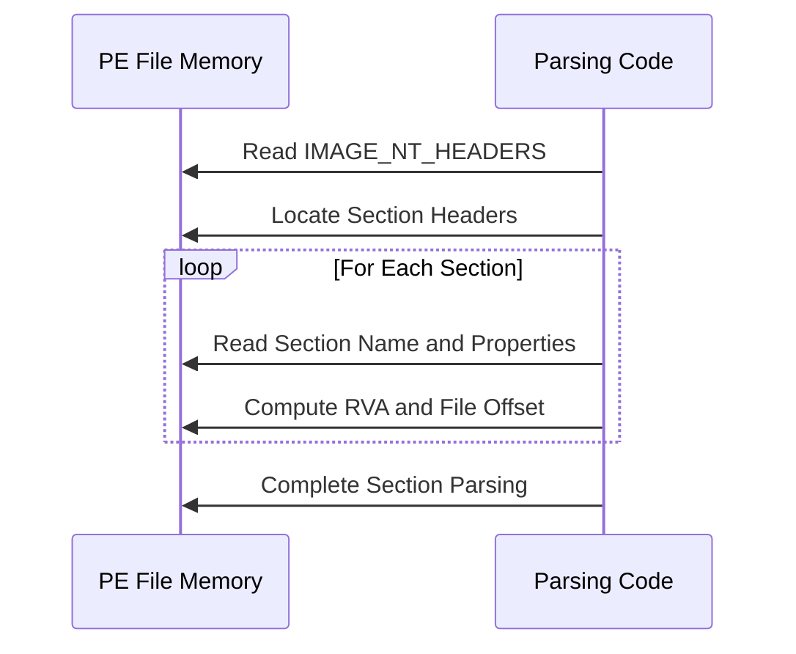
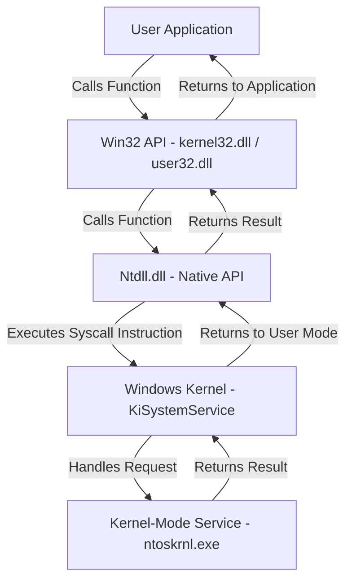

### **Memory Layout: How the Code Moves**


---

### **Binary Traversal: Pointer Arithmetic**


---

### **Explanation of Execution**
1. **The PE file is loaded into memory**.
2. **The program reads the PE headers**: IMAGE_DOS_HEADER and IMAGE_NT_HEADERS.
3. **It locates the start of section headers** by skipping IMAGE_NT_HEADERS.
4. **A loop iterates through sections**, moving from one IMAGE_SECTION_HEADER to the next.
5. **Each section's metadata is extracted**, such as:
   - Name `.text`, `.data`, `.rsrc`, `.reloc`
   - Virtual Address
   - Size of Raw Data
   - Characteristics: Executable, Readable, Writable
1. **Execution completes after parsing all sections**.


*https://fluxsec.red/rust-edr-evasion-hells-gate*


```

```

