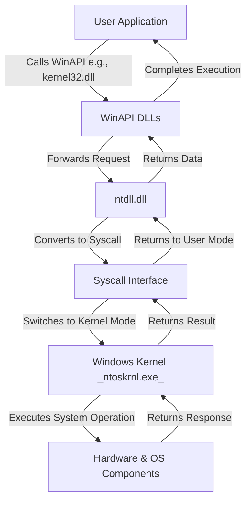

---
{"dg-publish":true,"permalink":"/attack-computer/attack-windows/1-windows-basic/3-flow-of-system-calls-ntdll-dll-kernel32-dll/","noteIcon":"","created":"2025-04-15T14:11:19.615-04:00"}
---

**basic flow of `ntdll.dll` in Windows system operations**:

[[4a. NTDLL.DLL - Overview and Functionality\|Attack Computer/Attack Windows/1. Windows Basic/4a. NTDLL.DLL - Overview and Functionality]]

[[4. Win32 API and Windows Native API\|Attack Computer/Attack Windows/1. Windows Basic/4. Win32 API and Windows Native API]]

### **Explanation**
1. **User Application** calls a function from **WinAPI** (e.g., `ReadFile` from `kernel32.dll`).
2. **WinAPI DLLs** forward the request to `ntdll.dll`.
3. **`ntdll.dll`** translates the request into a **syscall** and passes it to the **Windows Kernel**.
4. **Windows Kernel (`ntoskrnl.exe`)** processes the request and interacts with hardware or OS components.
5. The **kernel returns the result** through `ntdll.dll`, which passes it back to the **WinAPI DLLs** and ultimately to the **user application**.

