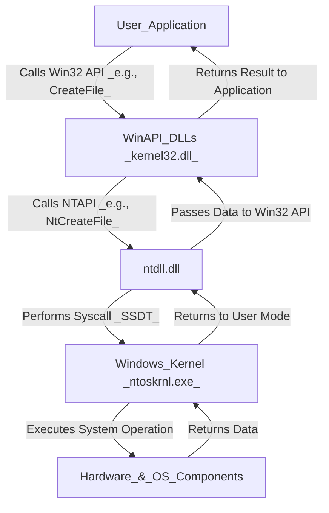

### **Windows NTAPI (Native API)**
**NTAPI (Windows Native API)** is a set of **low-level system functions** provided by **ntdll.dll** that allow user-mode applications to interact directly with the Windows **NT kernel (`ntoskrnl.exe`)**.

Unlike **Win32 API** (which is used by most applications), **NTAPI functions** are primarily used by **Windows itself** and low-level system utilities for:
- **Process and thread management**
- **Memory management**
- **File system operations**
- **Security and access control**
- **Interacting with the kernel**

---

## **1. NTAPI vs. Win32 API**
| Feature          | NTAPI (Native API)                             | Win32 API (Windows API)                     |
| ---------------- | ---------------------------------------------- | ------------------------------------------- |
| **Access Level** | Lower-level (closer to kernel)                 | Higher-level (user-friendly)                |
| **Availability** | Implemented in `ntdll.dll`                     | Implemented in `kernel32.dll`, `user32.dll` |
| **Usage**        | Used internally by Windows                     | Used by most applications                   |
| **Stability**    | Unstable (can change between Windows versions) | Stable and backward-compatible              |
| **Examples**     | `NtCreateFile`, `NtAllocateVirtualMemory`      | `CreateFile`, `VirtualAlloc`                |

- **Win32 API calls internally use NTAPI functions**, meaning Win32 functions are essentially **wrappers** around NTAPI.
- NTAPI functions are **undocumented** and mostly used by **Windows itself, security researchers, and malware authors**.

---

## **2. How NTAPI Works**
When a **user-mode application** makes a **Win32 API call**, it often internally calls an NTAPI function in `ntdll.dll`, which then transitions into **kernel mode** via a system call.

---

## **3. Examples of NTAPI Functions**
Here's a **table** with NTAPI functions categorized by their use, along with brief explanations:

| **Category**                    | **Function**              | **Brief Explanation**                                                                    |
| ------------------------------- | ------------------------- | ---------------------------------------------------------------------------------------- |
| **Process & Thread Management** | `NtCreateProcess`         | Creates a new process in Windows. Used internally for spawning processes.                |
|                                 | `NtCreateThreadEx`        | Creates a new thread within a process. Often used in process injection techniques.       |
|                                 | `NtTerminateProcess`      | Terminates a process by its handle, forcibly stopping execution.                         |
| **Memory Management**           | `NtAllocateVirtualMemory` | Allocates memory in a process's virtual address space. Used in malware injection.        |
|                                 | `NtFreeVirtualMemory`     | Frees memory that was allocated with `NtAllocateVirtualMemory`.                          |
|                                 | `NtProtectVirtualMemory`  | Changes memory protection (e.g., making a page executable). Used in shellcode execution. |
| **File & Registry Operations**  | `NtCreateFile`            | Opens or creates a file, bypassing standard Windows APIs.                                |
|                                 | `NtReadFile`              | Reads data from a file handle. Used for direct file access.                              |
|                                 | `NtOpenKey`               | Opens a registry key. Used in Windows configuration modifications.                       |
|                                 | `NtQueryValueKey`         | Retrieves the value of a registry key. Often used in malware persistence.                |
| **Security & Access Control**   | `NtOpenProcessToken`      | Retrieves the security token of a process. Used in privilege escalation.                 |
|                                 | `NtAdjustPrivilegesToken` | Modifies the privileges of a process (e.g., enabling SeDebugPrivilege for admin access). |
* **Nt functions are used in both user mode and kernel mode and always perform access checks.**
* **Zw functions are mainly for kernel mode and can bypass security checks when used by privileged drivers.**

### **Key Takeaways**
- **Process & Thread Management** → Handles process and thread creation, termination, and injection.
- **Memory Management** → Allocates, frees, and modifies memory, critical for malware execution.
- **File & Registry Operations** → Directly interacts with files and the registry, often bypassing security tools.
- **Security & Access Control** → Manages security tokens and privilege escalation techniques.

Would you like **specific syscall examples in C or assembly** for exploitation or debugging? 🚀

---

## **4. Why NTAPI Matters in Security**
### **Legitimate Uses**
- Windows **internally relies** on NTAPI for system operations.
- **Security tools** like Process Explorer and Sysmon use NTAPI for deeper system access.

### **Exploit and Malware Uses**
- **Direct Syscalls:** Attackers bypass antivirus detection by calling NTAPI functions directly instead of using the higher-level Win32 API.
- **API Hooking:** Security tools monitor NTAPI calls (especially process and memory-related ones) to detect malicious activity.
- **Process Injection:** Malware often uses NTAPI functions (`NtWriteVirtualMemory`, `NtCreateThreadEx`) to inject and execute payloads in another process.

---

## **5. Key Takeaways**
- **NTAPI is an internal Windows API** implemented in `ntdll.dll`, used for direct kernel interaction.
- **Win32 API is a wrapper around NTAPI** and is meant for regular applications.
- **NTAPI is often used in security research, debugging, and malware development** due to its lower-level access.
- **Directly using NTAPI can bypass security tools**, making it an important focus for both attackers and defenders.

Would you like examples of **NTAPI-based process injection** or **how to analyze NTAPI calls in memory for security research**? 🚀